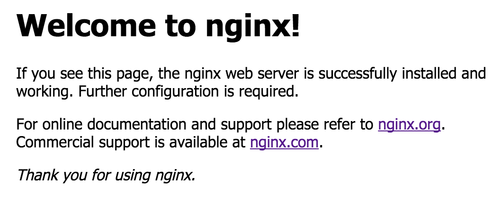

# Getting Started

## Visualizing Docker Engine Architecture

A high-level overview of the current Docker engine architecture:

<br>


## Images and Containers

When we start using Docker, there are two main concepts we need to be clear on — images and containers.

### Docker Images

An image is a file that represents a packaged application with all the dependencies needed to run correctly.

Every image we create or pull from Docker Hub is stored in our filesystem and is identified by its name and tag. It can also be identified by its image id.

### Docker Containers

A container is an instance of an image. Each container can be identified by its ID.

Docker defines seven states for a container: _created_, _restarting_, _running_, _removing_, _paused_, _exited_, and _dead_. This is important to know. Since a container is just an instance of the image, it doesn't need to be running.

One big advantage is that containers are like lightweight VMs. Their behaviors are completely isolated from each other. This means that we can run multiple containers of the same image, having each one in a different state with different data and different IDs.


## Running Your First Container

### Hosting simple static content

To start your first container, using the `nginx:1.23.2` image:

```bash
docker run --rm \
    --name my-nginx-container \
    nginx:1.23.2
```

!!!info
    The `--rm` flag cleans up the container and removes it from the filesystem once it exits.

    By default a container’s file system persists even after the container exits.


### Run in detatched mode

The following command will start a new container (if no container exists with the same name) in detatched mode (i.e. in the background):

```bash
docker run -d \
    --name my-nginx-container \
    nginx:1.23.2
```

### Exposing external port

Port mapping is used to access the services running inside a Docker container. We open a host port to give us access to a corresponding open port inside the Docker container. Then all the requests that are made to the host port can be redirected into the Docker container.

!!!info
    Port mapping makes the processes inside the container available from the outside.

The following command will bind port `80` of the container to TCP port `8080` on the host machine:

```bash
docker run -d \
    -p 8080:80 \
    --name my-nginx-container \
    nginx:1.23.2
```

If everything goes as expected, you should be able to access the default Nginx webpage from your browser under [http://localhost:8080/](http://localhost:8080/), which should look like this:




### List Containers

To list _running_ containers:

```bash
docker container ls
```

!!! tip
    To list _all_ containers (default shows just running), you can use the `-a` option.


### Clean Up

To clean up the containers created for this workshop:

1. List all the containers in your system:

    ```bash
    $ docker container ls -a

    CONTAINER ID   IMAGE           COMMAND                  CREATED          STATUS            PORTS          NAMES
    6dd455738e04   nginx:1.23.2    "/docker-entrypoint.…"   24 seconds ago   Up 23 seconds     80/tcp    romantic_feistel
    6ff707de3d08   nginx:1.23.2    "/docker-entrypoint.…"   25 seconds ago   Up 25 seconds     80/tcp    determined_feynman
    d33e4c445d54   nginx:1.23.2    "/docker-entrypoint.…"   28 seconds ago   Up 28 seconds     80/tcp    interesting_jang
    ```

1. Remove unnecessary containers:

    ```bash
    docker rm CONTAINER
    ```

    For _example_, to remove the containers with container ID `6dd455738e04`, `6ff707de3d08`, `d33e4c445d54`:

    ```bash
    docker rm 6dd455738e04 6ff707de3d08 d33e4c445d54
    ```

    !!! tip
        - Use the `-f` option to force the removal of a running container (uses `SIGKILL`).

1. (Optional) You could also remove unused data with:

    ```bash
    docker system prune
    ```

    This command will remove:

    - all stopped containers
    - all networks not used by at least one container
    - all dangling images
    - all dangling build cache


## Summary

In this section we went through:

- a high level overview of Docker's engine architecture
- the creation of an Nginx container and binded a port from the container to a port on the host machine.
- how to list containers
- how to remove containers and unused data.
