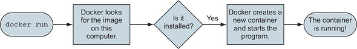

# Docker Run Under the Hood

When we execute the `docker run` command, the Docker client packaged up the command and POSTed it to the API server running on the Docker daemon. The Docker daemon accepted the command and searched the Docker host’s local image repository to see if it already had a copy of the requested image. In the examples cited, it didn’t, so it went to Docker Hub to see if it could find it there. It found it, pulled it locally, and stored it in its local cache.

Note: In a standard, out-of-the-box Linux installation, the Docker daemon implements the Docker Remote API on a local IPC/Unix socket at `/var/run/docker.sock`. The default non-TLS network port for Docker is 2375, the default TLS port is 2376.

Once the image was pulled, the daemon instructed `containerd` and `runc` to create and start the container.

## Running docker run with missing image

When you run `docker run` and the specified image doesn't exist in your system, the following happens under the hood (high level overview):

 

A similar illustration:

## Running docker run with already existing image

When you run `docker run` and the specified image exists in your system, docker will (by default) use the cached image:

!!! tip
    Use the --pull flag to set the image pull policy when creating (and running) the container.
