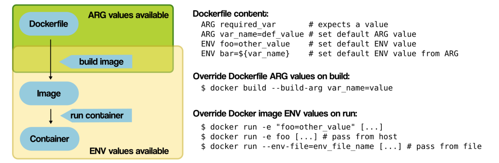

# Environment Variables

Environment variables are a convenient way to externalize application configuration; therefore, they're also useful for building Docker containers.

## Advantages of Using Environment Variables

The biggest advantage of using environment variables is flexibility. We can create just one Dockerfile that will be configured differently depending on the environment that was used to build a container.

As an example, let's imagine an application with debug options enabled in the development environment, and the same options disabled in the production environment. With environment variables, we need to create just one Dockerfile that will pass an environment variable holding the debug flag to the container and the app within.

The other important advantage is security issues. Storing passwords or other sensitive information directly in the Dockerfile is probably not the best idea. Environment variables help overcome that problem.

## Passing Environment Variables

### Docker run

When using the `docker run` command, the `-e`, `--env`, and `--env-file` flags can be used to set simple (non-array) environment variables in the container you’re running, or overwrite variables that are defined in the Dockerfile of the image you’re running.


For example, the [official MongoDB Docker image](https://hub.docker.com/_/mongo) supports environment variables for the the initialization of the MongoDB instance.

By setting the `MONGO_INITDB_ROOT_USERNAME` and `MONGO_INITDB_ROOT_PASSWORD` during the `docker run` command will create a new user and set that user's password.

The following is an example of using these two variables to create a MongoDB instance and then using the `mongosh` cli (use `mongo` with `4.x` versions) to connect against the `admin` authentication database.

1. Create a temporary Docker network. Don't worry about the details now, we'll have a closer look at Docker networking the next sections.

    ```bash
    $ docker network create -d bridge mongo-env-vars-workshop

    72500af23bbb7f4c9212d3772606f511379177b1e999406168553dbc1565398d
    ```

1. Create a MogoDB container in the network we created above:

    ```bash
    $ docker run -d --network mongo-env-vars-workshop --name cms-daq-test-mongo \
        -e MONGO_INITDB_ROOT_USERNAME=cmsdaquser \
        -e MONGO_INITDB_ROOT_PASSWORD=secret \
        mongo

    928d5528480a3ba5ba20121ee3fcdd6c50c131f404dd2b9737aa372b6b1b11e4
    ```

1. Create a container and run `mongosh` cli to interact with the previous MongoDB container:

    ```bash
    $ docker run -it --network mongo-env-vars-workshop --rm mongo \
        mongosh --host cms-daq-test-mongo \
            -u cmsdaquser \
            -p secret \
            --authenticationDatabase admin \
            some-db

    > db.getName();
    some-db
    ```


### Dockerfile

#### Hardcoding Environment Values in Dockerfile

The simplest way to pass an environment value is to hardcode it in the `Dockerfile`. In some cases, this is good enough. In the following example, we hardcode the `MY_NAME` env variable to the `John Doe` value:

```docker
FROM alpine:latest

ENV MY_NAME="John Doe"

<DOCKERFILE_INSTRUCTIONS>
```

#### Setting Dynamic Environment Variables

Dockerfile doesn't provide a dynamic tool to set an `ENV` value during the build process. Although, there is a workaround by using `ARG`:

```docker
# expect a build-time variable
ARG name

# # use the value to set the ENV var default
ENV MY_NAME $name

# if not overridden, that value of MY_NAME will be available to your containers
```

When we want to set this argument, we'll pass it with the `--build-arg` flag:

```bash
docker build -t cmsdaq-image --build-arg name=CMSDAQ .
```

## Overriding ENV Values

The precedence is (from highest to lowest priority): environment variables the containerized application sets, values from single environment entries, values from the `env_file`(s) and finally Dockerfile defaults.



## Sensitive Values

More often than not, one of the variables will be a password to a database or an external service. We have to be careful about how we inject those variables into the Docker container.

Passing those values directly via the command line is probably the least secure, as there is a greater risk of leaking the sensitive values somewhere we don't expect, such as in our source control system or the OS process list.

Defining sensitive values in the local environment or in a file might be a better choice, as both can be secured from unauthorized access.

However, it's important to realize that any user with access to the Docker runtime can inspect a running container and discover the secret values (by using the `docker inspect` command that we saw in one of the previous sections).

## Summary

In the section we went through on the different ways to use environment variables in containers.

- we started by setting env variables from a pre-built (official) Docker image
- we moved on with setting env variables via the Dockerfile (either via hardcoding them or by dynamically setting them with the help of the `ARG` instruction).
- we went through a few advantages and examples of using env variables
- how to treat sensitive values
