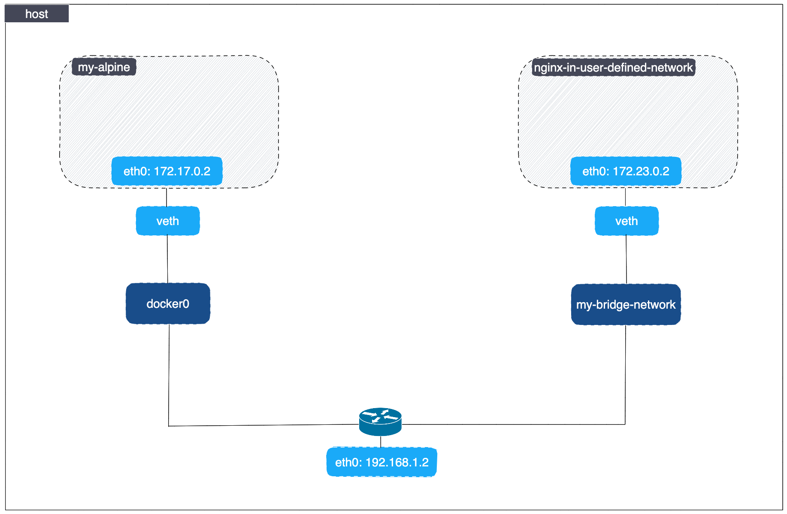
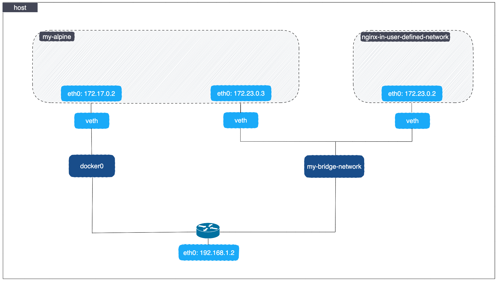

# Bridge Network Connection

As we already mentioned in a previous section, Docker networks are natural ways to isolate containers from other containers or other networks.

Let's illustrate this by creating two containers - one in a _user-defined_ network (which will be using the bridge driver) and the second one in the _default_ `bridge` network.

## Create a container on the default network

A typical installation of Docker (e.g. Docker Engine, Docker Desktop, etc.) includes three networks: `bridge` (default), `host` and `none`.

Let's create a container named `my-alpine` in the default `bridge` network.
    
```bash
$ docker run -dit --name my-alpine alpine

592a6ce6d22a77e2e658a99af7174e8517c4810b131eddbfce740d7ffceec539
```


Inspecting the network is an easy way to find out the container’s IP address:

```bash
$ docker network inspect bridge

[
    {
        "Name": "bridge",
        "Id": "e7e33ff798aeab11a8f52034bf16aa31f5c04ba123e023148ed51789b0ba1ee4",
        "Created": "2022-11-21T10:24:02.314289585+01:00",
        "Scope": "local",
        "Driver": "bridge",
        "IPAM": {
            "Driver": "default",
            "Options": null,
            "Config": [
                {
                    "Subnet": "172.17.0.0/16"
                }
            ]
        },
        "Containers": {
            "592a6ce6d22a77e2e658a99af7174e8517c4810b131eddbfce740d7ffceec539": {
                "Name": "my-alpine",
                "EndpointID": "ae09eb848fe87d93b2b11fd676edfacada1d7cdfebd8ead7932ffb2e29249ab8",
                "MacAddress": "02:42:ac:11:00:02",
                "IPv4Address": "172.17.0.2/16",
                "IPv6Address": ""
            }
        },
    }
]
```

## Create a user-defined Docker bridge network

Create the `my-bridge-network` network based on on the bridge driver (if not already created in a previous section):

```bash
docker network create --driver bridge my-bridge-network
```

!!!info
    You can use the `--subnet` and `--gateway` options when creating a bridge network with `docker network create` to specify the desired subnet (in CIDR format) and the gateway IP for the master subnet respectively. More details on the [official documentation](https://docs.docker.com/engine/reference/commandline/network_create/#bridge-driver-options).

Once created, the `docker network ls` commands should return it:

```bash
$ docker network ls

NETWORK ID     NAME                DRIVER    SCOPE
e7e33ff798ae   bridge              bridge    local
757b8ce188bd   host                host      local
253cdd3f74d5   my-bridge-network   bridge    local
63641bc1d066   none                null      local
```

If you inspect the network, it has nothing in it:

```bash
$ docker network inspect my-bridge-network

[
    {
        "Name": "my-bridge-network",
        "Id": "253cdd3f74d579c92e595ea1e274e08096a6c210fab61ae30ece1134ec96a2dc",
        "Created": "2022-11-23T11:38:50.209664623+01:00",
        "Scope": "local",
        "Driver": "bridge",
        "EnableIPv6": false,
        "IPAM": {
            "Driver": "default",
            "Options": {},
            "Config": [
                {
                    "Subnet": "172.23.0.0/16",
                    "Gateway": "172.23.0.1"
                }
            ]
        },
        "Internal": false,
        "Attachable": false,
        "Ingress": false,
        "ConfigFrom": {
            "Network": ""
        },
        "ConfigOnly": false,
        "Containers": {},
        "Options": {},
        "Labels": {}
    }
]
```

## Add containers to the user-defined bridge network

Create a container named `nginx-in-user-defined-network` in the `my-bridge-network` network (if not already created in a previous section):

```bash
docker run -d \
    --network my-bridge-network \
    --name nginx-in-user-defined-network \
    nginx:1.23.2
```

If you inspect the `my-bridge-network` network you can see it has a container attached. You can also inspect the container to see where it is connected:


```bash
$ docker container inspect \
    --format='{{json .NetworkSettings.Networks}}' \
    nginx-in-user-defined-network

{
  "my-bridge-network": {
    "IPAMConfig": null,
    "Links": null,
    "Aliases": [
      "97dcbf6609a4"
    ],
    "NetworkID": "253cdd3f74d579c92e595ea1e274e08096a6c210fab61ae30ece1134ec96a2dc",
    "EndpointID": "627a962d1a1319ec38b12e1fffad1e2fc13569835d43f49402e516a11b1cd047",
    "Gateway": "172.23.0.1",
    "IPAddress": "172.23.0.2",
    "IPPrefixLen": 16,
    "IPv6Gateway": "",
    "GlobalIPv6Address": "",
    "GlobalIPv6PrefixLen": 0,
    "MacAddress": "02:42:ac:17:00:02",
    "DriverOpts": null
  }
}
```

Here is the overview of what we have created so far in the previous steps:



!!!note
    Docker takes care of creating the network interfaces in the host machine and inside the containers.

!!! tip
    - Use the `ip addr show` command to show all available network interfaces.
    - Use the `brctl show` command to show all available Ethernet bridges.
    - Use the `iptables -nvL` command to show all iptables rules.

    Combining the above commands should give you an overview on how network interfaces are connected to each other and about packet filtering rules.

## Check connectivity between containers in the default and the user-defined network

Execute a command from the Alpine-based container in order to ping the Nginx container and check if the DNS resolution works.
    
```bash
$ docker exec -it my-alpine ping -c 2 nginx-in-user-defined-network

ping: bad address 'nginx-in-user-defined-network
```

As you can see, the Alpine container (which runs in a different network than the Nginx container) cannot resolve Nginx's default webpage.

## Connect Container to Network

To connect the `my-alpine` container to the `my-bridge-network` network, run the following command from a shell in your host machine:

```bash
docker network connect my-bridge-network my-alpine
```



## Check connectivity between containers in the same bridge network

Now that we've added the `my-alpine` container to the `my-bridge-network` network, the Alpine container has a new IP address. Let's list all the containers connected to the `my-bridge-network` network:

```bash
$ docker network inspect my-bridge-network \
    --format='{{range .Containers}}{{printf "Container: %s, IPv4: %s\n" .Name .IPv4Address}}{{end}}'

Container: my-alpine, IPv4: 172.23.0.3/16
Container: nginx-in-user-defined-network, IPv4: 172.23.0.2/16
```

The Alpine container should be able to reach the Nginx container and resolve its name. To confirm, run the following command:

```bash
$ docker exec -it my-alpine ping -c 2 nginx-in-user-defined-network

PING nginx-in-user-defined-network (172.23.0.2): 56 data bytes
64 bytes from 172.23.0.2: seq=0 ttl=64 time=0.266 ms
64 bytes from 172.23.0.2: seq=1 ttl=64 time=0.215 ms

--- nginx-in-user-defined-network ping statistics ---
2 packets transmitted, 2 packets received, 0% packet loss
round-trip min/avg/max = 0.215/0.240/0.266 ms
```
