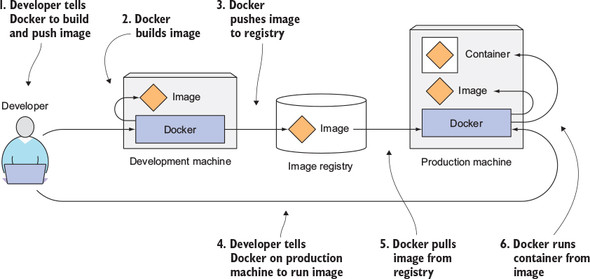
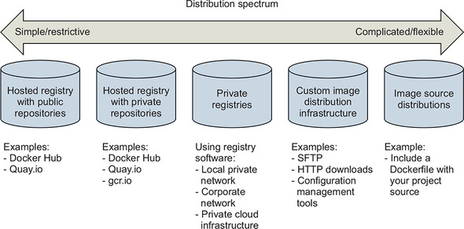

# Image Distribution & Registries

There are several ways to publish (or fetch) images.

You get Docker images by pulling them from an image registry. Hosted registries offer both public and private repositories with automated build tools. By contrast, running a private registry lets you hide and customize your image distribution infrastructure.

The most common registry is [Docker Hub](https://hub.docker.com/), but others exist.

## Typical Docker Image Workflow

The following figure shows a typical Docker image workflow; from building, distributing and running a Docker image.

The developer first builds an image and then pushes it to a registry. The image is thus available to anyone who can access the registry. They can then pull the image to any other machine running Docker and run the image. Docker creates an isolated container based on the image and runs the binary executable specified as part of the image.

## Official and Unofficial Repositories

[Docker Hub](https://hub.docker.com/) has the concept of _official repositories_ and _unofficial repositories_.

As the name suggests, _official repositories_ are the home to images that have been vetted and curated by Docker, Inc. This means they should contain up-to-date, high-quality code, that is secure, well-documented, and in-line with best practices.

_Unofficial repositories_ can be like the wild-west — you should not assume they are safe, well-documented or built according to best practices. That’s not saying everything in unofficial repositories is bad. There’s some excellent stuff in unofficial repositories. You just need to be very careful before trusting code from them.

Most of the popular applications and base operating systems have their own _official repositories_ on Docker Hub. They’re easy to spot because they live at the top level of the Docker Hub namespace. The following list contains a few of the _official repositories_, and shows their URLs that exist at the top-level of the Docker Hub namespace:

- nginx: [https://hub.docker.com/_/nginx/](https://hub.docker.com/_/nginx/)
- redis: [https://hub.docker.com/_/redis/](https://hub.docker.com/_/redis/)

## Choosing a Distribution Method

The first thing to recognize about distributing software with Docker is that there’s no universal solution. Distribution requirements vary for many reasons, and several methods are available. Every method has Docker tools at its core, so it’s always possible to migrate from one to another with minimal effort.

### A Distribution Spectrum

The image distribution spectrum offers many methods with differing levels of flexibility and complexity.

### Selection Criteria

When making a decision, consider how important each of these is in your situation:

- Cost
- Visibility
- Transport speed or bandwidth overhead
- Longevity control
- Availability control
- Access control
- Artifact integrity
- Artifact confidentiality
- Requisite expertise
## Popular Container Registries

Some of the most popular container registries:

- [Docker Hub](https://hub.docker.com/search?q=&type=image)
- [Quay.io](https://quay.io/search)
- [CERN Registry](https://registry.cern.ch/)

## Resources
- [Docker in Action](https://www.manning.com/books/docker-in-action-second-edition)
