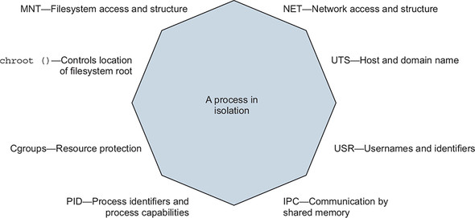
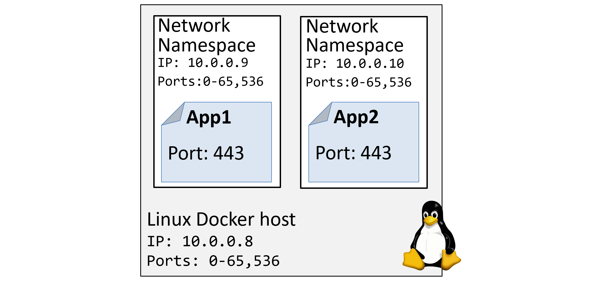

# Linux Namespaces

## Overview

_Kernel namespaces_ are at the very heart of containers. They slice up an operating system (OS) so that it looks and feels like multiple isolated operating systems. This lets us do really cool things like run multiple web servers on the same OS without having port conflicts. It also lets us run multiple apps on the same OS without them fighting over shared config files and shared libraries.

## Docker Utilized Namespaces

Docker on Linux currently utilizes the following kernel namespaces:

- Process ID (pid)
- Network (net)
- Filesystem/mount (mnt)
- Inter-process Communication (ipc)
- User (user)
- UTS (uts)



!!!note
    **Every container has its own pid, net, mnt, ipc, uts, and potentially user namespace**. In fact, an organized collection of these namespaces is what we call a “container”

## Examples

A couple of quick examples:

- Namespaces let you run multiple web servers, each on port 443, on a single OS. To do this you just run each web server app inside of its own network namespace. This works because each network namespace gets its own IP address and full range of ports. You may have to map each one to a separate port on the Docker host, but each can run without being re-written or reconfigured to use a different port.

- You can run multiple applications, each requiring their own version of a shared library or configuration file. To do this you run each application inside of its own mount namespace. This works because each mount namespace can have its own isolated copy of any directory on the system (e.g. `/etc`, `/var`, `/dev` etc.)

The image below shows a high-level example of two web server applications running on a single host and both using port 443. Each web server app is running inside of its own network namespace.



## Breakdown

Let’s briefly look at how Docker uses each namespace:

- `Process ID namespace`: Docker uses the `pid` namespace to provide isolated process trees for each container. This means every container gets its own PID 1. PID namespaces also mean that one container cannot see or access to the process tree of other containers. Nor can it see or access the process tree of the host it’s running on.

- `Network namespace`: Docker uses the `net` namespace to provide each container its own isolated network stack. This stack includes; interfaces, IP addresses, port ranges, and routing tables. For example, every container gets its own `eth0` interface with its own unique IP and range of ports.

- `Mount namespace`: Every container gets its own unique isolated root (`/`) filesystem. This means every container can have its own `/etc`, `/var`, `/dev` and other important filesystem constructs. Processes inside of a container cannot access the mount namespace of the Linux host or other containers — they can only see and access their own isolated filesystem.

- `Inter-process Communication namespace`: Docker uses the ipc namespace for shared memory access within a container. It also isolates the container from shared memory outside of the container.

- `User namespace`: Docker lets you use `user` namespaces to map users inside of a container to different users on the Linux host. A common example is mapping a container’s `root` user to a non-root user on the Linux host.

- `UTS namespace`: Docker uses the `uts` namespace to provide each container with its own hostname.

## List Container Namespaces in Linux

1. Run a Docker container:

    ```bash
    docker run -d \
        --name my-nginx-container \
        nginx:1.23.2
    ```

1. On your Linux host, get Nginx's master process PID (the master process that runs inside the container we created above):

    ```bash
    NGINX_MASTER_HOST_PID=$(docker top my-nginx-container | grep -i master | head -n 1 | awk '{print $2}')
    ```

1. Verify that the `NGINX_MASTER_HOST_PID` environment variable is set:

    ```bash
    $ echo $NGINX_MASTER_HOST_PID

    45324
    ```

1. List namespaces for the above PID:

    ```bash
    $ ls -al /proc/$NGINX_MASTER_HOST_PID/ns/

    total 0
    dr-x--x--x. 2 root root 0 Dec 14 01:11 .
    dr-xr-xr-x. 9 root root 0 Dec 14 01:11 ..
    lrwxrwxrwx. 1 root root 0 Dec 14 16:27 cgroup -> 'cgroup:[4026531835]'
    lrwxrwxrwx. 1 root root 0 Dec 14 16:27 ipc -> 'ipc:[4026532377]'
    lrwxrwxrwx. 1 root root 0 Dec 14 16:27 mnt -> 'mnt:[4026532375]'
    lrwxrwxrwx. 1 root root 0 Dec 14 01:11 net -> 'net:[4026532381]'
    lrwxrwxrwx. 1 root root 0 Dec 14 16:27 pid -> 'pid:[4026532378]'
    lrwxrwxrwx. 1 root root 0 Dec 14 16:27 pid_for_children -> 'pid:[4026532378]'
    lrwxrwxrwx. 1 root root 0 Dec 14 16:27 time -> 'time:[4026531834]'
    lrwxrwxrwx. 1 root root 0 Dec 14 16:27 time_for_children -> 'time:[4026531834]'
    lrwxrwxrwx. 1 root root 0 Dec 14 16:27 user -> 'user:[4026531837]'
    lrwxrwxrwx. 1 root root 0 Dec 14 16:27 uts -> 'uts:[4026532376]'
    ```

## References

- [Docker Deep Dive (book)](https://learning.oreilly.com/library/view/docker-deep-dive/9781800565135/)
