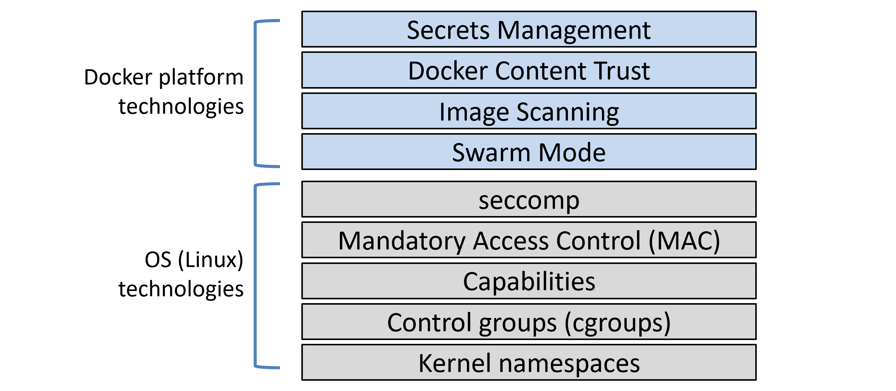

# Linux and Docker

Docker on Linux leverages most of the common Linux security and workload isolation technologies. These include namespaces, control groups (cgroups), capabilities, mandatory access control (MAC) systems, and seccomp. For each one, Docker implements sensible defaults for a seamless and moderately secure out-of-the-box experience.

All good container platforms use namespaces and cgroups to build containers. The best container platforms will also integrate with other Linux security technologies such as capabilities, Mandatory Access Control systems like SELinux and AppArmor, and seccomp. As expected, Docker integrates with them all.

