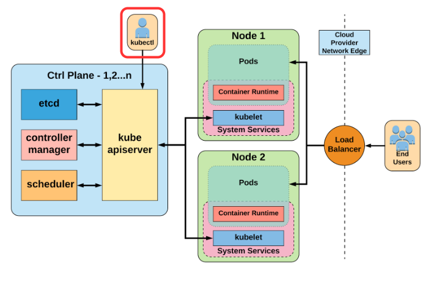

# Kubectl

The Kubernetes command-line tool, [`kubectl`](https://kubernetes.io/docs/reference/kubectl/kubectl/), allows you to run commands against Kubernetes clusters by interacting with the Kubernetes API. You can use `kubectl` to deploy applications, inspect and manage cluster resources, and view logs.



## Kubectl autocomplete

Consult the [official docs](https://kubernetes.io/docs/reference/kubectl/cheatsheet/#kubectl-autocomplete), depending on your shell (e.g. bash, zsh, etc.).

## Kubectl Context and Configuration

Some usuful `kubectl` commands on contexts and configuration:

```bash
kubectl config view                 # Show merged kubeconfig settings.

kubectl config get-contexts         # display list of contexts
kubectl config current-context      # display the current-context

kubectl config use-context my-cluster-name    # set the default context to my-cluster-name
kubectl config set-cluster my-cluster-name    # set a cluster entry in the kubeconfig
```


## Checking Cluster Status

To view your client and server version information for the current context:

```bash
$ kubectl version --short

Client Version: v1.22.0
Server Version: v1.22.9
```

This will display two different versions: the version of the local `kubectl` tool, as well as the version of the Kubernetes API server.

!!! note
    Don’t worry if these versions are different. The Kubernetes tools are backward- and forward-compatible with different versions of the Kubernetes API as long as you stay within one minor versions for both the tools and the cluster and don’t try to use newer features on an older cluster. Kubernetes follows the semantic versioning specification, where the minor version is the middle number (e.g., the `20` in `1.20.2`). More details [here](https://kubernetes.io/releases/version-skew-policy/).

## Checking Cluster Information

To display addresses of the control plane and services with label `kubernetes.io/cluster-service=true`:

```bash
$ kubectl cluster-info

Kubernetes control plane is running at https://1.2.3.4:6443
CoreDNS is running at https://1.2.3.4:6443/api/v1/namespaces/kube-system/services/kube-dns:dns/proxy
```

## Listing Kubernetes Nodes

To list all of the nodes in your cluster:

```bash
$ kubectl get nodes -o wide

NAME                                     STATUS   ROLES    AGE   VERSION   INTERNAL-IP       EXTERNAL-IP   OS-IMAGE                        KERNEL-VERSION            CONTAINER-RUNTIME
cms-daq-workshop-gml7jxg5oxyf-master-0   Ready    master   10d   v1.22.9   1.2.3.4           <none>        Fedora CoreOS 35.20220227.2.1   5.16.13-200.fc35.x86_64   containerd://1.4.13
cms-daq-workshop-gml7jxg5oxyf-node-0     Ready    <none>   10d   v1.22.9   5.6.7.8           <none>        Fedora CoreOS 35.20220227.2.1   5.16.13-200.fc35.x86_64   containerd://1.4.13
cms-daq-workshop-gml7jxg5oxyf-node-1     Ready    <none>   10d   v1.22.9   8.9.10.11         <none>        Fedora CoreOS 35.20220227.2.1   5.16.13-200.fc35.x86_64   containerd://1.4.13
cms-daq-workshop-gml7jxg5oxyf-node-2     Ready    <none>   10d   v1.22.9   12.13.14.15       <none>        Fedora CoreOS 35.20220227.2.1   5.16.13-200.fc35.x86_64   containerd://1.4.13
```

As you can see, this is a four-node cluster that's been up for 10 days.

In Kubernetes, nodes are separated into `control-plane` nodes that contain containers like the API server, scheduler, etc., which manage the cluster, and `worker` nodes where your containers will run. Kubernetes won’t generally schedule work onto `control-plane` nodes to ensure that user workloads don’t harm the overall operation of the cluster.

## Kubectl output verbosity and debugging

Kubectl verbosity is controlled with the -v or --v flags followed by an integer representing the log level. General Kubernetes logging conventions and the associated log levels are described [here](https://github.com/kubernetes/community/blob/master/contributors/devel/sig-instrumentation/logging.md).

| Verbosity | Description |
|:---------:|:-----------:|
| `--v=0` | Generally useful for this to always be visible to a cluster operator. |
| `--v=1` | A reasonable default log level if you don't want verbosity. |
| `--v=2` | Useful steady state information about the service and important log messages that may correlate to significant changes in the system. This is the recommended default log level for most systems. |
| `--v=3` | Extended information about changes. |
| `--v=4` | Debug level verbosity. |
| `--v=5` | Trace level verbosity. |
| `--v=6` | Display requested resources. |
| `--v=7` | Display HTTP request headers. |
| `--v=8` | Display HTTP request contents. |
| `--v=9` | Display HTTP request contents without truncation of contents. |

For example, let's list again all of the nodes in the cluster but this time specifying a verbosity level:

```bash
kubectl get nodes -o wide -v 7
```

The output of the above command should provide extra details about the HTTP calls taking place in the background.


## Kubectl Cheatsheet

- [`kubectl` cheatsheet](https://kubernetes.io/docs/reference/kubectl/cheatsheet/)
