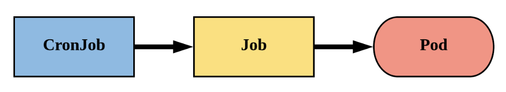

# CronJobs

**A CronJob creates Jobs on a repeating schedule**.



CronJob is meant for **performing regular scheduled actions** such as backups, report generation, and so on. One CronJob object is like one line of a crontab (cron table) file on a Unix system. It runs a job periodically on a given schedule, written in Cron format.

## Example

This example CronJob manifest prints the current time and a hello message every minute:

```yaml
apiVersion: batch/v1
kind: CronJob
metadata:
  name: hello
spec:
  schedule: "* * * * *"
  jobTemplate:
    spec:
      template:
        spec:
          containers:
          - name: hello
            image: busybox:1.28
            imagePullPolicy: IfNotPresent
            command:
            - /bin/sh
            - -c
            - date; echo Hello from the Kubernetes cluster
          restartPolicy: OnFailure
```


## Schedule Syntax

```
# ┌───────────── minute (0 - 59)
# │ ┌───────────── hour (0 - 23)
# │ │ ┌───────────── day of the month (1 - 31)
# │ │ │ ┌───────────── month (1 - 12)
# │ │ │ │ ┌───────────── day of the week (0 - 6) (Sunday to Saturday;
# │ │ │ │ │                                   7 is also Sunday on some systems)
# │ │ │ │ │                                   OR sun, mon, tue, wed, thu, fri, sat
# │ │ │ │ │
# * * * * *
```

To generate CronJob schedule expressions, you can also use web tools like [crontab.guru](https://crontab.guru/).


## Guidelines on Writing a CronJob spec

Guidelines on writing a CronJob spec can be found [here](https://kubernetes.io/docs/concepts/workloads/controllers/cron-jobs/#writing-a-cronjob-spec).


## Concurrency policy

The `.spec.concurrencyPolicy` field is also optional. It specifies how to treat concurrent executions of a job that is created by this CronJob. The spec may specify only one of the following concurrency policies:

- `Allow` (default): The CronJob allows concurrently running jobs
- `Forbid`: The CronJob does not allow concurrent runs; if it is time for a new job run and the previous job run hasn't finished yet, the CronJob skips the new job run
- `Replace`: If it is time for a new job run and the previous job run hasn't finished yet, the CronJob replaces the currently running job run with a new job run


## Time zones

For CronJobs with no time zone specified, the kube-controller-manager interprets schedules relative to its local time zone.
