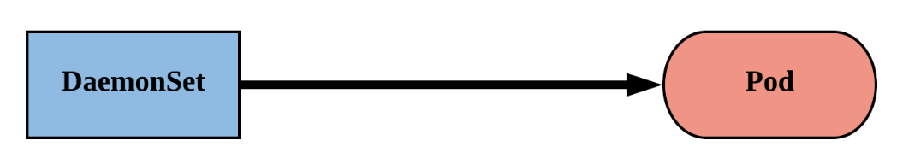

# DaemonSet

A **DaemonSet ensures that all (or some) Nodes run a copy of a Pod**. As nodes are added to the cluster, Pods are added to them. As nodes are removed from the cluster, those Pods are garbage collected. Deleting a DaemonSet will clean up the Pods it created.

Some typical uses of a DaemonSet are:

- running a cluster storage daemon on every node (e.g. `ceph`)
- running a logs collection daemon on every node (e.g. `fluent-bit`)
- running a node monitoring daemon on every node (e.g. `collectd`)



## Create a DaemonSet

The YAML block below describes a DaemonSet that runs the fluentd-elasticsearch Docker image:

```yaml
apiVersion: apps/v1
kind: DaemonSet
metadata:
  name: fluentd-elasticsearch
  namespace: kube-system
  labels:
    k8s-app: fluentd-logging
spec:
  selector:
    matchLabels:
      name: fluentd-elasticsearch
  updateStrategy:
    type: RollingUpdate
    rollingUpdate:
      maxUnavailable: 1
  template:
    metadata:
      labels:
        name: fluentd-elasticsearch
    spec:
      affinity:
        nodeAffinity:
          requiredDuringSchedulingIgnoredDuringExecution:
            nodeSelectorTerms:
            - matchExpressions:
              - key: kubernetes.io/os
                operator: In
                values:
                - linux
      containers:
      - name: fluentd-elasticsearch
        image: quay.io/fluentd_elasticsearch/fluentd:v2.5.2
        resources:
          limits:
            memory: 200Mi
          requests:
            cpu: 100m
            memory: 200Mi
        volumeMounts:
        - name: varlog
          mountPath: /var/log
      terminationGracePeriodSeconds: 30
      volumes:
      - name: varlog
        hostPath:
          path: /var/log
```

!!! note
    A `hostPath` volume mounts a file or directory from the host node's filesystem into your Pod. For applications like log collectors/shippers, it might come handy (e.g. access to Pods' logs that are stored in the nodes' filesystem).

    More details about Volumes can be found on the corresponding chapter of this workshop.

In this example:

- A DaemonSet named `fluentd-elasticsearch` is created.
- A DaemonSet Pod is present on all worker nodes that satisfy the nodeAffinity rules.
- The Pod's container pulls the `quay.io/fluentd_elasticsearch/fluentd:v2.5.2` image.
- The container requests `100m` of CPU and `200Mi` of memory, and limits itself to `200Mi` total of memory usage.

Once the above manifest is applied to your Kubernetes cluster, Pods will only be scheduled to your worker nodes that satisfy the nodeAffinity rules. To have the DaemonSet runnable on control plane nodes, we need to add a couple of [tolerations](https://kubernetes.io/docs/concepts/scheduling-eviction/taint-and-toleration/).

Notes:

- The `.spec.template` is a pod template. It has exactly the same schema as a Pod, except it is nested and does not have an `apiVersion` or `kind`.
- The `.spec.selector` field is a pod selector.

More details can be found [here](https://kubernetes.io/docs/concepts/workloads/controllers/daemonset/#writing-a-daemonset-spec).


## How Daemon Pods are scheduled

### Scheduled by default scheduler

A DaemonSet ensures that all eligible nodes run a copy of a Pod. Normally, the node that a Pod runs on is selected by the Kubernetes scheduler. However, DaemonSet pods are created and scheduled by the DaemonSet controller instead.

1. The DaemonSet controller creates a Pod for each eligible node and adds the `spec.affinity.nodeAffinity` field of the Pod to match the target host.
1. After the Pod is created, the default scheduler typically takes over and then binds the Pod to the target host by setting the `.spec.nodeName` field.
1. If the new Pod cannot fit on the node, the default scheduler may preempt (evict) some of the existing Pods based on the priority of the new Pod.

**Note**: The original node affinity specified at the `.spec.template.spec.affinity.nodeAffinity` field (if specified) is taken into consideration by the DaemonSet controller when evaluating the eligible nodes, but is replaced on the created Pod with the node affinity that matches the name of the eligible node.

```yaml
nodeAffinity:
  requiredDuringSchedulingIgnoredDuringExecution:
    nodeSelectorTerms:
    - matchFields:
      - key: metadata.name
        operator: In
        values:
        - cms-daq-workshop-gml7jxg5oxyf-node-2
```

You can verify this by running the `kubectl get pods` command:

```bash
kubectl get pods -n kube-system <POD_NAME> -o yaml
```

The output should be similar to this (in this case the `<POD_NAME>` is `fluentd-elasticsearch-5mlxt`):

```yaml
apiVersion: v1
kind: Pod
metadata:
  name: fluentd-elasticsearch-5mlxt
  namespace: kube-system
spec:
  affinity:
    nodeAffinity:
      requiredDuringSchedulingIgnoredDuringExecution:
        nodeSelectorTerms:
        - matchFields:
          - key: metadata.name
            operator: In
            values:
            - cms-daq-workshop-gml7jxg5oxyf-node-2
  ...
  nodeName: cms-daq-workshop-gml7jxg5oxyf-node-2
  ...

```

### Taints and Tolerations

Although Daemon Pods respect [taints and tolerations](https://kubernetes.io/docs/concepts/scheduling-eviction/taint-and-toleration/), there are a few tolerations added to DaemonSet Pods automatically. More details can be found [here](https://kubernetes.io/docs/concepts/workloads/controllers/daemonset/#taints-and-tolerations).

### Schedule Pods on control plane nodes

To make a DaemonSet runnable on on control plane nodes, we need to add the following tolerations:

```yaml
spec:
  template:
    spec:
      tolerations:
      # these tolerations are to have the daemonset runnable on control plane nodes.
      # remove them if your control plane nodes should not run pods
      - key: node-role.kubernetes.io/control-plane
        operator: Exists
        effect: NoSchedule
      - key: node-role.kubernetes.io/master
        operator: Exists
        effect: NoSchedule
```

Therefore, the original DaemonSet manifest becomes:

```yaml
apiVersion: apps/v1
kind: DaemonSet
metadata:
  name: fluentd-elasticsearch
  namespace: kube-system
  labels:
    k8s-app: fluentd-logging
spec:
  selector:
    matchLabels:
      name: fluentd-elasticsearch
  updateStrategy:
    type: RollingUpdate
    rollingUpdate:
      maxUnavailable: 1
  template:
    metadata:
      labels:
        name: fluentd-elasticsearch
    spec:
      tolerations:
      # these tolerations are to have the daemonset runnable on control plane nodes
      # remove them if your control plane nodes should not run pods
      - key: node-role.kubernetes.io/control-plane
        operator: Exists
        effect: NoSchedule
      - key: node-role.kubernetes.io/master
        operator: Exists
        effect: NoSchedule
      affinity:
        nodeAffinity:
          requiredDuringSchedulingIgnoredDuringExecution:
            nodeSelectorTerms:
            - matchExpressions:
              - key: kubernetes.io/os
                operator: In
                values:
                - linux
      containers:
      - name: fluentd-elasticsearch
        image: quay.io/fluentd_elasticsearch/fluentd:v2.5.2
        resources:
          limits:
            memory: 200Mi
          requests:
            cpu: 100m
            memory: 200Mi
        volumeMounts:
        - name: varlog
          mountPath: /var/log
      terminationGracePeriodSeconds: 30
      volumes:
      - name: varlog
        hostPath:
          path: /var/log
```

## Alternatives to DaemonSet

### Init scripts

It is certainly possible to run daemon processes by directly starting them on a node (e.g. using `init`, `upstartd`, or `systemd`). This is perfectly fine. However, there are several advantages to running such processes via a DaemonSet:

- Ability to monitor and manage logs for daemons in the same way as applications.
- Same config language and tools (e.g. Pod templates, `kubectl`) for daemons and applications.
- Running daemons in containers with resource limits increases isolation between daemons from app containers. However, this can also be accomplished by running the daemons in a container but not in a Pod.

### Deployments

DaemonSets are similar to Deployments in that they both create Pods, and those Pods have processes which are not expected to terminate (e.g. web servers, storage servers).

**Use a DaemonSet when it is important that a copy of a Pod always run on all or certain hosts, if the DaemonSet provides node-level functionality that allows other Pods to run correctly on that particular node.**
