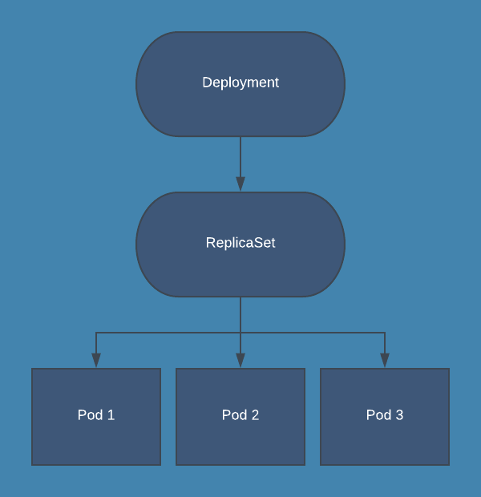

# Deployments

**A _Deployment_ provides declarative updates for Pods and ReplicaSets.**

You describe a _desired state_ in a Deployment, and the Deployment Controller changes the actual state to the desired state at a controlled rate. You can define Deployments to create new ReplicaSets, or to remove existing Deployments and adopt all their resources with new Deployments.

!!! tip
    As already mentioned in the Pods chapter, you shouldn't use naked Pods (that is, Pods not bound to a ReplicaSet or Deployment). Naked Pods will not be rescheduled in the event of a node failure.

    Instead, create them using workload resources such as Deployment or Job.


## Creating a Deployment

The following is an example of a Deployment. It creates a ReplicaSet to bring up three `nginx` Pods:

```yaml
apiVersion: apps/v1
kind: Deployment
metadata:
  name: nginx-deployment
  labels:
    app: nginx
spec:
  replicas: 3
  selector:
    matchLabels:
      app: nginx
  template:
    metadata:
      labels:
        app: nginx
    spec:
      containers:
      - name: nginx
        image: nginx:1.14.2
        ports:
        - containerPort: 80
```

In this example:

- A Deployment named `nginx-deployment` is created
- The Deployment creates a ReplicaSet that creates three replicated Pods
- The `.spec.selector` field defines how the created ReplicaSet finds which Pods to manage.
- The `template` field contains the following sub-fields:
    - The Pods are labeled `app: nginx` using the `.metadata.labels` field.
    - The Pods run one container, named `nginx`, using the `nginx:1.14.2` image from [Docker Hub](https://hub.docker.com/).



Before you begin, make sure your Kubernetes cluster is up and running and that your current context is pointing to the desired cluster. To create the above Deployment and go through this example:

1. Save the Deployment to a file named `nginx-deployment.yaml`.

1. Create the Deployment by running the following command:

    ```bash
    kubectl apply -f nginx-deployment.yaml
    ```

1. Run the following command to check if the Deployment was created.

    ```bash
    $ kubectl get deployments

    NAME               READY   UP-TO-DATE   AVAILABLE   AGE
    nginx-deployment   3/3     3            3           3h29m
    ```

    Notice that the Deployment has created all three replicas, and all replicas are up-to-date (they contain the latest Pod template) and available.

1. To see the Deployment rollout status, run the following command.

    ```bash
    $ kubectl rollout status deployment/nginx-deployment

    deployment "nginx-deployment" successfully rolled out
    ```

1. To see the ReplicaSet (`rs`) created by the Deployment, run the following command:

    ```bash
    $ kubectl get rs

    NAME                          DESIRED   CURRENT   READY   AGE
    nginx-deployment-66b6c48dd5   3         3         3       3h32m
    ```


## Failed Deployment

Your Deployment may get stuck trying to deploy its newest ReplicaSet without ever completing. This can occur due to some of the following factors:

- Insufficient quota
- Readiness probe failures
- Image pull errors
- Insufficient permissions
- Limit ranges
- Application runtime misconfiguration
