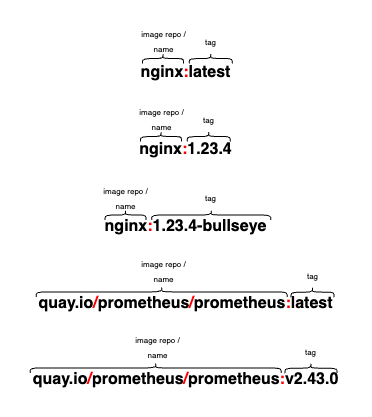

# Images

A container image represents binary data that encapsulates an application and all its software dependencies.

**You typically create a container image of your application and push it to a registry before referring to it in a Pod**.

## Image names

- Container images are usually given a name such as `pause`, `example/mycontainer`, or `kube-apiserver`. Images can also include a registry hostname; for example: `fictional.registry.example/imagename`, and possibly a port number as well; for example: `fictional.registry.example:10443/imagename`.

    !!! note
        If you don't specify a registry hostname, Kubernetes assumes that you mean the Docker public registry.

- After the image name part you can add a tag (in the same way you would when using with commands like `docker` or `podman`). **Tags let you identify different versions of the same series of images**.

- Image tags consist of lowercase and uppercase letters, digits, underscores (`_`), periods (`.`), and dashes (`-`).
    - There are additional rules about where you can place the separator characters (`_`, `-`, and `.`) inside an image tag.
    - If you don't specify a tag, Kubernetes assumes you mean the tag `latest`.

### Examples

A few examples for image names and tags:

