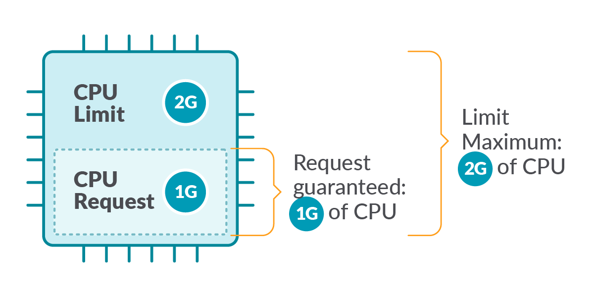
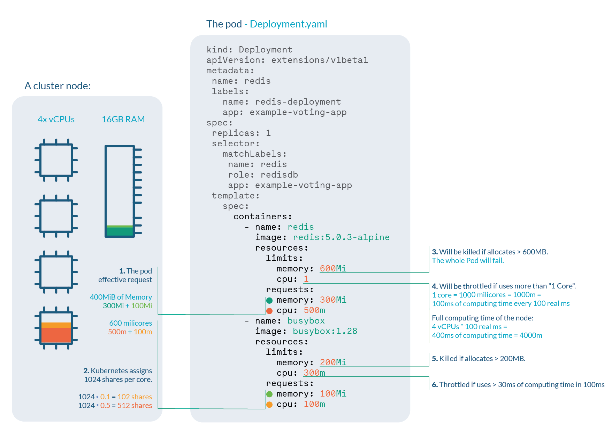
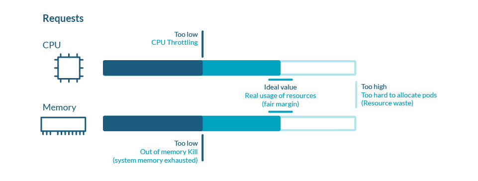
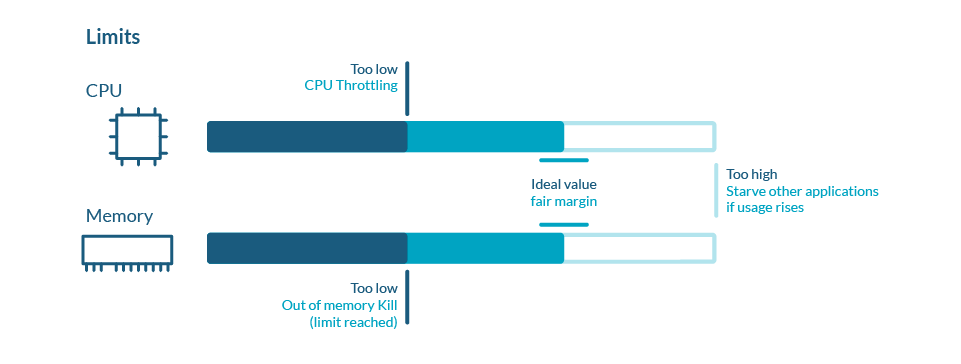
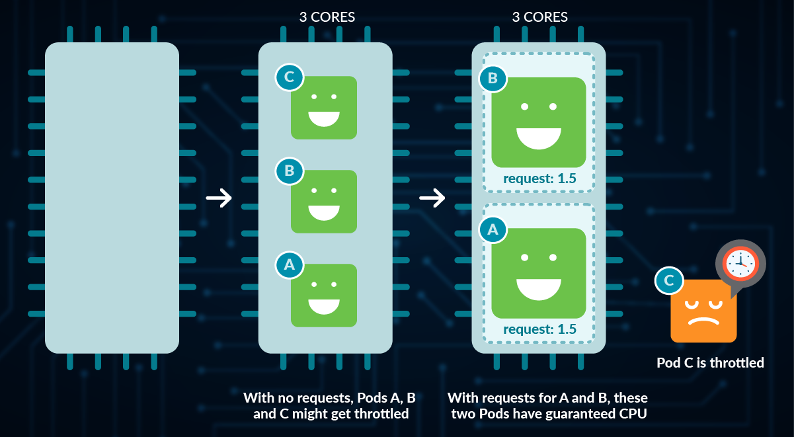
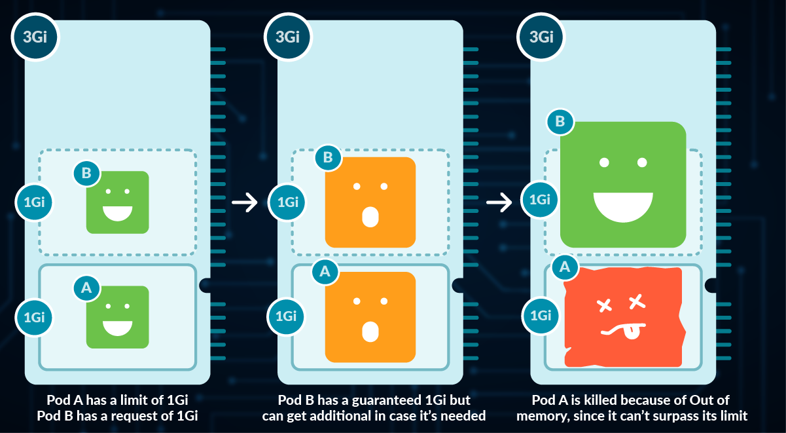

# Resource Management for Pods and Containers

When you specify a Pod, you can optionally specify how much of each resource a container needs. The most common resources to specify are CPU and memory (RAM).

- **Kubernetes defines _Limits_ as the maximum amount of a resource** to be used by a container. This means that the container can never consume more than the memory amount or CPU amount indicated.

    When you specify a **resource limit** for a container, the `kubelet` enforces those limits so that the running container is not allowed to use more of that resource than the limit you set.

- **_Requests_, on the other hand, are the minimum guaranteed amount of a resource** that is reserved for a container.

    When you specify the **resource request** for containers in a Pod:

    - the `kube-scheduler` uses this information to decide which node to place the Pod on
    - the `kubelet` also reserves at least the request amount of that system resource specifically for that container to use.




## Resource Types

_CPU_ and _memory_ are each a resource type. A resource type has a base unit. CPU represents compute processing and is specified in units of [Kubernetes CPUs](#cpu-resource-units). Memory is specified in units of bytes.

!!! note
    CPU and Memory are the most common resource types, but there are a few more. Consult the official Kubernetes documentation for all the available resource types.

!!! tip
    Although you can only specify requests and limits for individual containers, it is also useful to think about the **overall resource requests and limits for a Pod**. For a particular resource, a Pod resource request/limit is the sum of the resource requests/limits of that type for each container in the Pod.


## Resource units in Kubernetes

### CPU resource units

Limits and requests for CPU resources are measured in cpu units. In Kubernetes, 1 CPU unit is equivalent to **1 physical CPU core**, or **1 virtual core**, depending on whether the node is a physical host or a virtual machine running inside a physical machine.

Fractional requests are allowed. When you define a container with `spec.containers[].resources.requests.cpu` set to `0.5`, you are requesting half as much CPU time compared to if you asked for `1.0` CPU. For CPU resource units, the quantity expression `0.1` is equivalent to the expression `100m`, which can be read as "one hundred millicpu". Some people say "one hundred millicores".

### Memory resource units

Limits and requests for memory are measured in bytes. You can express memory as a plain integer or as a fixed-point number using one of these quantity suffixes: E, P, T, G, M, k. You can also use the power-of-two equivalents: Ei, Pi, Ti, Gi, Mi, Ki. For example: `100M`, `250Mi`, `1Gi`, etc.

!!! note
    A Mebibyte (and their analogues Kibibyte, Gibibyte,…) is 2 to the power of 20 bytes. It was created to avoid the confusion with the Kilo, Mega definitions of the metric system. You should be using this notation, as it’s the canonical definition for bytes, while Kilo and Mega are multiples of 1000

## Example

Let’s have a look at this Deployment, where we are setting up limits and requests for two different containers on both CPU and Memory:

```yaml
apiVersion: apps/v1
kind: Deployment
metadata:
  name: resource-req-and-limits
  labels:
    app.kubernetes.io/name: resource-req-and-limits
spec:
  replicas: 1
  selector:
    matchLabels:
      app.kubernetes.io/name: resource-req-and-limits
  template:
    metadata:
      labels:
        app.kubernetes.io/name: resource-req-and-limits
    spec:
      containers:
      - name: redis
        image: redis:7.0.8-alpine
        resources:
          limits:
            memory: 600Mi
            cpu: 1
          requests:
            memory: 300Mi
            cpu: 500m
      - name: busybox
        image: busybox:1.36
        args: ["/bin/sh", "-c", "sleep infinity"]
        resources:
          limits:
            memory: 200Mi
            cpu: 300m
          requests:
            memory: 100Mi
            cpu: 100m
```

Let’s say we are running a cluster with, for example, 4 cores and 16GB RAM nodes. We can extract a lot of information:



1. **Pod effective request** is 400 MiB of memory and 600 millicores of CPU. You need a node with enough free allocatable space to schedule the pod.
1. **CPU shares** for the redis container will be 512, and 102 for the busybox container. Kubernetes always assign 1024 shares to every core, so redis: 1024 * 0.5 cores = 512 and busybox: 1024 * 0.1cores = 102
1. Redis container will be **OOM killed** if it tries to allocate more than 600MB of RAM, most likely making the pod fail.
1. Redis will suffer **CPU throttle** if it tries to use more than 100ms of CPU in every 100ms, (since we have 4 cores, available time would be 400ms every 100ms) causing performance degradation.
1. Busybox container will be **OOM killed** if it tries to allocate more than 200MB of RAM, resulting in a failed pod.
1. Busybox will suffer **CPU throttle** if it tries to use more than 30ms of CPU every 100ms, causing performance degradation.


## Kubernetes Requests

Kubernetes defines requests as a **guaranteed minimum amount of a resource** to be used by a container.

Basically, it will set the minimum amount of the resource for the container to consume.

When a Pod is scheduled, `kube-scheduler` will check the Kubernetes requests in order to allocate it to a particular Node that can satisfy _at least_ that amount for all containers in the Pod. If the requested amount is higher than the available resource, the Pod will not be scheduled and remain in `Pending` status.

Requests are used:

- When allocating Pods to a Node, so the indicated requests by the containers in the Pod are satisfied.
- At runtime, the indicated amount of requests will be guaranteed as a minimum for the containers in that Pod.



## Kubernetes Limits

Kubernetes defines **limits** as a **maximum amount of a resource** to be used by a container.

This means that the container can never consume more than the memory amount or CPU amount indicated.

Limits are used:

- When allocating Pods to a Node. If no requests are set, by default, Kubernetes will assign requests = limits.
- At runtime, Kubernetes will check that the containers in the Pod are not consuming a higher amount of resources than indicated in the limit.




## Fetch metrics for the Pods

Run `kubectl top` to fetch the metrics for the Pods:

```bash
$ kubectl top pods


NAME                                       CPU(cores)   MEMORY(bytes)
nginx-deployment-559d658b74-2rhds          0m           52Mi
nginx-deployment-559d658b74-885xm          0m           1Mi
nginx-deployment-559d658b74-dvlhl          0m           1Mi
nginx-deployment-559d658b74-fbfl8          0m           26Mi
nginx-deployment-559d658b74-kl4t6          0m           1Mi
nginx-deployment-559d658b74-lchj2          0m           1Mi
nginx-deployment-559d658b74-qsm7p          0m           1Mi
nginx-deployment-559d658b74-tk6t7          0m           1Mi
nginx-deployment-559d658b74-v55sg          0m           1Mi
nginx-deployment-559d658b74-wg6s7          0m           1Mi
resource-req-and-limits-77d745c8fc-prfk9   2m           2Mi
```

If your Pod doesn't show up on the `kubectl top pods` command, wait a few seconds, until the next scrape of the [metrics-server](https://github.com/kubernetes-sigs/metrics-server).

!!! info
    [Metrics Server](https://github.com/kubernetes-sigs/metrics-server) is a scalable, efficient source of container resource metrics for Kubernetes built-in autoscaling pipelines.

    Metrics Server collects resource metrics from Kubelets and exposes them in Kubernetes apiserver through [Metrics API](https://github.com/kubernetes/metrics). Metrics API can be accessed by `kubectl top`.

    Metrics Server is usually provided by the cluster administrators.


To fetch metrics for every container in the Pods, you can append the `--containers` flag to the `kubectl top` command:

```diff
$ kubectl top pods --containers


  POD                                        NAME      CPU(cores)   MEMORY(bytes)
  nginx-deployment-559d658b74-2rhds          nginx     0m           52Mi
  nginx-deployment-559d658b74-885xm          nginx     0m           1Mi
  nginx-deployment-559d658b74-dvlhl          nginx     0m           1Mi
  nginx-deployment-559d658b74-dvlhl          nginx     0m           1Mi
  nginx-deployment-559d658b74-dvlhl          nginx     0m           1Mi
  nginx-deployment-559d658b74-fbfl8          nginx     0m           26Mi
  nginx-deployment-559d658b74-kl4t6          nginx     0m           1Mi
  nginx-deployment-559d658b74-lchj2          nginx     0m           1Mi
  nginx-deployment-559d658b74-qsm7p          nginx     0m           1Mi
  nginx-deployment-559d658b74-tk6t7          nginx     0m           1Mi
  nginx-deployment-559d658b74-v55sg          nginx     0m           1Mi
  nginx-deployment-559d658b74-wg6s7          nginx     0m           1Mi
+ resource-req-and-limits-77d745c8fc-prfk9   busybox   0m           0Mi
+ resource-req-and-limits-77d745c8fc-prfk9   redis     2m           2Mi
```

You can also fetch metrics for Pods and sort it by 'cpu' _or_ 'memory':

```bash
kubectl top pods --sort-by=memory
```


## CPU particularities

CPU is a **compressible resource**, meaning that it can be stretched in order to satisfy all the demand. In case that the processes request too much CPU, some of them will be throttled.

**CPU** represents **computing processing time**, measured in cores. 

- You can use millicores (m) to represent smaller amounts than a core (e.g., 500m would be half a core)
- The minimum amount is 1m
- A Node might have more than one core available, so requesting CPU > 1 is possible
- Kubernetes uses **kernel throttling** to implement CPU limit. If an application goes above the limit, it gets throttled (aka fewer CPU cycles).




## Memory particularities

**Memory** is a **non-compressible** resource, meaning that it can’t be stretched in the same manner as CPU. If a process doesn’t get enough memory to work, the process is killed.

Memory is measured in Kubernetes in **bytes**.

- You can use, E, P, T, G, M, k to represent Exabyte, Petabyte, Terabyte, Gigabyte, Megabyte and kilobyte, although only the last four are commonly used. (e.g., 500M, 4G)
- Warning: don’t use lowercase m for memory (this represents Millibytes, which is ridiculously low)
- You can define Mebibytes using Mi, as well as the rest as Ei, Pi, Ti (e.g., 500Mi)




## Exceed a Container's memory limit

A Container can exceed its memory request if the Node has memory available. But a Container is not allowed to use more than its memory limit. If a Container allocates more memory than its limit, the Container becomes a candidate for termination. If the Container continues to consume memory beyond its limit, the Container is terminated. If a terminated Container can be restarted, the kubelet restarts it

In this example, we create a Pod that attempts to allocate more memory than its limit. Here is the configuration file for a Pod that has one Container with a memory request of 50 MiB and a memory limit of 100 MiB:

```yaml
apiVersion: v1
kind: Pod
metadata:
  name: exceeding-memory-limits
spec:
  containers:
  - name: memory-demo-2-ctr
    image: polinux/stress
    resources:
      requests:
        memory: "50Mi"
      limits:
        memory: "100Mi"
    command: ["stress"]
    args: ["--vm", "1", "--vm-bytes", "250M", "--vm-hang", "1"]
```

In the args section of the configuration file, you can see that the Container will attempt to allocate 250 MiB of memory, which is well above the 100 MiB limit.

Once the above manifest is applied,

```bash
$ kubectl get pods exceeding-memory-limits


NAME                      READY   STATUS      RESTARTS      AGE
exceeding-memory-limits   0/1     OOMKilled   1             10s
```

Get a more detailed view of the Container status:

```bash
kubectl get pod exceeding-memory-limits -o yaml
```

The output shows that the Container was killed because it is out of memory (OOM):

```bash
lastState:
    terminated:
    containerID: containerd://136ef6c8d24a6a0b9cd60ae8625ba483d0b8bc471861f40588bab89369bf1802
    exitCode: 1
    finishedAt: "2023-02-21T16:12:15Z"
    reason: OOMKilled
    startedAt: "2023-02-21T16:12:14Z"
```

## Extras

!!! note
    The following sections are mostly focused on the administration aspect of the K8s cluster.

### Namespace ResourceQuota

With [`ResourceQuotas`](https://kubernetes.io/docs/concepts/policy/resource-quotas/), you can **set a memory or CPU limit to the entire namespace**, ensuring that entities in it can’t consume more from that amount.

### Namespace LimitRange

[`LimitRanges`](https://kubernetes.io/docs/concepts/policy/limit-range/) are a Kubernetes policy that **restricts the resource settings for _each_ entity in a namespace**. A LimitRange provides constraints that can:

- Enforce minimum and maximum compute resources usage per Pod or Container in a namespace.
- Enforce minimum and maximum storage request per PersistentVolumeClaim in a namespace.
- Enforce a ratio between request and limit for a resource in a namespace.
- Set default request/limit for compute resources in a namespace and automatically inject them to Containers at runtime.


## Resources

- [Official Kubernetes docs, Resource Management for Pods and Containers](https://kubernetes.io/docs/concepts/configuration/manage-resources-containers/)
- [Sysdig, Understanding Kubernetes Limits and Requests](https://sysdig.com/blog/kubernetes-limits-requests/)
- [Omio Engineering, CPU limits and aggressive throttling in Kubernetes](https://medium.com/omio-engineering/cpu-limits-and-aggressive-throttling-in-kubernetes-c5b20bd8a718)
