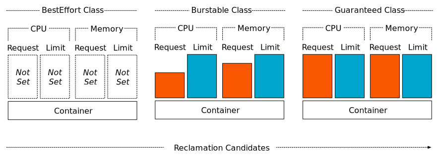

# Quality of Service for Pods

Kubernetes uses Quality of Service (QoS) classes to make decisions about evicting Pods when Node resources are exceeded.

When Kubernetes creates a Pod it assigns one of these QoS classes to the Pod:

- [Guaranteed](#guaranteed)
- [Burstable](#burstable)
- [BestEffort](#besteffort)

Resource Requests and Limits and QoS Classes are tightly coupled.

## Guaranteed

Pods that are `Guaranteed` have the strictest resource limits and are least likely to face eviction. They are guaranteed not to be killed until they exceed their limits or there are no lower-priority Pods that can be preempted from the Node.

### Criteria
For a Pod to be given a QoS class of Guaranteed:

- Every Container in the Pod must have a memory limit and a memory request.
- For every Container in the Pod, the memory limit must equal the memory request.
- Every Container in the Pod must have a CPU limit and a CPU request.
- For every Container in the Pod, the CPU limit must equal the CPU request.

## Burstable

Pods that are `Burstable` have some lower-bound resource guarantees based on the request, but do not require a specific limit. If a limit is not specified, it defaults to a limit equivalent to the capacity of the Node, which allows the Pods to flexibly increase their resources if resources are available. In the event of Pod eviction due to Node resource pressure, these Pods are evicted only after all `BestEffort` Pods are evicted. Because a `Burstable` Pod can include a Container that has no resource limits or requests, a Pod that is `Burstable` can try to use any amount of node resources.

### Criteria

A Pod is given a QoS class of Burstable if:

- The Pod does not meet the criteria for QoS class Guaranteed.
- At least one Container in the Pod has a memory or CPU request or limit.

## BestEffort

Pods in the `BestEffort` QoS class can use node resources that aren't specifically assigned to Pods in other QoS classes. For example, if you have a node with 16 CPU cores available to the kubelet, and you assign 4 CPU cores to a Guaranteed Pod, then a Pod in the `BestEffort` QoS class can try to use any amount of the remaining 12 CPU cores.

The kubelet prefers to evict `BestEffort` Pods if the node comes under resource pressure.

### Criteria

A Pod has a QoS class of `BestEffort` if it doesn't meet the criteria for either `Guaranteed` or `Burstable`. In other words, a Pod is `BestEffort` only if none of the Containers in the Pod have a memory limit or a memory request, and none of the Containers in the Pod have a CPU limit or a CPU request. Containers in a Pod can request other resources (not CPU or memory) and still be classified as `BestEffort`.

## Overview

