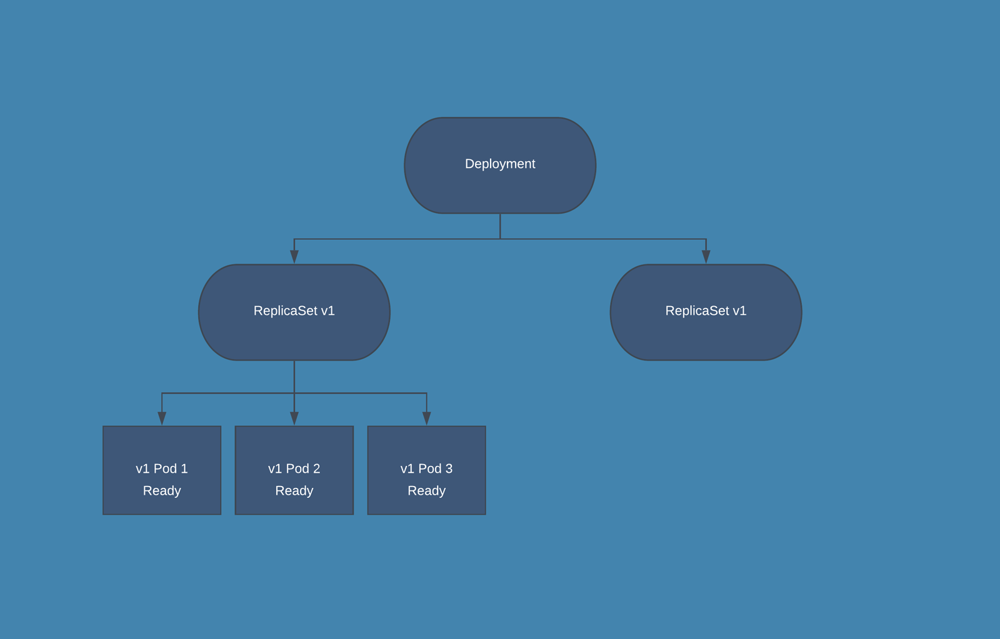

# Rolling Update

A rolling deployment involves **gradually replacing** an older version of the application with a new one. This software deployment strategy helps gradually replace the infrastructure running the application until the rolling deployment becomes the only version. It is the default deployment strategy in Kubernetes.

## How Rolling Deployment Works

In a rolling upgrade, only a portion of the application server’s capacity is taken offline at any given time, meaning the update can be performed with no downtime. 

Rolling deployments use the concept of a window size — this is the number of servers that are updated at any given time. For example, if a Kubernetes cluster is running 10 instances of an application (10 pods), and you want to update two of them at a time, you can perform a rolling deployment with a window size of 2.

This process ensures there are always instances of the application online and ready to serve user requests throughout the deployment process.

Here is an illustration of how the rolling deployments work in Kubernetes:



## Defining a Rolling Deployment in Kubernetes

Rolling deployment is the default deployment strategy in Kubernetes. It lets you update a set of pods with no downtime, by incrementally replacing pod instances with new instances that run a new version of the application. The new pods are scheduled on eligible nodes (they may not run on the same nodes as the original pods).

Here is a simple example of a Deployment object. This object runs 10 instances of an nginx container image, using the container image `nginx:1.14.2`, and uses the `RollingUpdate` strategy:

```yaml
apiVersion: apps/v1
kind: Deployment
metadata:
  name: nginx-deployment
  labels:
    app: nginx
spec:
  replicas: 10
  selector:
    matchLabels:
      app: nginx
  strategy: 
    type: RollingUpdate
    rollingUpdate:
      maxSurge: 1
      maxUnavailable: 0
  template:
    metadata:
      labels:
        app: nginx
    spec:
      containers:
      - name: nginx
        image: nginx:1.14.2
        ports:
        - containerPort: 80
```

You can set two optional parameters that define how the rolling update takes place:

- `.spec.strategy.rollingUpdate.maxUnavailable`: specifies the maximum number of Pods that can be unavailable during the update process. The value can be an absolute number (for example, 5) or a percentage of desired Pods (for example, 10%). The absolute number is calculated from percentage by rounding down. The default value is 25%.
- `.spec.strategy.rollingUpdate.maxSurge`: specifies the maximum number of Pods that can be created over the desired number of Pods. The value can be an absolute number (for example, 5) or a percentage of desired Pods (for example, 10%). The absolute number is calculated from the percentage by rounding up. The default value is 25%.

Once you apply the Deployment object in the cluster, you can trigger a rolling update by updating the pod image:

```bash
kubectl set image deployment/nginx-deployment nginx=nginx:1.16.1
```

List all Pods:

```bash
kubectl get pods --watch
```

and you should be able to see that only 1 Pod can be created over the desired number of Pods (based on the `maxSurge` value) and have 0 Pods unavailable during the update process.

## When to Use a Rolling Deployment?

Rolling deployments are suitable for applications that run on multiple server instances, in such a way that some servers can be taken offline without significant performance degradation. It is also useful for deployments with minor changes, or when there is a high likelihood that pods will update successfully and quickly.

However, rolling deployments can be problematic when:

- The new version has changes that can break the user’s experience or previous transactions. 
- During the deployment, some users will have a different experience than others, which can create challenges for technical support and other teams interfacing with the application.
- There is a need to roll out the new version quickly—rolling updates can take time and the total deployment time is sometimes unpredictable.
