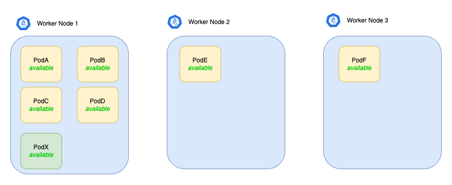
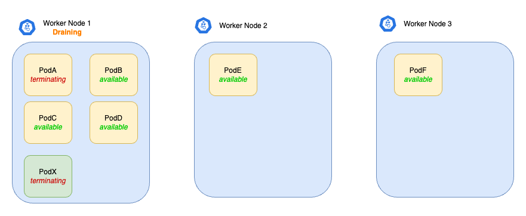
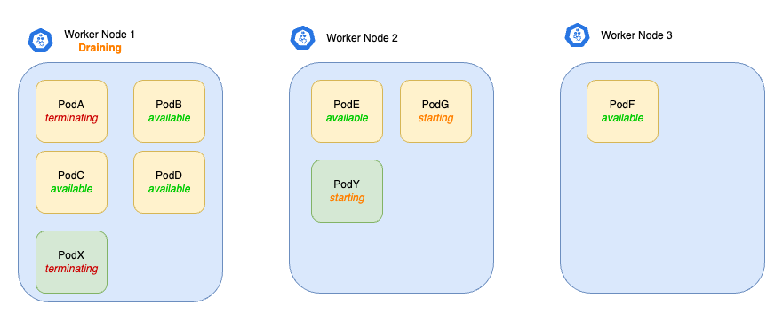
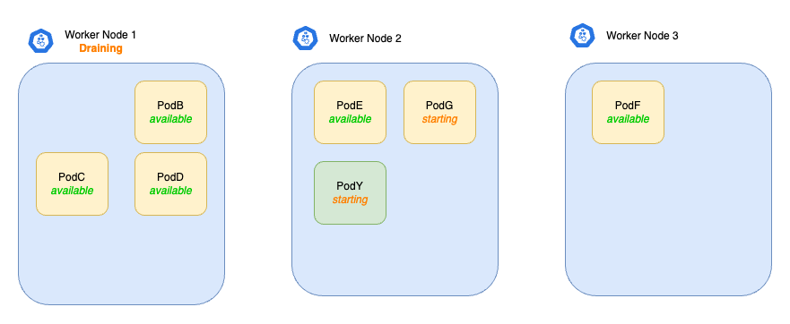
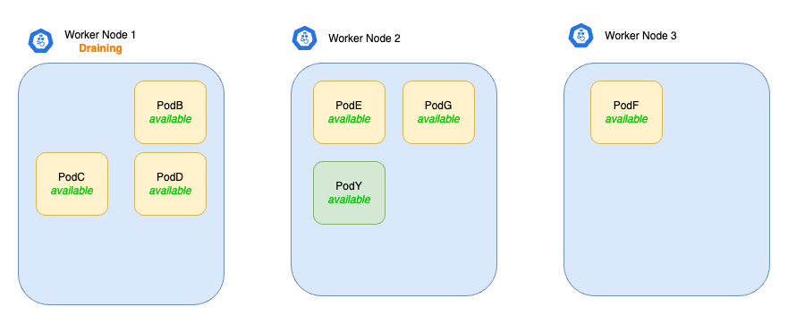
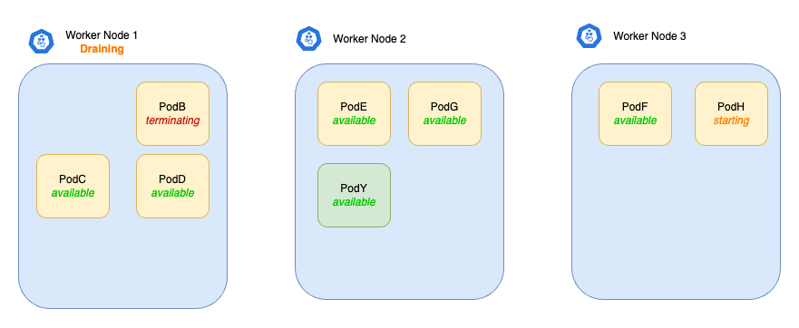
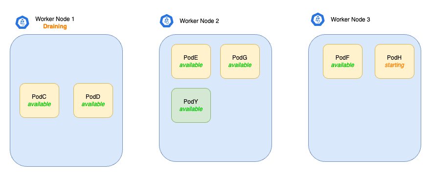
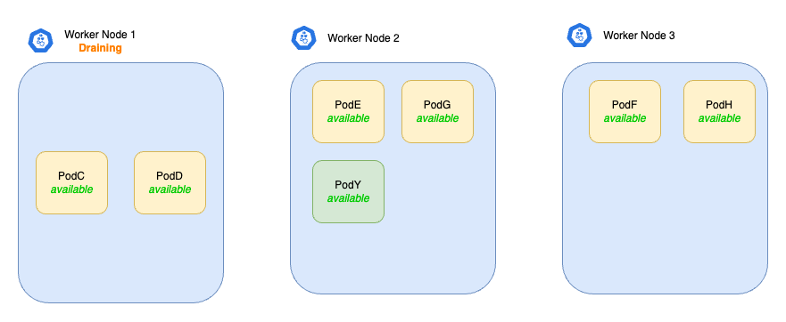
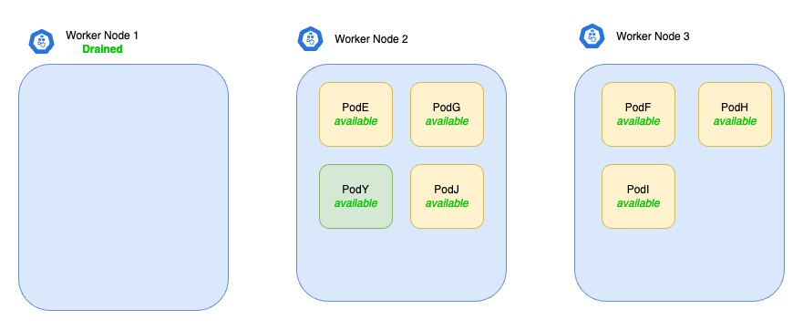

# Disruptions

## Voluntary and involuntary disruptions

Pods do not disappear until:

- someone (a person or a controller) destroys them (e.g. updating a Deployment's pod template causing a restart, draining a node for repair or upgrade, etc.) - we call other cases _voluntary disruptions_ to an application.
- there is an unavoidable hardware or system software error (e.g. hardware failure, hypervisor failure, kernel panic, etc.). - we call these unavoidable cases _involuntary disruptions_.

These actions might be taken directly by the cluster administrator, or by automation run by the cluster administrator, or sometimes by users.

!!! note
    **Caution**: Not all _voluntary disruptions_ are constrained by Pod Disruption Budgets. For example, deleting Deployments or pods bypasses Pod Disruption Budgets.

## Dealing with disruptions

Here are some ways to mitigate involuntary disruptions:

- Ensure your Pod requests the resources it needs (using resource requests).
- Replicate your application if you need higher availability.
- For even higher availability when running replicated applications, spread applications across racks (using anti-affinity) or across zones (if using a multi-zone cluster.)

## Pod disruption budgets

Kubernetes offers features to help you run highly available applications even when you introduce frequent voluntary disruptions.

As an application owner, you can create a **PodDisruptionBudget (PDB)** for each application. **A PDB limits the number of Pods of a replicated application that are down simultaneously from voluntary disruptions**.

A PDB specifies the number of replicas that an application can tolerate having, relative to how many it is intended to have. For example, a Deployment which has a `.spec.replicas: 5` is supposed to have 5 pods at any given time. If its PDB allows for there to be 4 at a time, then the Eviction API will allow voluntary disruption of one (but not two) pods at a time.

Involuntary disruptions cannot be prevented by PDBs; however they do count against the budget.

Pods which are deleted or unavailable due to a rolling upgrade to an application do count against the disruption budget, but workload resources (such as Deployment and StatefulSet) are not limited by PDBs when doing rolling upgrades. Instead, the handling of failures during application updates is configured in the spec for the specific workload resource.

## PodDisruptionBudget example

- Consider a cluster with 3 nodes, `node-1` through `node-3`. The cluster is running several applications:
    - One of them has 6 replicas initially; `PodA` through `PodF` (yellow boxes).
    - Another, unrelated pod without a PDB, called `PodX` (green box), is also shown.

- Initially, the pods are laid out as follows:
    
    

    All 6 Pods of the yellow boxes are part of a Deployment, and they collectively have a **PDB which requires a maximum of 1 unavailable Pod at all times** (Note: As the application developer you can specify the maximum unavailable Pods to the desired value. In this example, we assume that the application developer has specified 1 maximum unavailable Pod on the PDB object).

- Let's assume the cluster administrator wants to reboot into a new kernel version to fix a bug in the kernel. The cluster administrator first tries to drain `node-1` and `PodA` and `PodX` are being evicted. Both Pods go into the terminating state at the same time. This puts the cluster in this state:

    

    The pods `PodB`, `PodC` and `PodD` cannot be yet evicted, as we have defined the PDB with 1 maximum unavailable Pod at all times.

- The Deployment notices that one of the Pods is terminating, so it creates a replacement called `PodG`. Since `node-1` is cordoned, it lands on another node. Something has also created `PodY` as a replacement for `PodX`. Now the cluster is in this state:

    

- At this point, if an impatient cluster administrator tries to drain `node-2` or `node-3`, the drain command will block, because there is already one unavailable Pod for the Deployment. At some point, the pods terminate, and the cluster looks like this:

    

- After some time passes, `PodG` and `PodY` become available. The cluster state now looks like this:

    

- Now the draining of the worker node `node-1` can continue, since there's no violation of the PDB. Therefore, `PodB` goes in a terminating state. The Deployment notices that one of the Pods is terminating, so it creates a replacement called `PodH`:

    

- At some point, the pod terminates, and the cluster looks like this:

    

- After some time passes, `PodH` becomes available. The cluster state now looks like this

    

- Same procedure will be followed for the remaining Pods in `node-1`. Once this is completed (and all Pods have been removed from `node-1`), the cluster looks like this:

    
