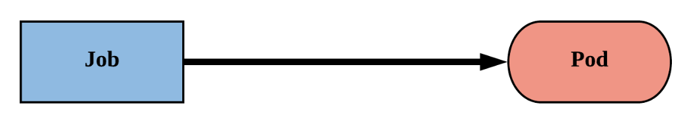

# Jobs

A Job creates one or more Pods and will continue to retry execution of the Pods until a specified number of them successfully terminate.

Deleting a Job will clean up the Pods it created.



A simple case is to create one Job object in order to reliably run one Pod to completion. The Job object will start a new Pod if the first Pod fails or is deleted (for example due to a node hardware failure or a node reboot).

You can also use a Job to run multiple Pods in parallel.

If you want to run a Job (either a single task, or several in parallel) on a schedule, see CronJob.

## Job Types

There are three main types of task suitable to run as a Job:

1. Non-parallel Jobs
    - normally, only one Pod is started, unless the Pod fails.
    - the Job is complete as soon as its Pod terminates successfully.

1. Parallel Jobs with a _fixed completion count_:
    - specify a non-zero positive value for .spec.completions.
    - the Job represents the overall task, and is complete when there are .spec.completions successful Pods.

1. Parallel Jobs with a work queue

    - running multiple tasks in parallel. In many cases, it is impractical to complete one task and then start another. It can be much more efficient, and make better use of available computing resources, to support parallelism.


## Example

Here is an example Job config. It computes π to 2000 places and prints it out. It takes around 10s to complete.

```yaml
apiVersion: batch/v1
kind: Job
metadata:
  name: pi
spec:
  template:
    spec:
      containers:
      - name: pi
        image: perl:5.34.0
        command: ["perl",  "-Mbignum=bpi", "-wle", "print bpi(2000)"]
      restartPolicy: Never
  backoffLimit: 4
```


!!! note
    Note that you _cannot_ set the restart policy to `Always`. The Job must not restart the Pod after successful termination. Only a RestartPolicy equal to `Never` or `OnFailure` is allowed.


You can check the status of the Job with `kubectl`. A couple of commands that come handy:

```bash
kubectl describe job pi
```

and

```bash
kubectl get job pi -o yaml
```

### Listing Resources

- To view completed Pods of a Job, use `kubectl get pods`.

- To list all the Pods that belong to a Job in a machine readable form, you can use a command like this:

    ```bash
    pods=$(kubectl get pods --selector=job-name=pi --output=jsonpath='{.items[*].metadata.name}')

    echo $pods
    ```

## Completions & Parallelism

when we create a Job, it creates a single Pod and performs the given task. You’ve already experienced it via the above example. But using completions we can initiate several pods one after the other.

```yaml
apiVersion: batch/v1
kind: Job
metadata:
  name: pi-completions
spec:
  completions: 2
  template:
    spec:
      containers:
      - name: pi
        image: perl:5.34.0
        command: ["perl",  "-Mbignum=bpi", "-wle", "print bpi(2000)"]
      restartPolicy: Never
```

Once you added the `.spec.completions` field, you’ll see two Pods are created for this Job. Use the `kubectl get pods` command to see the created Pods:

```bash
$ kubectl get pods -l job-name=pi-completions -w


NAME                      READY   STATUS      RESTARTS   AGE
pi-completions--1-blb4p   0/1     Completed   0          7s
pi-completions--1-rmv8z   0/1     Pending     0          0s
```

As you might observe, the Pods don't run in parallel.

You can use `.spec.parallelism` to run multiple Pods at the same time:

```yaml
apiVersion: batch/v1
kind: Job
metadata:
  name: pi-parallel
spec:
  completions: 2
  parallelism: 2
  template:
    spec:
      containers:
      - name: pi
        image: perl:5.34.0
        command: ["perl",  "-Mbignum=bpi", "-wle", "print bpi(2000)"]
      restartPolicy: Never
```

You can set the maximum number of Pods you need to run for this particular Job under the `.spec.completions` field and you can define how many Pods should run in parallel under the `.spec.parallelism` field.

Once the above manifest is applied, you can watch the Pods lifecycle (e.g. creation, completion and parallelism):


## Guidelines

Guidelines on writing a Job spec can be found [here](https://kubernetes.io/docs/concepts/workloads/controllers/job/#writing-a-job-spec).

The name of a Job must be a **valid DNS subdomain** value, but this can produce unexpected results for the Pod hostnames. Even when the name is a DNS subdomain, **the name must be no longer than 63 characters**.

The `.spec.template` is a Pod template and it's required. It has exactly the same schema as a Pod.


## Job termination and cleanup

When a Job completes, no more Pods are created, but the Pods are usually not deleted either. Keeping them around allows you to still view the logs of completed pods to check for errors, warnings, or other diagnostic output. The job object also remains after it is completed so that you can view its status. It is up to the user to delete old jobs after noting their status.

!!! note
    In Kubernetes v1.23 there's a stable feature that provides [TTL mechanism for finished Jobs](https://kubernetes.io/docs/concepts/workloads/controllers/job/#ttl-mechanism-for-finished-jobs).
