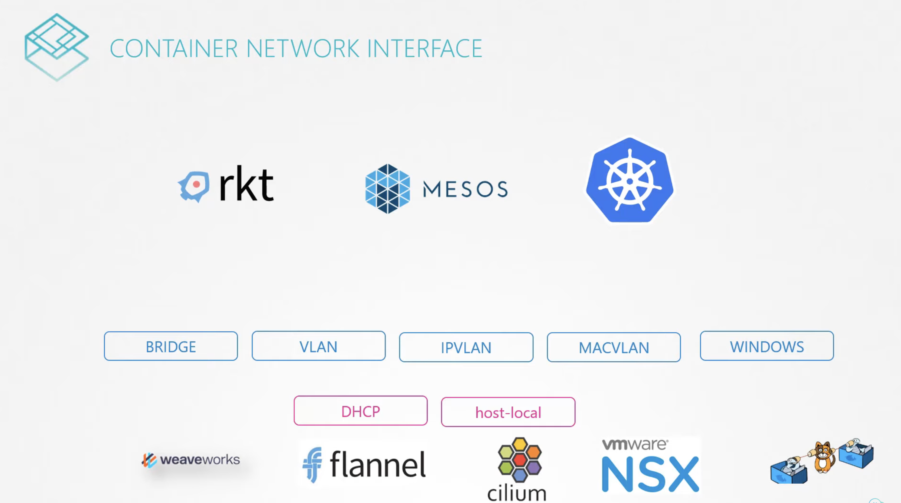
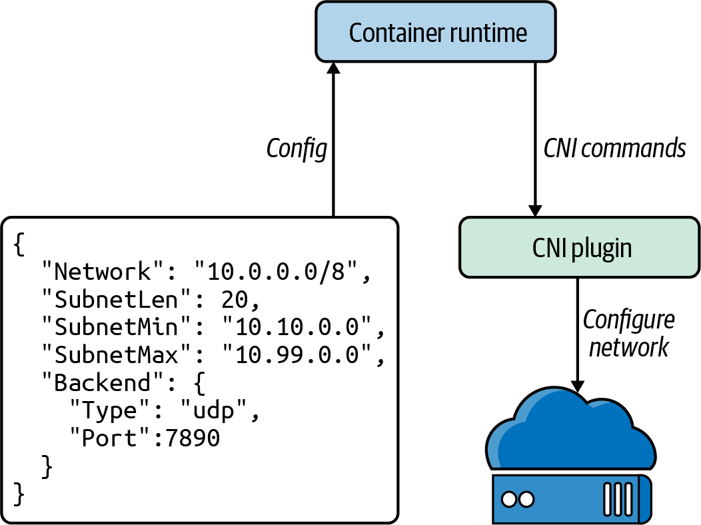
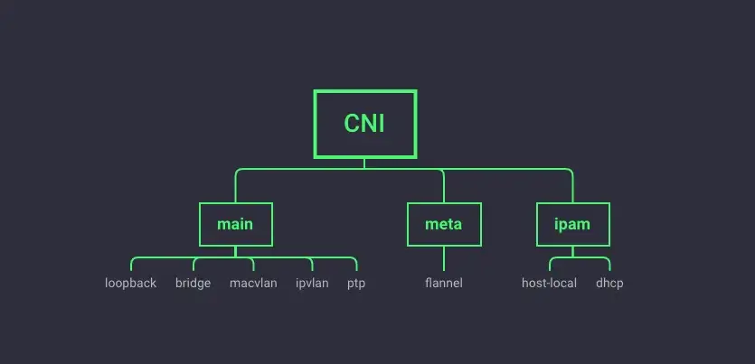

# Container Network Interface (CNI)

**Container Network Interface** (**CNI**) is a framework for **dynamically configuring networking resources**.

**CNI is the software interface between the container runtime and the network implementation**.

CNI consists of a specification and libraries for writing plugins to configure networks interfaces in Linux containers, along with a nuimber of supported plugins. CNI concerns itself only with network connectivity of containers and removing allocated resources when the container is deleted.

CNI uses a **software-defined networking (SDN)** approach to unify container communication throughout clusters.

**The plugin specification defines an interface for configuring the network, provisioning IP addresses, and maintaining connectivity with multiple hosts**.

When used with Kubernetes, CNI can integrate smoothly with the kubelet to enable the use of an **_overlay_** network to automatically configure the network between pods.

!!! info
    An _overlay network_ is a virtual network which is routed on top of underlay netowork infrastructure. Routing decision would take place with the help of software.

    Some overlay network providers operate in Layer2 (e.g. use VXLAN to encapsulate Layer2 Ethernet inside a UDP packet) and some in Layer3 (e.g. use IPinIP protocol).

An overview of CNI can be seen below:

## Plugins

The container/pod initially has no network interface. The container runtime calls the CNI plugin with verbs such as `ADD`, `DEL`, `CHECK`, and `VERSION`:

- `ADD`: Add container to network, or apply modifications
- `DEL`: Remove container from network, or un-apply modifications
- `CHECK`: Check container's networking is as expected

The plugins:

- Must support command line arguments `ADD`/`DEL`/`CHECK`/etc.
- Must support parameters, such as container ID, network namespace, etc.
- Must manage IP Address assignement to PODs
- Must return results in a specific format

The official CNI plugin is currently divided into three categories:

- **main** — The main plug-in that implements a specific network function.
- **meta** — Itself does not provide specific network functions, it will call other plug-ins, or simply for testing.
- **IPAM** (IP Address Management) — A plug-in for assigning IP addresses.

Example of plugins:

- **main** functions
    - **ptp** – creates a veth link in the root namespace and plugs the other end into the Pod’s namespace.
    - **bridge**: does the same but also connects the rootNS end of the link to the bridge. Similar to Docker’s default network model, connecting all containers to a virtual switch.
    - **loopback**: This plugin is very simple, it is responsible for generating the `lo` network card and configuring it `127.0.0.1/8` address.
- **IPAM** functions
    - **host-local**: IP allocation and management based on local files, save the allocated IP address in the file.
    - **dhcp**: get an IP address from an already running DHCP server.

## Main Goals

A CNI plugin must provide at least the following two things:

- **Connectivity** - making sure that a Pod gets its default `eth0` interface with IP reachable from the root network namespace of the hosting Node.
- **Reachability** - making sure that Pods from other Nodes can reach each other directly without NAT.

!!! note
    The Container Runtime (e.g. [containerd](https://kubernetes.io/docs/setup/production-environment/container-runtimes/#containerd)) is responsible for the network namespace(s) creation and deletion.

### Execution flow of the CNI plugins

1. Kubernetes creates the container in the desired namespace.
1. When the container runtime expects to perform network operations on a container, it (like the kubelet in the case of Kubernetes) calls the CNI plugin with the desired command.
1. The container runtime also provides related network configuration and container-specific data to the plugin.
1. The CNI plugin performs the required operations and reports the result.

CNI is called (at least) twice by Kubernetes (kubelet) to set up `loopback` and `eth0` interfaces for a pod.

### Connectivity

Connectivity requirement is the most straight-forward one to understand – every Pod must have a NIC to communicate with anything outside of its own network namespace. Some local processes on the Node (e.g. kubelet) need to reach PodIP from the root network namespace (e.g. to perform health and readiness checks), hence the root NS connectivity requirement.

### Reachability

Reachability, on the other hand, may require a bit of unpacking:

- Every Pod gets a unique IP from a `PodCIDR` range configured on the Node.
- This range is assigned to the Node during kubelet bootstrapping phase.
- Nodes are not aware of `PodCIDRs` assigned to other Nodes, allocations are normally managed by the controller-manager.

## Secondary Goals

In addition to the base functionality described above, there’s always a need to do things like:

- **IP address management** to keep track of IPs allocated to each individual Pod.
- **Port mappings** to expose Pods to the outside world.
- **Bandwidth control** to control egress/ingress traffic rates.
- **Source NAT** for traffic leaving the cluster (e.g. Internet)

## Docker and CNI

- Docker doesn't implement CNI.
- Docker has its own set of standards for networking, named Container Network Model (CNM).

## CNI Open-Source Implementations

There are several open source projects that implement CNI plugins with various features and functionality.

The following tables gives a brief overview of the major CNI plugins to choose from:

| Name      | NetworkPolicy support | Data storage          | Network setup                  |
|:---------:|:---------------------:|:---------------------:|:------------------------------:|
| Cilium    | Yes                   | etcd or consul        | Ipvlan(beta), veth, L7 aware   |
| Flannel   | No                    | etcd                  | Layer 3 IPv4 overlay network   |
| Calico    | Yes                   | etcd or Kubernetes API| Layer 3 network using BGP      |
| Weave Net | Yes                   | No external cluster store | Mesh overlay network       |

An outline of some of the above CNI plugins:

- [_Cilium_](https://cilium.io/)

    Cilium is open source software for securing network connectivity between application containers. Cilium is an L7/HTTP-aware CNI and can enforce network policies on L3–L7 using an identity-based security model decoupled from network addressing. A Linux technology eBPF powers it.

- [_Flannel_](https://github.com/flannel-io/flannel)

    Flannel is a simple way to configure a layer 3 network fabric designed for Kubernetes. Flannel focuses on networking. Flannel uses the Kubernetes cluster’s existing `etcd` datastore to store its state information to avoid providing a dedicated one.

- [_Calico_](https://www.tigera.io/project-calico/)

    According to Calico, it “combines flexible networking capabilities with run-anywhere security enforcement to provide a solution with native Linux kernel performance and true cloud-native scalability.” It has full network policy support and works well in conjunction with other CNIs. Calico does not use an overlay network. Instead, Calico configures a layer 3 network that uses the BGP routing protocol to route packets between hosts. Calico can also integrate with Istio, a service mesh, to interpret and enforce policy for workloads within the cluster, both at the service mesh and the network infrastructure layers.

There are many more options for a CNI, and it is up to the cluster administrator, network admins, and application developers to best decide which CNI solves their business use cases.
