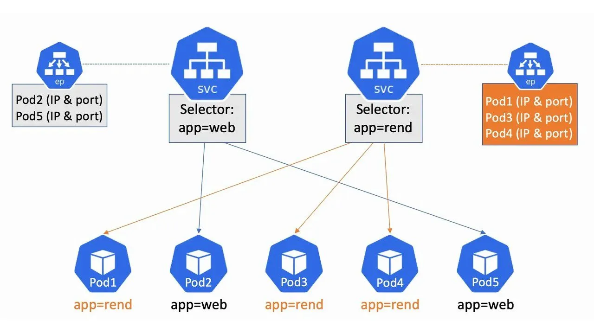
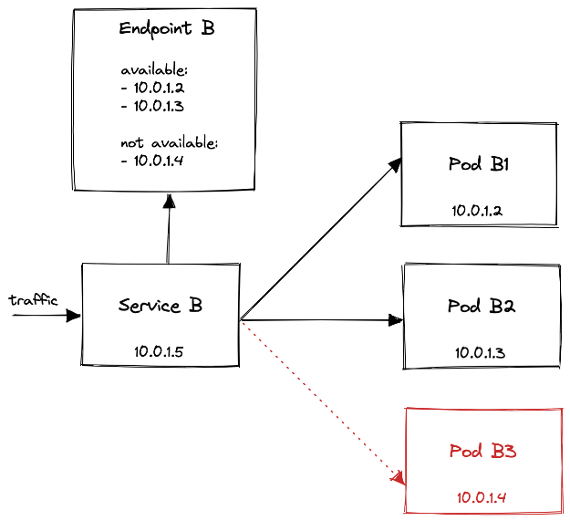
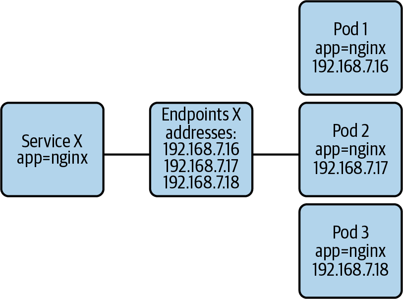
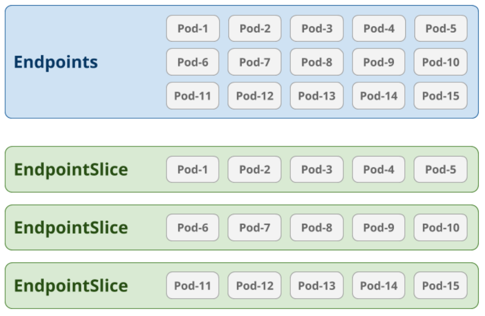

# Endpoints and EndpointSlices

In the previous sections we defined Services as objects with a virtual IP that proxy and load-balance incoming traffic to the desired Pod(s) whose selector contains a label described in its YAML description.

But how do Services know which Pods to track, and which Pods are ready to accept traffic? The answer is **`Endpoints`**.

When Kubernetes processes a Service description, and if the service selector matches a pod label, Kubernetes will automatically create an **Endpoints** and and **EndpointSlice** object with the same name as the Service, which stores the Pod’s IP address and port.
Consequently, when the Service receives a request, its proxy will redirect it to one of those IPs and ports.

An overview of how the Services, Pods and Endpoint/EndpointSlices work together can be seen below:



## Endpoints

`Endpoints` objects have a 1:1 relationship with Services, and are created for keeping track of IP addresses of running Pods their corresponding Services are proxying for.



In the example above, Pod B3 is in an unready state and that information is reflected onto its parent Endpoint object. That’s how Service B knows **not to** send any traffic to Pod B3.

!!! info
    **The [EndpointSlice](#endpointslice) API is the recommended replacement for Endpoints.**

Endpoints is a collection of endpoints that implement the actual service. Example:

```json
Name: "mysvc",
Subsets: [
    {
        Addresses: [{"ip": "10.10.1.1"}, {"ip": "10.10.2.2"}],
        Ports: [{"name": "a", "port": 8675}, {"name": "b", "port": 309}]
    },
    {
        Addresses: [{"ip": "10.10.3.3"}],
        Ports: [{"name": "a", "port": 93}, {"name": "b", "port": 76}]
    },
]
```

??? info "Another diagram for Endpoints"

    Another diagram for illustrating the relationship between Services, Endpoints and Pods can be seen below:

    

### Over-capacity endpoints

**Kubernetes limits the number of endpoints that can fit in a single Endpoints object**. When there are over 1000 backing endpoints for a Service, Kubernetes truncates the data in the Endpoints object. Because a Service can be linked with more than one EndpointSlice, the 1000 backing endpoint limit only affects the legacy Endpoints API.

In that case, Kubernetes selects at most 1000 possible backend endpoints to store into the Endpoints object.

Traffic is still sent to backends, but any load balancing mechanism that relies on the legacy Endpoints API only sends traffic to at most 1000 of the available backing endpoints.

_Enter EndpointSlice_.


## EndpointSlice

**EndpointSlices are an API that provides a scalable and extensible alternative to the Endpoints API**. EndpointSlices track IP addresses, ports, readiness, and topology information for Pods backing a Service.

The EndpointSlice API was designed to address this issue with an approach similar to sharding. Instead of tracking all Pod IPs for a Service with a single Endpoints resource, we split them into multiple smaller EndpointSlices.

### Example

Consider an example where a Service is backed by 15 pods. We'd end up with a single Endpoints resource that tracked all of them. If EndpointSlices were configured to store 5 endpoints each, we'd end up with 3 different EndpointSlices:



!!! info
    By default, EndpointSlices store as many as 100 endpoints each, though this can be configured on kube-controller-manager.

## Notes

As we already mentioned, the Endpoint collects all the IP addresses and ports from the Pods.

But not just one time.

The Endpoint object is refreshed with a new list of endpoints when:

- A Pod is created.
- A Pod is deleted.
- A label is modified on the Pod.

So you can imagine that every time you create a Pod and after the kubelet posts its IP address to the master Node, Kubernetes updates all the endpoints to reflect the change.

For example, if a Pod dies, a replacement pod will be generated, with a new IP address. Conceptually, the dead Pod IP will be removed from the Endpoint object, and the IP of the newly created Pod will be added, so that the Service is updated and knows which Pods to connect to.
