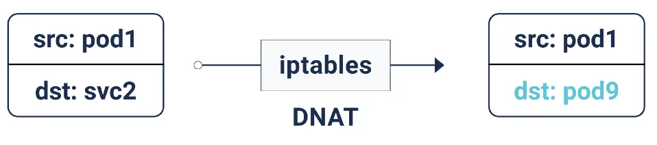

# kube-proxy and iptables

As we already mentioned, the **whole virtual IP implementation for Services** is (most probably) **based on a proxy mode like iptables** or IPVS.

kube-proxy in `iptables` mode selects a _ready_ backend Pod at _random_. This is done with the [`statistic` module/extension](https://ipset.netfilter.org/iptables-extensions.man.html).

!!! info
    The `statistic` module matches packets based on some statistic condition.

In the case of kube-proxy, backends Pods on an iptable chain are selected with a probability.

!!! note
    Most Linux distributions are replacing `iptables` with `nftables`, a similar but more performant tool built atop [Netfilter](https://www.netfilter.org/). Some distros already ship with a version of `iptables` that is powered by `nftables`.


## ClusterIP Services

To realize **ClusterIP** Services, **kube-proxy programs the Linux kernel’s NAT table to perform Destination NAT (DNAT)** on packets destined for Services. The DNAT rules replace the packet’s destination IP address with the IP address of a Service endpoint (a Pod IP address). Once replaced, the network handles the packet as if it was originally sent to the Pod.

To load balance traffic across multiple Service endpoints, kube-proxy uses multiple iptables chains:

- _Services chain_:

    Top-level chain that contains a rule for each Service. Each rule checks whether the destination IP of the packet matches the ClusterIP of the Service. If it does, the packet is sent to the Service-specific chain.

- _Service-specific chain_:

    Each Service has its iptables chain. This chain contains a rule per Service endpoint. Each rule uses the `statistic` iptables extension to select a target endpoint randomly. Each endpoint has 1/n probability of being selected, where n is the number of endpoints. Once selected, the packet is sent to the Service endpoint chain.

- _Service endpoint chain_:

    Each Service endpoint has an iptables chain that performs DNAT on the packet.


The following listing of iptables rules shows an example of a ClusterIP Service.

1. SSH in one of the worker nodes and let's list the rules in the NAT table.

    The `PREROUTING` chain in the `nat` table (which alters packets before routing, i.e packet translation happens immediately after the packet comes to the system (and before routing)). All Pod-to-Service packets get intercepted by the `PREROUTING` chain:

    ```bash
    $ iptables -t nat -vL PREROUTING

    Chain PREROUTING (policy ACCEPT 2206 packets, 246K bytes)
    pkts bytes target         prot opt in     out     source               destination
    17M 2477M cali-PREROUTING  all  --  any    any     anywhere             anywhere             /* cali:6gwbT8clXdHdC1b1 */
    17M 2477M KUBE-SERVICES    all  --  any    any     anywhere             anywhere             /* kubernetes service portals */
    568K   21M DOCKER          all  --  any    any     anywhere             anywhere             ADDRTYPE match dst-type LOCAL
    ```

    This helps to translate the destination IP address of the packets to something that matches the routing on the local server. This is used for DNAT (destination NAT).

    These packets get redirected to the `KUBE-SERVICES` chain.

    !!! info
        The `KUBE-SERVICES` chain is the _top-level chain_. It has rules for all the Services in the cluster.

1. Then, let's list the iptables rules in the `nat` table in the `KUBE-SERVICES` chain, as it is the entry point for service packets, matches the destination IP:port and dispatches the packet to the corresponding `KUBE-SVC-*` chain:

    ```bash
    iptables -t nat -vL KUBE-SERVICES
    ```

    The output should be similar to this:

    ```bash
    Chain KUBE-SERVICES (2 references)
    pkts bytes target     prot opt in     out     source               destination
        0     0 KUBE-SVC-ERIFXISQEP7F7OF4  tcp  --  any    any     anywhere             10.254.0.10          /* kube-system/kube-dns:dns-tcp cluster IP */ tcp dpt:domain
        0     0 KUBE-SVC-VS7JYC4FNXA3J2IX  tcp  --  any    any     anywhere             10.254.247.64        /* default/nginx-clusterip:http cluster IP */ tcp dpt:http
        0     0 KUBE-SVC-FM36JLW72KLVJK5C  tcp  --  any    any     anywhere             10.254.172.238       /* default/nginx-clusterip-session-affinity:http cluster IP */ tcp dpt:http
        0     0 KUBE-SVC-N5ZJHSRAEYPG7OUW  tcp  --  any    any     anywhere             10.254.242.188       /* kube-system/cern-magnum-metrics-server:https cluster IP */ tcp dpt:https
        0     0 KUBE-SVC-427AMIOYDD4NPRJC  tcp  --  any    any     anywhere             10.254.101.195       /* kube-system/cern-magnum-openstack-manila-csi-controllerplugin:dummy cluster IP */ tcp dpt:italk
        0     0 KUBE-SVC-WFJRZMUCT6Y67XI4  tcp  --  any    any     anywhere             10.254.116.96        /* kube-system/cern-magnum-traefik:http cluster IP */ tcp dpt:http
    ```

    In short:

    - For each port of each Service, there should be 1 rule in `KUBE-SERVICES` and one `KUBE-SVC-<hash>` chain.
    - For each Pod endpoint, there should be a small number of rules in that `KUBE-SVC-<hash>` and one `KUBE-SEP-<hash>` chain with a small number of rules in it.

1. Let's take as an example the case of the `nginx-deployment` Deployment with 3 replicas. On one of the worker nodes, let's have a look on the `KUBE-SVC-VS7JYC4FNXA3J2IX` chain on the `nat` table (note: in this example, the `KUBE-SVC-VS7JYC4FNXA3J2IX` chain is responsible for the `nginx-clusterip` Service, as we defined it [here](../../000-services/clusterIP.md)):

    ```bash
    $ iptables -t nat -vL KUBE-SVC-VS7JYC4FNXA3J2IX


    Chain KUBE-SVC-VS7JYC4FNXA3J2IX (1 references)
    pkts bytes target                     prot opt  in     out     source                                             destination
        0     0 KUBE-MARK-MASQ             tcp  --  any    any    !SERVICES-VIRTUAL-PRIVATE-NET-2.net.cern.ch/16    10.254.201.125      /* default/nginx-clusterip:http cluster IP */ tcp dpt:http
        0     0 KUBE-SEP-5EH7HXPWCMEFZ7MM  all  --  any    any     anywhere                                               anywhere      /* default/nginx-clusterip:http */ statistic mode random probability 0.33333333349
        0     0 KUBE-SEP-CSPARMQUUTD7R4QK  all  --  any    any     anywhere                                               anywhere      /* default/nginx-clusterip:http */ statistic mode random probability 0.50000000000
        0     0 KUBE-SEP-YREZEDGGIC5RK7NN  all  --  any    any     anywhere                                               anywhere      /* default/nginx-clusterip:http */
    ```

    Notice that 3 different probabilities are defined and not 0.33 everywhere, even if we have 3 backend Pods for that rule. The reason is that the rules are executed sequentially.

    With a probability of 0.33, the first rule will be executed 33% of the time and skipped 66% of the time.

    With a probability of 0.5, the second rule will be executed 50% of the time and skipped 50% of the time. However, since this rule is placed after the first one, it will only be executed 66% of the time. Hence this rule will be applied to only 33% of the requests (it's 50% of the remaining 66%).

    Since only 33% of the traffic reaches the last rule, it must always be applied.

1. If we have a look at one of the targets, e.g. `KUBE-SEP-5EH7HXPWCMEFZ7MM`, it points to `10.100.126.81:80`, which is the Pod IP:port address (i.e. Service endpoints) of one of the nginx pods:

    ```bash
    $ iptables -t nat -vL KUBE-SEP-5EH7HXPWCMEFZ7MM

    Chain KUBE-SEP-5EH7HXPWCMEFZ7MM (1 references)
    pkts bytes target     prot opt in     out     source               destination
        0     0 KUBE-MARK-MASQ  all  --  any    any     10.100.126.81        anywhere             /* default/nginx-clusterip:http */
        0     0 DNAT       tcp  --  any    any     anywhere             anywhere             /* default/nginx-clusterip:http */ tcp to:10.100.126.81:80
    ```

    The last rule in this chain is the one that performs **DNAT** to forward the packet to the endpoint (or Pod).

    

## NodePort and LoadBalancer Services

When it comes to NodePort and LoadBalancer Services, kube-proxy configures iptables rules similar to those used for ClusterIP Services. The main difference is that the rules match packets based on their destination port number. If they match, the rule sends the packet to the Service-specific chain where DNAT happens. 


```bash
$ iptables -t nat -vL KUBE-NODEPORTS

Chain KUBE-NODEPORTS (1 references)
target     prot opt source               destination
KUBE-SVC-NX3A3B4B5B3WMIRB  tcp  --  anywhere             anywhere             /* default/nginx-nodeport:http */ tcp dpt:30589
KUBE-SVC-6AJOFW3SKWPNURS5  tcp  --  anywhere             anywhere             /* default/nginx-loadbalancer:http */ tcp dpt:30694
```

!!! info
    The `KUBE-NODEPORTS` chain takes into account the packets coming on Service of type NodePort and LoadBalancer (which is a superset of NodePort).

- For the case of a NodePort type Service: If the packet has `tcp: 30589` as the destination port, it is sent to the Service-specific chain. 
- Same logic with the 2nd rule, which is a LoadBalancer type Service: if the packet has `tcp: 30694` as the destination port, it is sent to the Service-specific chain.

In addition to programming the iptables rules, kube-proxy opens the port assigned to the NodePort Service and holds it open. Holding on to the port has no function from a routing perspective. It merely prevents other processes from claiming it.


## Connection tracking (conntrack)

When the kernel’s networking stack performs DNAT on a packet destined to a Service, it adds an entry to the **connection tracking (conntrack) table**. The table tracks the translation performed so that it is applied to any additional packet destined to the same Service. The table is also used to remove the NAT from response packets before sending them to the source Pod.

Each entry in the table maps the pre-NAT protocol, source IP, source port, destination IP, and destination port onto the post-NAT protocol, source IP, source port, destination IP, and destination port (5-tuple entries in conntrack table).

The image below shows a table entry that tracks the connection from a Pod (`192.168.0.9`) to a Service (`10.96.0.14`). Notice how the destination IP and port change after the DNAT:


!!! note
    When the conntrack table fills up, the kernel starts dropping or rejecting connections, which can be problematic for some applications. If you are running workloads that handle many connections and notice connection issues, you may need to tune the maximum size of the conntrack table on your nodes. More importantly, you should monitor the conntrack table utilization and alert when the table is close to being full.

## Masquerade

You may have noticed that we glossed over the `KUBE-MARK-MASQ` iptables rules listed in the previous examples. These rules are in place for packets that arrive at a node from outside the cluster. To route such packets properly, the Service fabric needs to masquerade/source NAT the packets when forwarding them to another node. Otherwise, response packets will contain the IP address of the Pod that handled the request. The Pod IP in the packet would cause a connection issue, as the client initiated the connection to the node and not the Pod.

Masquerading is also used to egress from the cluster. When Pods connect to external services, the source IP must be the IP address of the node where the Pod is running instead of the Pod IP. Otherwise, the network would drop response packets because they would have the Pod IP as the destination IP address.

!!! info
    A common use case is to provide a known host for traffic, as a security bastion, or to provide a predictable set of IP addresses to third parties.

The `MASQUERADE` target is similar to SNAT; however, it does NOT require `--to-source` as it was made to work with dynamically assigned IP addresses. SNAT works with static IP addresses. MASQUERADE has extra overhead and is slower than SNAT because each time the MASQUERADE target gets hit by a packet, it has to check for the IP address to use.
