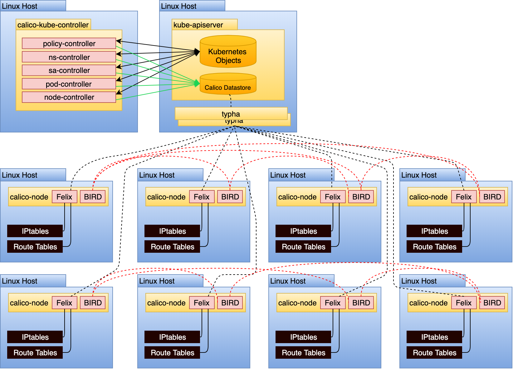
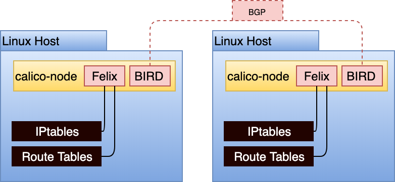
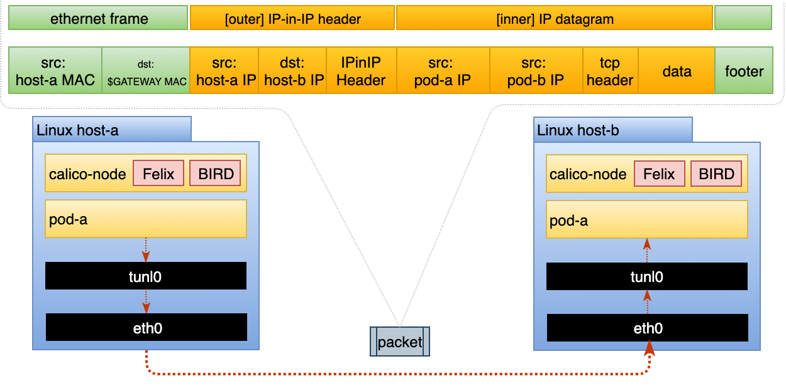
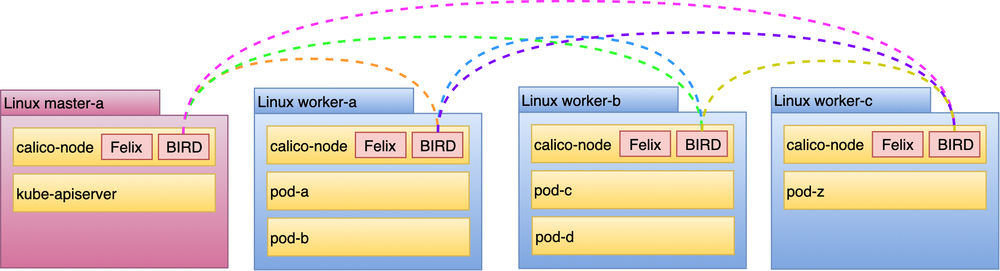

# Calico Architecture

## Calico components

The following diagram shows the required and optional Calico components for a Kubernetes deployment with networking and network policy:


??? note "Another Calico Architecture diagram"
    

On the following sections we're going to provide a high-level overview of the main Calico components. For details, refer to the [official Calico documentation](https://docs.tigera.io/calico/latest/reference/architecture/overview).


??? example "A high-level overview on the `calico-node` Pod running on every node"
    The `calico-node` pod runs on every host and the container runs 2 processes, [Felix](https://github.com/projectcalico/felix) and [BIRD](https://github.com/projectcalico/bird), which are shown in the diagram below:

    


### Felix

**Main task**: Programs routes and ACLs, and anything else required on the host to provide desired connectivity for the endpoints on that host. Runs on each machine that hosts endpoints. Runs as an agent daemon.

Depending on the specific orchestrator environment, Felix is responsible for:

- **Interface management**: Programs information about interfaces into the kernel so the kernel can correctly handle the traffic from that endpoint. In particular, it ensures that the host responds to ARP requests from each workload with the MAC of the host, and enables IP forwarding for interfaces that it manages.
- **Route programming**: Programs routes to the endpoints on its host into the Linux kernel FIB (Forwarding Information Base).
- **ACL programming**: Programs ACLs into the Linux kernel to ensure that only valid traffic can be sent between endpoints, and that endpoints cannot circumvent Calico security measures.
- **State reporting**: Provides network health data.


### BIRD

**Main task**: Gets routes from Felix and distributes to BGP (Border Gateway Protocol) peers on the network for inter-host routing. Runs on each node that hosts a Felix agent.

!!! info
    **BGP** is a standard protocol for exchanging routing information between routers in a network. Each router running BGP has one or more **BGP peers** - other routers which they are communicating with over BGP. You can think of Calico networking as providing a virtual router on each of your nodes.

The BGP client is responsible for:

- **Route distribution**: When Felix inserts routes into the Linux kernel FIB, the BGP client distributes them to other nodes in the deployment. This ensures efficient traffic routing for the deployment.
- **BGP route reflector configuration**.

### IPAM plugin

!!! info
    IPAM stands for IP Address Management.

**Main task**: Uses Calico’s IP pool resource to control how IP addresses are allocated to pods within the cluster.

Some of the functionalities of the IPAM plugin:

- IPAM finds out what IP addresses are available by communicating with the datastore.
- Gets the IP and gives it to the CNI plugin which then configures container and also ensures that the IP information is written back to the datastore.


## Routing Configuration

Calico supports multiple routing modes each with unique trade-offs. This section details the differences in those routing modes, our recommendations based on topology, and an overview of alternative configurations.

Routing Methods
Calico supports 3 routing modes:

| Routing Mode | Description |
|:------------:|:-----------:|
|    Native    | Packets routed as-is, no encapsulation. |
|   IP-in-IP   | Minimal encapsulation; outer header includes host source/destination IPs and inner header includes pod source/destination |
|    VXLAN     | Robust encapsulation using UDP over IP; outer header includes host source/destination IP addresses and inner header includes pod source/destination IP addresses as well as Ethernet headers. |


??? info "Native Routing method"
    The _"Native"_ routing method can be problematic in environments that:

    - Cross multiple subnets or feature routers that rely on the destination IP to determine the host it should route the packet to.
    - Enforce source/destination checks for inbound packets (e.g. AWS)

??? info "VXLAN"
    VXLAN has a slightly higher per-packet overhead than IP-in-IP because the header is larger. However, it’s a known and capable protocol, which a network team may prefer.

### IP-in-IP

**IP-in-IP is a simple form of encapsulation** that wraps the packet with an outer IP header that appears as if the source and destination are hosts rather than pods. Therefore, when a host receives an IP-in-IP packet, it examines the internal IP header to determine the target pod. This is Calico’s default routing method. While this routing method incurs more overhead than native routing, it does work in most environments without modification, especially in environments that cross multiple subnets. When running in this mode, the packet structure looks as shown in the diagram below:



Note the ethernet frame destination is set to the `$GATEWAY`, this could be targeting a node’s mac address or a router depending on whether the request is crossing a subnet boundary.

At the cost of the additional IP-in-IP overhead, this model works in most network topologies. Environments where this model can be problematic are:

- Environments that explicitly disallow IP-in-IP, such as Azure.
- Environments that block all BGP, which is used in this model for route distribution.


## Route distribution

Unless running in VXLAN mode, **Calico requires the Border Gateway Protocol (BGP) to share routes amongst hosts**. BGP is a common protocol that many routers are able to peer with. By default, **Calico requires no BGP-capable routers to be deployed**. Instead it runs a routing daemon (BIRD) in each node, creating a BGP mesh.



Each colored line represents a peering relationship. This model is referred to as a node-to-node mesh, as it does not centralize route distribution. Using `calicoctl` on 1 of the 4 hosts reveals the peering relationship:

```bash
$ sudo calicoctl node status


Calico process is running.

IPv4 BGP status
+--------------+-------------------+-------+----------+--------------------------------+
| PEER ADDRESS |     PEER TYPE     | STATE |  SINCE   |              INFO              |
+--------------+-------------------+-------+----------+--------------------------------+
| 10.30.0.17   | node-to-node mesh | up    | 01:17:08 | Established                    |
| 10.30.0.16   | node-to-node mesh | up    | 01:17:07 | Established                    |
| 10.30.0.14   | node-to-node mesh | up    | 01:29:06 | Established                    |
+--------------+-------------------+-------+----------+--------------------------------+
```

## Resources

- [Component architecture, Calico official docs](https://docs.tigera.io/calico/latest/reference/architecture/overview)
- [Calico Reference Architecture, VMware Tanzu Developer Center](https://tanzu.vmware.com/developer/guides/container-networking-calico-refarch/)
