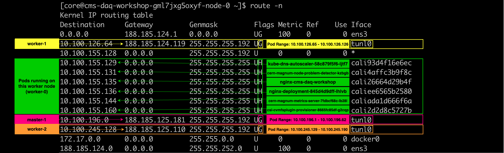

# Routing in Containers and Kubernetes

!!! warning "Disclaimer"
    The output of the commands in this page are heavily relied on IT's OpenStack Magnum clusters infrastructure (e.g. using Calico as a CNI).

## Route table of Containers

!!! info
    Remember that each Pod in Kubernetes has a dedicated network namespace and that containers in a Pod share the same network namespace. This means that each Pod has its own routing table.


Let's start by viewing the routing table of a container running as part of a Pod in Kubernetes. The following will execute the required commands inside the nginx container of the `nginx-deployment-845d4d9dff-55nq5` pod in order to install the package(s) that contain the `route` command (make sure to replace the Pod name):

```bash
kubectl exec -it nginx-deployment-845d4d9dff-55nq5 -- /bin/sh -c 'apt-get update -y && apt-get install -y net-tools && route -n'
```


For OpenStack Magnum clusters provided by IT (which uses Calico as a CNI), the output should be similar to this:

```bash
Kernel IP routing table
Destination     Gateway         Genmask         Flags Metric Ref    Use Iface
0.0.0.0         169.254.1.1     0.0.0.0         UG    0      0        0 eth0
169.254.1.1     0.0.0.0         255.255.255.255 UH    0      0        0 eth0
```

!!! info
    In a Calico network, each host acts as a gateway router for the workloads that it hosts. In container deployments, Calico uses `169.254.1.1` as the address for the Calico router.

    In container deployments, Calico only uses proxy **Address Resolution Protocol (ARP)** for resolving the `169.254.1.1` address. The routing table inside the container ensures that all traffic goes via the `169.254.1.1` gateway so that is the only IP that will be ARPed by the container.

    ARP is a communication protocol used for discovering the link layer (L2) address, such as a MAC address, associated with a given internet layer address, typically an IPv4 address.


    More info can be found on the [official Calico documentation page](https://docs.tigera.io/calico/latest/reference/faq).


Note how the default route is pointing to the fake next-hop address `169.254.1.1`. This will be the same for all Pods and this IP will resolve to the same MAC address configured on all veth links (make sure to replace the Pod name):

```bash
$ kubectl exec -it nginx-deployment-845d4d9dff-55nq5 -- ip neigh


169.254.1.1 dev eth0 lladdr ee:ee:ee:ee:ee:ee STALE
188.185.125.110 dev eth0 lladdr ee:ee:ee:ee:ee:ee STALE
```

!!! info
    The `ip neigh` command shows neighbour objects; also known as the **ARP table** for IPv4.


## Route table of Worker nodes

1. Get the IP address of one of the workers nodes:

    ```bash
    $ kubectl get nodes -o wide


    NAME                                     STATUS   ROLES    AGE    VERSION   INTERNAL-IP       EXTERNAL-IP   OS-IMAGE                        KERNEL-VERSION            CONTAINER-RUNTIME
    cms-daq-workshop-gml7jxg5oxyf-master-0   Ready    master   180d   v1.22.9   188.185.125.181   <none>        Fedora CoreOS 35.20220227.2.1   5.16.13-200.fc35.x86_64   containerd://1.4.13
    cms-daq-workshop-gml7jxg5oxyf-node-0     Ready    <none>   180d   v1.22.9   188.185.124.201   <none>        Fedora CoreOS 35.20220227.2.1   5.16.13-200.fc35.x86_64   containerd://1.4.13
    cms-daq-workshop-gml7jxg5oxyf-node-1     Ready    <none>   180d   v1.22.9   188.185.124.119   <none>        Fedora CoreOS 35.20220227.2.1   5.16.13-200.fc35.x86_64   containerd://1.4.13
    cms-daq-workshop-gml7jxg5oxyf-node-2     Ready    <none>   180d   v1.22.9   188.185.125.110   <none>        Fedora CoreOS 35.20220227.2.1   5.16.13-200.fc35.x86_64   containerd://1.4.13
    ```

1. SSH in one of the worker nodes of your cluster (remember, you can get the nodes' IP address with `kubectl get nodes -o wide`):

    ```bash
    ssh core@188.185.124.201
    ```

1. Before viewing the routing table on our worker node, let's first list the network interfaces:

    ```bash
    $ ip address list


    1: lo: <LOOPBACK,UP,LOWER_UP> mtu 65536 qdisc noqueue state UNKNOWN group default qlen 1000
        link/loopback 00:00:00:00:00:00 brd 00:00:00:00:00:00
        inet 127.0.0.1/8 scope host lo
        valid_lft forever preferred_lft forever
        inet6 ::1/128 scope host
        valid_lft forever preferred_lft forever
    2: ens3: <BROADCAST,MULTICAST,UP,LOWER_UP> mtu 1500 qdisc fq_codel state UP group default qlen 1000
        link/ether fa:16:3e:bf:f7:b5 brd ff:ff:ff:ff:ff:ff
        altname enp0s3
        inet 188.185.124.201/22 brd 188.185.127.255 scope global dynamic noprefixroute ens3
        valid_lft 367845sec preferred_lft 367845sec
        inet6 fe80::ed42:495c:2205:790b/64 scope link noprefixroute
        valid_lft forever preferred_lft forever
    3: docker0: <NO-CARRIER,BROADCAST,MULTICAST,UP> mtu 1500 qdisc noqueue state DOWN group default
        link/ether 02:42:94:e8:0b:cd brd ff:ff:ff:ff:ff:ff
        inet 172.17.0.1/16 brd 172.17.255.255 scope global docker0
        valid_lft forever preferred_lft forever
    4: tunl0@NONE: <NOARP,UP,LOWER_UP> mtu 1440 qdisc noqueue state UNKNOWN group default qlen 1000
        link/ipip 0.0.0.0 brd 0.0.0.0
        inet 10.100.155.128/32 brd 10.100.155.128 scope global tunl0
        valid_lft forever preferred_lft forever
    7: cali93d4f16e6ec@if4: <BROADCAST,MULTICAST,UP,LOWER_UP> mtu 1440 qdisc noqueue state UP group default
        link/ether ee:ee:ee:ee:ee:ee brd ff:ff:ff:ff:ff:ff link-netns cni-af3de06f-bfe5-bc0c-84c2-ac4df9e75e0e
        inet6 fe80::ecee:eeff:feee:eeee/64 scope link
        valid_lft forever preferred_lft forever
    9: cali4affc3b9f8c@if4: <BROADCAST,MULTICAST,UP,LOWER_UP> mtu 1440 qdisc noqueue state UP group default
        link/ether ee:ee:ee:ee:ee:ee brd ff:ff:ff:ff:ff:ff link-netns cni-ffdfe007-38fd-8c8a-8623-0270af20de37
        inet6 fe80::ecee:eeff:feee:eeee/64 scope link
        valid_lft forever preferred_lft forever
    18978: caliee6565b2580@if4: <BROADCAST,MULTICAST,UP,LOWER_UP> mtu 1440 qdisc noqueue state UP group default
        link/ether ee:ee:ee:ee:ee:ee brd ff:ff:ff:ff:ff:ff link-netns cni-d644bc9f-3f7e-d05d-fcde-6215cf291fe9
        inet6 fe80::ecee:eeff:feee:eeee/64 scope link
        valid_lft forever preferred_lft forever
    11651: cali26664d29b4f@if4: <BROADCAST,MULTICAST,UP,LOWER_UP> mtu 1440 qdisc noqueue state UP group default
        link/ether ee:ee:ee:ee:ee:ee brd ff:ff:ff:ff:ff:ff link-netns cni-978dd4f4-56f3-1dea-3e5b-82f30fba6810
        inet6 fe80::ecee:eeff:feee:eeee/64 scope link
        valid_lft forever preferred_lft forever
    11730: cali2d2d8c5727b@if4: <BROADCAST,MULTICAST,UP,LOWER_UP> mtu 1440 qdisc noqueue state UP group default
        link/ether ee:ee:ee:ee:ee:ee brd ff:ff:ff:ff:ff:ff link-netns cni-37437236-e065-1ce4-eaa0-99bb826d13a4
        inet6 fe80::ecee:eeff:feee:eeee/64 scope link
        valid_lft forever preferred_lft forever
    11732: caliada1d666f6a@if4: <BROADCAST,MULTICAST,UP,LOWER_UP> mtu 1440 qdisc noqueue state UP group default
        link/ether ee:ee:ee:ee:ee:ee brd ff:ff:ff:ff:ff:ff link-netns cni-d0726781-82fb-e78c-e31e-97e6eec54e62
        inet6 fe80::ecee:eeff:feee:eeee/64 scope link
        valid_lft forever preferred_lft forever
    ```

    We can see a few network interfaces prefixed with `cali*` and their status is UP. These are [virtual Ethernet (vEth) interfaces](https://man7.org/linux/man-pages/man4/veth.4.html) that have been created by Calico and correspond to Pods running on the current worker node.

    In order to respond to an ARP request for `169.254.1.1`, [all vEth links have proxy ARP enabled](https://docs.tigera.io/calico/latest/reference/faq#why-cant-i-see-the-16925411-address-mentioned-above-on-my-host) (for example for the `cali26664d29b4f` interface):

    ```bash
    $ cat /proc/sys/net/ipv4/conf/cali26664d29b4f/proxy_arp

    1
    ```

    !!! note "Why do all `cali*` interfaces have the MAC address `ee:ee:ee:ee:ee:ee`?"
        In some setups the kernel is unable to generate a persistent MAC address and so Calico assigns a MAC address itself. Since Calico uses point-to-point routed interfaces, traffic does not reach the data link layer so the MAC Address is never used and can therefore be the same for all the `cali*` interfaces. [More details](https://docs.tigera.io/calico/latest/reference/faq#why-do-all-cali-interfaces-have-the-mac-address-eeeeeeeeeeee).


    If we list all of the named Linux network namespaces in the worker node:

    ```bash
    $ ip netns list

    cni-d644bc9f-3f7e-d05d-fcde-6215cf291fe9 (id: 1)
    cni-d0726781-82fb-e78c-e31e-97e6eec54e62 (id: 12)
    cni-37437236-e065-1ce4-eaa0-99bb826d13a4 (id: 3)
    cni-978dd4f4-56f3-1dea-3e5b-82f30fba6810 (id: 6)
    cni-ffdfe007-38fd-8c8a-8623-0270af20de37 (id: 2)
    cni-af3de06f-bfe5-bc0c-84c2-ac4df9e75e0e (id: 0)
    ```

    we'll notice that the prefixed `cali*` network interfaces are assigned to Linux network namespaces.

1. Let's view the routing table of the worker node (which has been assigned the `188.185.124.201` IPv4):

    ```bash
    $ route -n

    Kernel IP routing table
    Destination     Gateway         Genmask         Flags Metric Ref    Use Iface
    0.0.0.0         188.185.124.1   0.0.0.0         UG    100    0        0 ens3
    10.100.126.64   188.185.124.119 255.255.255.192 UG    0      0        0 tunl0
    10.100.155.128  0.0.0.0         255.255.255.192 U     0      0        0 *
    10.100.155.129  0.0.0.0         255.255.255.255 UH    0      0        0 cali93d4f16e6ec
    10.100.155.131  0.0.0.0         255.255.255.255 UH    0      0        0 cali4affc3b9f8c
    10.100.155.135  0.0.0.0         255.255.255.255 UH    0      0        0 cali26664d29b4f
    10.100.155.136  0.0.0.0         255.255.255.255 UH    0      0        0 caliee6565b2580
    10.100.155.144  0.0.0.0         255.255.255.255 UH    0      0        0 caliada1d666f6a
    10.100.155.160  0.0.0.0         255.255.255.255 UH    0      0        0 cali2d2d8c5727b
    10.100.196.0    188.185.125.181 255.255.255.192 UG    0      0        0 tunl0
    10.100.245.128  188.185.125.110 255.255.255.192 UG    0      0        0 tunl0
    172.17.0.0      0.0.0.0         255.255.0.0     U     0      0        0 docker0
    188.185.124.0   0.0.0.0         255.255.252.0   U     100    0        0 ens3
    ```

    

Notes:

- For Pods running on this worker node (i.e. `cms-daq-workshop-gml7jxg5oxyf-node-0`):
    - a local network interace is being used
    - the flags are `UH`, which means that the route is valid/up and the route is to a host rather than to a network

- For CIDR blocks (Pod ranges) that belong to another node (i.e. "remote" pods):
    - the node acts as a gateway and the `tunl0` interface is being used
    - the flags are `UG`, which means that the route is valid/up and the route is to a gateway router rather than to a directly connected network or host


### Examples

You can illustrate some examples with the `ip route get` command (these commands are being executed against a worker node):

!!! info
    The `ip route get` command gets a single route to a destination and prints its contents exactly as the kernel sees it.

- Get the route to a destination CIDR block that **doesn't** belong to this worker node:

    ```bash
    $ ip route get 10.100.245.148 fibmatch

    10.100.245.128/26 via 188.185.125.110 dev tunl0 proto bird onlink
    ```

- Get the route to a destination CIDR block that **doesn't** belong to this worker node:

    ```bash
    $ ip route get 10.100.126.84 fibmatch

    10.100.126.64/26 via 188.185.124.119 dev tunl0 proto bird onlink
    ```

- Get the route to a destination CIDR block that **DOES** belong to this worker node:

    ```bash
    $ ip route get 10.100.155.136 fibmatch

    10.100.155.136 dev caliee6565b2580 scope link
    ```
