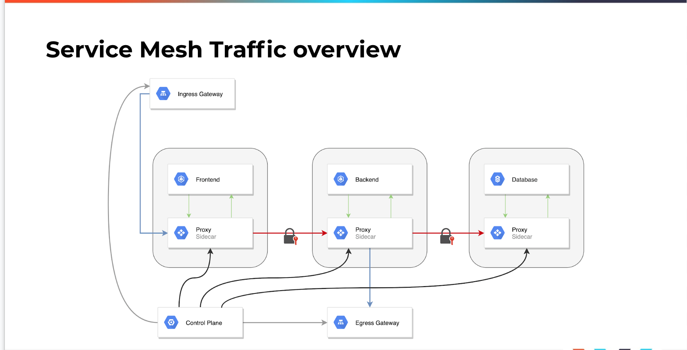
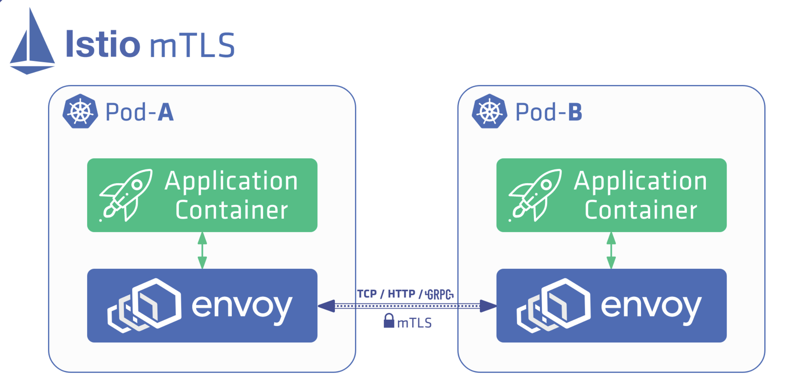
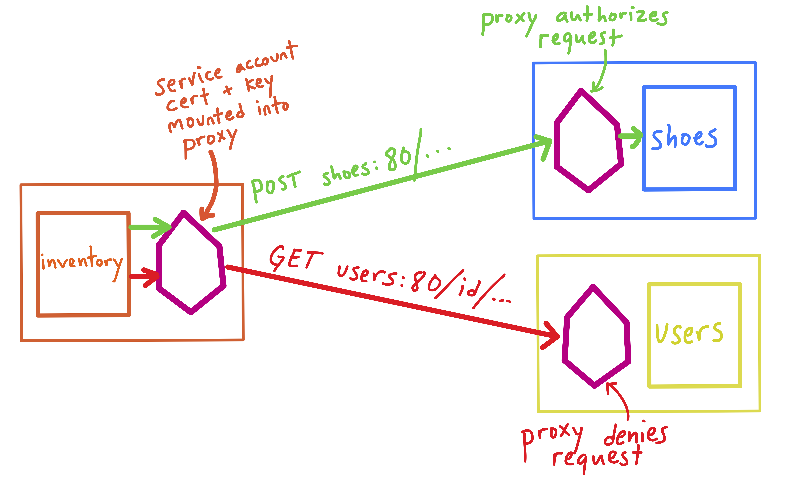
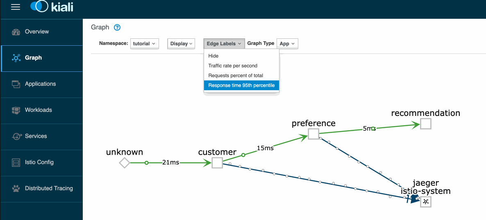

# Service Mesh

## High-level Overview

**A _service mesh_ is an API-driven infrastructure layer for handling service-to-service communication**.

From a security point of view, all traffic inside the cluster is unencrypted between pods, and each application team that runs a service must configure monitoring separately for each service.

From a developer’s perspective, injecting faults into the network is useful, but also not directly supported in default Kubernetes network deployments. With service meshes, developers can add fault testing, and instead of just killing pods, you can use service meshes to inject delays—again, each application would have to build in fault testing or circuit breaking.

There are several pieces of functionality that a service mesh enhances or provides in a default Kubernetes cluster network:

- _Load Balancing_

    The service mesh adds more advanced load balancing algorithms such as least request, consistent hashing, and zone aware.

- _Communication Resiliency_

    The service mesh can increase communication resilience for applications by not having to implement retries, timeouts, circuit breaking, or rate limiting in application code.

- _Security_

    A service mesh can provide the folllowing: * End-to-end encryption with mTLS between services * Authorization policies, which authorize what services can communicate with each other, not just at the layer 3 and 4 levels like in Kubernetes network polices.

- _Observability_

    Service meshes add in observability by enriching the layer 7 metrics and adding tracing and alerting.

- _Routing Control_

    Traffic shifting and mirroring in the cluster.

- _API_

    All of this can be controlled via an API provided by the service mesh implementation.

Let’s walk through several components of a service mesh in the following diagram:

Traffic is handled differently depending on the component or destination of traffic. Traffic into and out of the cluster is managed by the gateways. Traffic between the frontend, backend, and user service is all encrypted with Mutual TLS (mTLS) and is handled by the service mesh. All the traffic to the frontend, backend, and user pods in the service mesh **is proxied by the _sidecar proxy_ deployed within the pods**. 

## Popular Implementations

There are several options to use when deploying a service mesh. Some of the most popular implementations are:

- [_Istio_](https://istio.io/)
    - is a Kubernetes-native solution that was initially released by Lyft.
    - uses a Go control plane with an Envoy proxy.

- [_Linkerd_](https://linkerd.io/)
    - Also uses Go for the control plane with the Linkerd proxy.
    - No traffic shifting and no distributed tracing.
    - Is a Kubernetes-only solution, which results in fewer moving pieces and means that Linkerd has less complexity overall.

## Opinion

Some of the best use cases for service meshes are:

- **mTLS between services**.
    

- **Authentication (AuthN) and authorization (AuthZ)** policies.
    For example, with Istio you can achieve the following:

    - Request authentication allows end-user authentication, with Istio providing validation via JSON Web Tokens (JWTs) and a custom or OIDC-based authentication provider.
    - Peer authentication allows authentication between services, with Istio providing a full stack solution of mutual TLS.

        

    More details can be found [here](https://istio.io/latest/docs/concepts/security/#authentication).

- **[Circuit breaking](https://en.wikipedia.org/wiki/Circuit_breaker_design_pattern), fault testing for APIs, [retries](https://istio.io/latest/docs/concepts/traffic-management/#retries) and [fault injection](https://istio.io/latest/docs/tasks/traffic-management/fault-injection/)**. For network administrators, advanced routing policies and algorithms can be deployed with service meshes.

    !!! info
        **Circuit breaking** is used to detect failures and encapsulates the logic of preventing a failure from constantly recurring, during maintenance, temporary external system failure or unexpected system difficulties.

        It allows you to write applications that limit the impact of failures, latency spikes, and other undesirable effects of network peculiarities.

- **Observability**

    One problem with a plain vanilla cluster is that it can be difficult to troubleshoot the source of a problem.
    With a service mesh, all of the traffic is routed through ingress and egress through a proxy sidecar. The proxy sidecar then adds tracing headers to a request.

    
