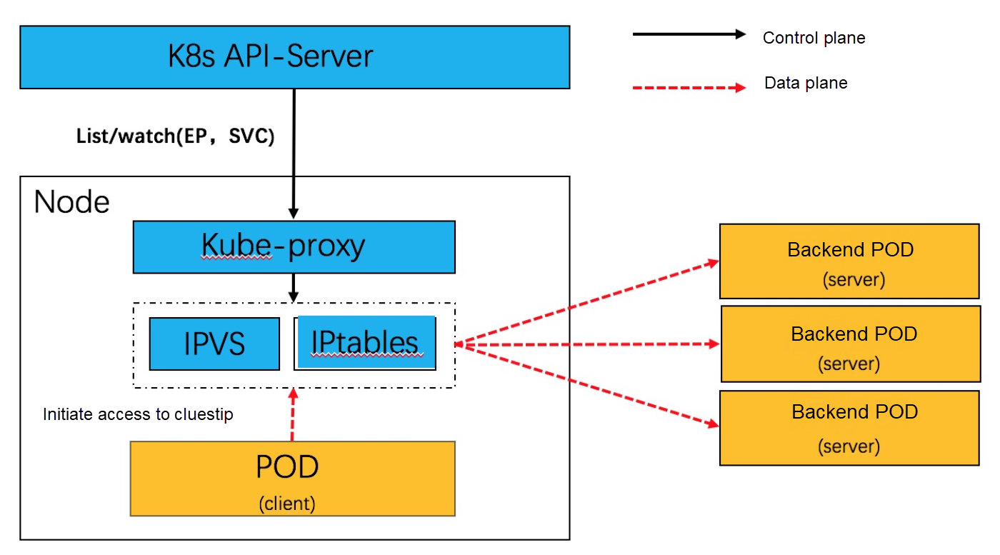
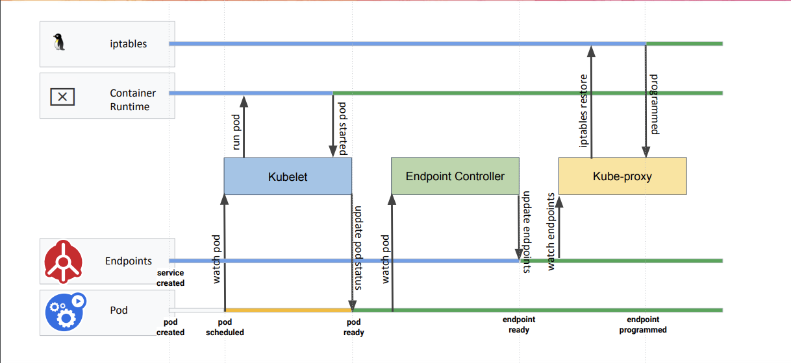
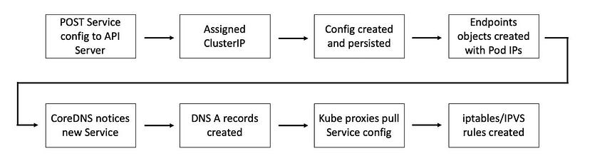

# Virtual IPs and Service Proxies

Every node in a Kubernetes cluster runs a [kube-proxy](https://kubernetes.io/docs/reference/command-line-tools-reference/kube-proxy/) (unless you have deployed your own alternative component in place of kube-proxy).

**The kube-proxy component is responsible for implementing a _virtual IP_ mechanism for Services** of type other than ExternalName.

## Proxy modes

The kube-proxy starts up in different modes, which are determined by its configuration (which is done via a ConfigMap):

- iptables
- IPVS

kube-proxy is installed in every worker node and generates forwarding table items locally to node. A high-level overview of kube-proxy in iptables or IPVS mode can be seen below:

### `iptables` proxy mode

In this mode, **kube-proxy watches the Kubernetes control plane for the addition and removal of Service and EndpointSlice objects**.

**For each Service, it installs iptables rules, which capture traffic to the Service's clusterIP and port, and redirect that traffic to one of the Service's backend sets. For each endpoint, it installs iptables rules which select a backend Pod**.

By default, **kube-proxy in iptables mode chooses a backend at random**.

In the iptables mode, **kube-proxy leverages the network address translation (NAT)** features of iptables.

Using iptables to handle traffic has a lower system overhead, because traffic is handled by Linux netfilter without the need to switch between userspace and the kernel space. This approach is also likely to be more reliable.

You can use [Pod readiness probes](../../000-pods/probes/getting-started.md) to verify that backend Pods are working OK, so that kube-proxy in iptables mode only sees backends that test out as healthy. Doing this means you avoid having traffic sent via kube-proxy to a Pod that's known to have failed.

#### Example - Theory

When the backend Service is created, the Kubernetes control plane assigns a virtual IP address, for example `10.0.0.1`. For this example, assume that the Service port is `1234`. All of the kube-proxy instances in the cluster observe the creation of the new Service.

When kube-proxy on a node sees a new Service, it installs a series of iptables rules which redirect from the virtual IP address to more iptables rules, defined per Service. The per-Service rules link to further rules for each backend endpoint, and the per- endpoint rules redirect traffic (using destination NAT) to the backends.

When a client connects to the Service's virtual IP address the iptables rule kicks in. A backend is chosen (either based on session affinity or randomly) and packets are redirected to the backend without rewriting the client IP address.

This same basic flow executes when traffic comes in through a node-port or through a load-balancer, though in those cases the client IP address does get altered.

#### Pod, Service, Endpoints, kube-proxy and iptables flow

The following diagram from a [2019 KubeCon talk](https://www.youtube.com/watch?v=Vw9GmSeomFg), shows the steps taken for a Pod to become Ready and create the iptables rules:

When a Service is created, Kubernetes will go through the following steps:

1. Once the Service is created, a ClusterIP is assigned.
1. Endpoints objects are created.
    1. The Endpoint Controller will receive an update (via `watch`) that there is a new pod that is `Ready` to be added to the Endpoints list for the Service and will add the pod IP/Port tuples to the appropriate endpoints array.
1. CoreDNS notices a new Service and creates DNS A/AAAA records.
1. `kube-proxy` receives an update (via `watch`) that there is a new IP/Port to add to the iptables rules for the Service.
    1. The local iptables rules on the worker node will be updated with the additional target pod for the NodePort Service.

#### Linux implementation

More details can be found [here](./kube-proxy-iptables-mode/iptables-chains.md).

### IPVS proxy mode

In `ipvs` mode (IP Virtual Server), kube-proxy watches Kubernetes Services and EndpointSlices, calls [netlink interface](https://man7.org/linux/man-pages/man7/netlink.7.html) to create IPVS rules accordingly and synchronizes IPVS rules with Kubernetes Services and EndpointSlices periodically. This control loop ensures that IPVS status matches the desired state. When accessing a Service, IPVS directs traffic to one of the backend Pods.

IPVS provides more options for balancing traffic to backend Pods; these are:

- `rr`: round-robin
- `lc`: least connection (smallest number of open connections)
- etc.

The advantage of IPVS over iptables is scalability: no matter how many routing rules are required (which are directly proportional to the number of Services), IPVS runs in O(1) time. Thus, for clusters that consist of thousands of Services, IPVS is generally a preferred option. That said, IPVS-based routing is still L4-level routing.

## IP address assignment to Services

Unlike Pod IP addresses, which actually route to a fixed destination, Service IPs are not actually answered by a single host. Instead, **kube-proxy uses packet processing logic (such as Linux iptables) to define virtual IP addresses which are transparently redirected as needed**.

When clients connect to the VIP, their traffic is automatically transported to an appropriate endpoint. The environment variables and DNS for Services are actually populated in terms of the Service's virtual IP address (and port).

Kubernetes allocates for each Service its own IP address from within the `service-cluster-ip-range` CIDR range that is configured for the API Server.

An Orchestrator (e.g. [`kubeadm`](https://kubernetes.io/docs/reference/setup-tools/kubeadm/)) will suggest a default value for this range (e.g. `10.96.0.0/12`). This range is completely “virtual”, i.e. does not need to have any coordination with the underlying network and can be re-used between clusters (one notable exception being [this Calico feature](https://docs.tigera.io/calico/latest/networking/configuring/advertise-service-ips#advertise-service-cluster-ip-addresses)). The only constraints for this value are:

- It must not overlap with any of the Pod IP ranges or Node IPs of the same cluster.
- It must not be loopback (`127.0.0.0/8` for IPv4, `::1/128` for IPv6) or link-local (`169.254.0.0/16` and `224.0.0.0/24` for IPv4, `fe80::/64` for IPv6).

Once a Kubernetes cluster has been bootstrapped, **every _new ClusterIP Service_ type will get a unique IP allocated from this range**.

## Extras

- Optimizing iptables mode performance: [Ref1](https://kubernetes.io/docs/reference/config-api/kube-proxy-config.v1alpha1/#kubeproxy-config-k8s-io-v1alpha1-KubeProxyIPTablesConfiguration) and [Ref2](https://kubernetes.io/docs/reference/networking/virtual-ips/#optimizing-iptables-mode-performance).

## References

- [Virtual IPs and Service Proxies, Official Kubernetes docs](https://kubernetes.io/docs/reference/networking/virtual-ips/)
