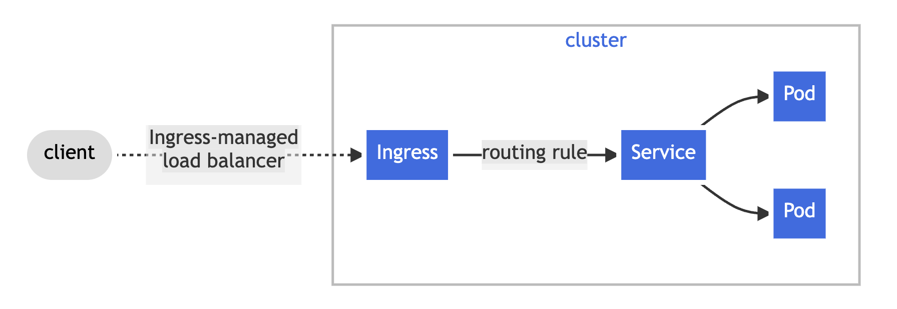

# Ingress

## Limitations with LoadBalancer or NodePort Services

Although technically it is possible to expose internal applications via NodePort or LoadBalancer Services, this happens very rarely. There are two main reasons for that:

- **Costs** – since each LoadBalancer Services is associated with a single external address, this can translate into a sizeable fee when running in a public cloud environment or even running out of quoata.
- **Functionality** – simple L4 load balancing provided by Services lacks a lot of the features that are typically associated with an application proxy or gateway. This means that each exposed application will need to take care of things like TLS management, rate-limiting, authentication and intelligent traffic routing on its own.

_Enter Ingress_.

## Ingress API in Kubernetes

**Ingress exposes HTTP and HTTPS routes from outside the cluster to services within the cluster. Traffic routing is controlled by rules defined on the Ingress resource**.



Ingress was designed as a generic, **vendor-independent API to configure an HTTP load balancer that would be available to multiple Kubernetes applications**. A user is expected to define a single rule telling the Ingress which backend Service to use. This would result in all incoming HTTP requests to be routed to one of the healthy Endpoint of this Service:

```yaml
apiVersion: networking.k8s.io/v1
kind: Ingress
metadata:
  name: example
spec:
  rules:
  - http:
      paths:
      - backend:
          service:
            name: web
            port:
              number: 80
        path: /
```


!!! note "Ingress and Namespaces"
    Ingress interacts with namespaces in some nonobvious ways. First, due to an abundance of security caution, an Ingress object can refer to only an upstream service in the same namespace. This means that **you can’t use an Ingress object to point a subpath to a service in another namespace**.


## Use-cases

A Layer 7 load balancer can be used to make load balancing decisions based on the URI, host, HTTP headers, and other data in the application message.

An Ingress may be configured to:

- give Services externally-reachable URLs
- load balance traffic
- terminate SSL / TLS
- offer name-based virtual hosting

An Ingress does not expose arbitrary ports or protocols. Exposing services other than HTTP and HTTPS to the internet typically uses a service of type `Service.Type=NodePort` or `Service.Type=LoadBalancer`.


## High-level overview


The figure shows:

- A Kubernetes cluster.
- Cluster users Admin, User A and User B, which use the cluster via the Kubernetes API.
- Clients A and Clients B, which connect to the Applications A and B deployed by the corresponding users.
- Ingress Controller (IC), deployed by Admin in a pod in the namespace `nginx-ingress` and configured via the ConfigMap `nginx-ingress`. 
- Application A with two pods deployed in the namespace A by User A. To expose the application to its clients (Clients A) via the host `a.example.com`, User A creates Ingress A.
- Application B with one pod deployed in the namespace B by User B. To expose the application to its clients (Clients B) via the host `b.example.com`, User B creates Ingress B.
- Public Endpoint, which fronts the IC pod(s). This is typically a TCP load balancer (cloud, software, or hardware) or a combination of such load balancer with a NodePort service. Clients A and B connect to their applications via the Public Endpoint.

??? example

    !!! note
        The manifests below are just examples for illustration purposes only.

    - For the first Ingress (on the `ns1` namespace):

        ```yaml
        apiVersion: v1
        kind: Service
        metadata:
          name: service1
          namespace: ns1
        spec:
          selector:
            app: myapp1
          ports:
          - name: http
            port: 80
        ---
        apiVersion: networking.k8s.io/v1
        kind: Ingress
        metadata:
          name: ingress1
          namespace: ns1
        spec:
          rules:
          - host: a.example.com
            http:
              paths:
              - pathType: Prefix
                path: /
                backend:
                  service:
                    name: service1
                    port:
                      number: 80
        ```

    - And for the second Ingress (on the `ns2` namespace):

        ```yaml
        apiVersion: v1
        kind: Service
        metadata:
          name: service2
          namespace: ns2
        spec:
          selector:
            app: myapp2
          ports:
          - name: http
            port: 80
        ---
        apiVersion: networking.k8s.io/v1
        kind: Ingress
        metadata:
          name: ingress2
          namespace: ns2
        spec:
          rules:
          - host: b.example.com
            http:
              paths:
              - pathType: Prefix
                path: /
                backend:
                  service:
                    name: service2
                    port:
                      number: 80
        ```

## Resources

- [How NGINX Ingress Controller Works, Nginx Docs](https://docs.nginx.com/nginx-ingress-controller/intro/how-nginx-ingress-controller-works/)
- [Ingress, Kubernetes official docs](https://kubernetes.io/docs/concepts/services-networking/ingress/)
