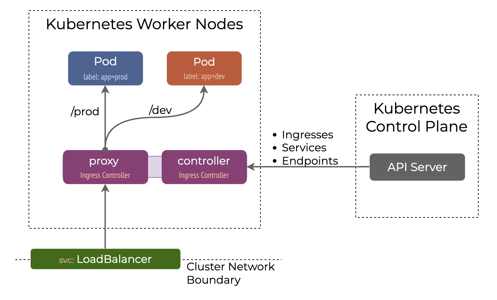

# Ingress Controller

## What is a Kubernetes ingress controller?

**An Ingress Controller is a component in a Kubernetes cluster that configures an HTTP load balancer according to Ingress resources** created by the cluster user.

Kubernetes provides **Layer 7** load balancers in the form of an Ingress controllers.

**An ingress controller acts as a reverse proxy and load balancer**. It implements a Kubernetes Ingress. The ingress controller adds a layer of abstraction to traffic routing, accepting traffic from outside the Kubernetes platform and load balancing it to Pods running inside the platform. It converts configurations from Ingress resources into routing rules that reverse proxies can recognize and implement.

Kubernetes Ingress controllers:

- Accept traffic from outside the Kubernetes platform, and load balance it to pods (containers) running inside the platform
- Can manage egress traffic within a cluster for services which need to communicate with other services outside of a cluster
- Are configured using the Kubernetes API to deploy objects called “Ingress Resources”
- Monitor the pods running in Kubernetes and automatically update the load‑balancing rules when pods are added or removed from a service

**You must have an Ingress controller to satisfy an Ingress. Only creating an Ingress resource has no effect**.


## Ingress Controller implementations

There are over a dozen of Ingress controller implementations from the major load balancer, proxy and service mesh vendors which makes choosing the right Ingress controller a very daunting task.

**Ingress controller is typically a proxy service deployed in the cluster**. It is nothing but a Kubernetes Deployment exposed to a Service. Some of the Ingress controllers available for Kubernetes:

- Nginx Ingress Controller (Community & From Nginx Inc)
- Traefik
- HAproxy
- Envoy
- Contour
- GKE Ingress Controller
- etc.

Generally, Nginx and Traefik are the most widely used ingress controllers.

A more detailed list can be found [here](https://docs.google.com/spreadsheets/d/191WWNpjJ2za6-nbG4ZoUMXMpUK8KlCIosvQB0f-oq3k/edit#gid=907731238) and [here](https://docs.google.com/spreadsheets/d/1DnsHtdHbxjvHmxvlu7VhzWcWgLAn_Mc5L1WlhLDA__k/edit#gid=0).

## Annotations

Ingress frequently uses annotations to configure some options depending on the Ingress controller, an example of which is the [rewrite-target annotation](https://github.com/kubernetes/ingress-nginx/blob/main/docs/examples/rewrite/README.md). Different Ingress controllers support different annotations.

!!! info
    Rewrite rules in Nginx change part or all of the URL in a client request, usually for one of two purposes:

    - To inform clients that the resource they’re requesting now resides at a different location.
    - To control the flow of processing within Nginx, for example to forward requests to an application server when content needs to be generated dynamically.


## IngressClassName

**Multiple Ingress controllers can be deployed in a single cluster** and Ingress resources are associated with a particular controller based on the `.spec.ingressClassName` field.

If the `ingressClassName` is omitted in an Ingress object, a default Ingress class should be defined.

Typically, during the installation process, **an Ingress Controller creates a Service type LoadBalancer** and uses the allocated IP to update the `.status.loadBalancer` field of all managed Ingresses.



### Default IngressClass

You can mark a particular IngressClass as default for your cluster. Setting the `ingressclass.kubernetes.io/is-default-class` annotation to `true` on an IngressClass resource will ensure that new Ingresses without an `ingressClassName` field specified will be assigned this default IngressClass.

```yaml
apiVersion: networking.k8s.io/v1
kind: IngressClass
metadata:
  labels:
    app.kubernetes.io/component: controller
  name: nginx-example
  annotations:
    ingressclass.kubernetes.io/is-default-class: "true"
spec:
  controller: k8s.io/ingress-nginx
```

