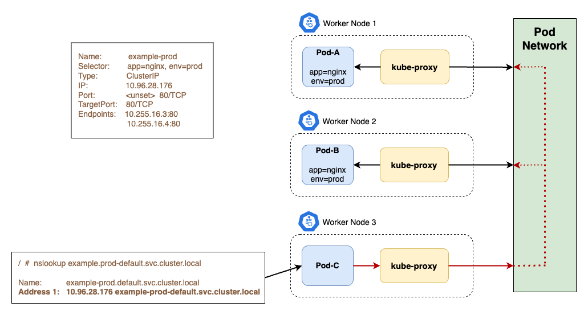

# ClusterIP Service

A `ClusterIP` Service exposes the Service on a **cluster-internal** IP. This makes the **Service only reachable from within the cluster**.

## Key Points

A few key points:

- Services can have a cluster-scoped virtual IP address (using a Service of `type: ClusterIP`).
    - Clients can connect using that virtual IP address, and Kubernetes then load-balances traffic to that Service across the different backing Pods.
- `ClusterIP` is the default and most common service type.
- Kubernetes will assign a cluster-internal IP address to ClusterIP service. This makes the service only reachable within the cluster.
- You cannot make requests to service (pods) from outside the cluster.
- You can optionally set cluster IP in the service definition file.
- Across your whole cluster, every Service `ClusterIP` must be unique. Trying to create a Service with a specific ClusterIP that has already been allocated will return an error.



## Use Cases

- Inter service communication within the cluster. For example, communication between the front-end and back-end components of your app.


## Example

### Before Service creation

!!! info
    To illustrate the use of the `ClusterIP` Service, we're going to use the `nginx-deployment` Deployment (under the `default` namespace) running on our Kubernetes cluster, which was created in previous sections.

**Before creating the Service below**, let's check that the `http://nginx-clusterip` endpoint doesn't resolve to anything (note: `nginx-clusterip` is the Service name, as stated in the `.metadata.name` field of the corresponding object (see manifest below)):

```bash
# Get the first Pod name based on the label selector app=nginx
NGINX_POD_NAME=$(kubectl get pods -l app=nginx --no-headers | head -n 1 | awk '{print $1}')

# Install curl on the nginx Pod
kubectl exec -it $NGINX_POD_NAME -- sh -c 'apt-get update -y && apt-get install -y curl'

# Attempt to resolve the Service name from the nginx Pod
kubectl exec -it $NGINX_POD_NAME -- curl http://nginx-clusterip
```

The output from the last command should return something like this:

```bash
curl: (6) Could not resolve host: nginx-clusterip
```

which means that there is no DNS resolution and loadbalancing across Pods, as the Service hasn't been created yet.

### Service creation

Let's create a Service of type `ClusterIP` that will target the Pods from the `nginx-deployment`:

```yaml
apiVersion: v1
kind: Service
metadata:
  name: nginx-clusterip
spec:
  type: ClusterIP  # ClusterIP is the default type, therefore it could be omitted.
  selector:
    app: nginx
  ports:
  - name: http
    protocol: TCP  # The default protocol for Services is TCP, therefore it could be omitted.
    port: 80
```

This specification creates a new Service object named `nginx-clusterip`, which targets TCP port `80` on any **Pod** with the `app: nginx` label.

!!! info
    The controller for the Service selector continuously scans for Pods that match its selector, and then POSTs any updates to an Endpoint object also named `nginx-clusterip`.


To list the Services:

```diff
$ kubectl get svc

  NAME              TYPE        CLUSTER-IP       EXTERNAL-IP   PORT(S)   AGE
  kubernetes        ClusterIP   10.254.0.1       <none>        443/TCP   14d
+ nginx-clusterip   ClusterIP   10.254.201.125   <none>        80/TCP    18m
```


As you can see, the `nginx-clusterip` Service has been created and has been assigned the `10.254.201.125` ClusterIP.

!!! info
    ClusterIP Service types are only reachable within the Kubernetes cluster.

### After Service creation

After the `nginx-clusterip` Service has been created, let's try to reach it:

```bash
# Get the first Pod name based on the label selector app=nginx
NGINX_POD_NAME=$(kubectl get pods -l app=nginx --no-headers | head -n 1 | awk '{print $1}')

# Attempt to resolve the Service name from the nginx Pod
kubectl exec -it $NGINX_POD_NAME -- curl http://nginx-clusterip
```

The last command should now return the default Nginx webpage.

We can also try this through a (temporary) Pod with `curl` installed:

```bash
# Create a temporary Pod with curl installed
$ kubectl run temp-curl -it --rm --image=curlimages/curl -- sh

# Run curl from the (temp) Pod with the Service name as the address
/ $ curl http://nginx-clusterip

# Run curl from the (temp) Pod with the ClusterIP address
/ $ curl http://10.254.201.125
```

!!! info
    Apart from the DNS resolution, Services also provide a load-balancing mechanism across Pods.


## DNS Resolution

Let's create a temporary Ubuntu Pod, run `nslookup` and see where the Service resolves to.

```bash
# Create a temporary Ubuntu Pod
$ kubectl run temp-ubuntu -it --rm --image=ubuntu -- bash

# Run nslookup **inside the Ubuntu Pod** to see
# what the ClusterIP Service resolves to.
$ nslookup nginx-clusterip.default.svc.cluster.local
```

!!! note
    The first part is (i.e. `nginx-clusterip.default.svc.cluster.local`) is:

    - `nginx-clusterip`: is the Service name (as stated on the `.metadata.name` field).
    - `default`: is the Namespace that the Service belongs to.

    Ignore the `svc.cluster.local` suffix for now. We're going to cover it in the DNS chapter.

The last command should return something like this:

```bash
Server:		10.254.0.10
Address:	10.254.0.10#53

Name:	nginx-clusterip.default.svc.cluster.local
Address: 10.254.201.125
```

This means that the `nginx-clusterip.default.svc.cluster.local` name resolves to the `10.254.201.125` address, which is the Service's ClusterIP that we created above.
