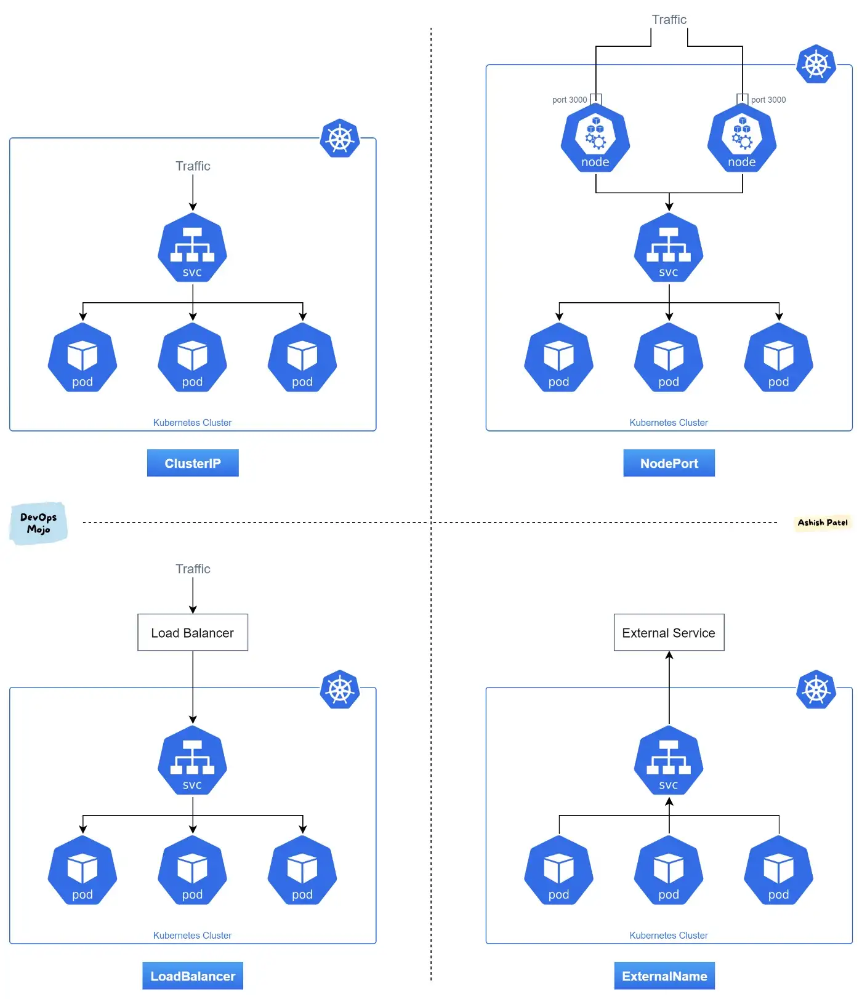

# Service

**An abstract way to expose an application running on a set of Pods as a network service**.

Kubernetes gives Pods their own IP addresses and a single DNS name for a set of Pods, and can load-balance across them.

## Service resources

The basic Kubernetes building block starts with the Pod, which is just a Kubernetes resource representing a collection of containers that can be created and destroyed on demand. For a client to connect to Pods, it needs to figure out the the IP address of each individual Pod. One option is to have the client call the Kubernetes API server and get the list of pods and their IP addresses through an API call. Although a couple of probles arise:
- the cluster's scheduler can move or reschedule a Pod to another Kubernetes cluster node, any internal IPs that this Pod is assigned can change over time.
- you should always strive to keep your apps Kubernetes-agnostic.
- making API calls to the K8s API every few seconds might saturate the network.

Enter Services.

In Kubernetes, a Service is an abstraction which defines a logical set of Pods and a policy by which to access them. The set of Pods targeted by a Service is usually determined by a selector. **Service discovery** is the actual process of figuring out how to connect to a service.

**A _good starting point_ to understand a Kubernetes Service is to think of it as a _distributed load-balancer_**. Similar to traditional load-balancers, its data model can be reduced to the following two components:

1. **Grouping of backend Pods** – all Pods with the same labels represent a single service and can receive and process incoming traffic for that service.
1. **Methods of exposure** – each group of Pods can be exposed either internally, to other Pods in a cluster, or externally, to end-users or external services in many different ways.

!!! info
    Virtual IP (VIP) hides all backend IPs to a client, decouples the client from backend instances. In this way, backend activities, such as scaling up/down, pulling in/out, will totally be transparent to clients.


## Service Types

For some parts of your application (for example, frontends) you may want to expose a Service onto an external IP address, that's outside of your cluster.

Services can be `Type` of:

| Type | Description |
|:----:|:-----------:|
| `ClusterIP` | The most common type, assigns a unique ClusterIP (VIP) to a set of matching backend Pods. DNS lookup of a Service name returns the allocated ClusterIP. All ClusterIPs are configured in the data plane of each node as DNAT rules – destination ClusterIP is translated to one of the PodIPs. These NAT translations always happen on the egress (client-side) node which means that Node-to-Pod reachability must be provided externally (by a CNI plugin). |
| `Headless`| The simplest form of load-balancing involving only DNS. Nothing is programmed in the data plane and no load-balancer VIP is assigned, however DNS query will return IPs for all backend Pods. The most typical use-case for this is stateful workloads (e.g. databases), where clients need stable and predictable DNS name and can handle the loss of connectivity and failover on their own. |
| `NodePort` | Builds on top of the ClusterIP Service by allocating a unique static port in the root network namespace of each Node and mapping it (via Port Translation) to the port exposed by the backend Pods. The incoming traffic can hit any cluster Node and, as long as the destination port matches the NodePort, it will get forwarded to one of the healthy backend Pods. |
| `LoadBalancer` | Attracts external user traffic to a Kubernetes cluster. Each LoadBalancer Service instance is assigned a unique, externally routable IP address which is advertised to the underlying physical network via BGP or gratuitous ARP. This Service type is implemented outside of the main kube controller – either by the underlying cloud as an external L4 load-balancer or with a cluster add-on like [MetalLB](https://github.com/metallb/metallb), [Porter](https://github.com/openelb/openelb) or [kube-vip](https://kube-vip.io/). |


An illustration of the various ServiceTypes can be seen below:



!!! note
    One Service type that doesn’t fit with the rest is `ExternalName`. It instructs DNS cluster add-on (e.g. CoreDNS) to respond with a CNAME, redirecting all queries for this service’s domain name to an external FQDN, which can simplify interacting with external services (for more details see the [Design Spec](https://github.com/kubernetes/community/blob/b3349d5b1354df814b67bbdee6890477f3c250cb/contributors/design-proposals/network/service-external-name.md#motivation)).


## Service Name

The Service name follow the DNS label standard as defined in [RFC 1035](https://www.rfc-editor.org/rfc/rfc1035). This means the name must:

- contain at most 63 characters
- contain only lowercase alphanumeric characters or '-'
- start with an alphabetic character
- end with an alphanumeric character


## Defining a Service

Suppose you have a set of Pods where each listens on TCP port `9376` and contains a label `app.kubernetes.io/name=MyApp`:

```yaml
apiVersion: v1
kind: Service
metadata:
  name: my-service
spec:
  selector:
    app.kubernetes.io/name: MyApp
  ports:
    - protocol: TCP
      port: 80
      targetPort: 9376
```

This specification creates a new Service object named `my-service`, which targets TCP port `9376` on any Pod with the `app.kubernetes.io/name=MyApp` label.

Kubernetes assigns this Service an IP address, which is used by the Service proxies.

The controller for the Service selector continuously scans for Pods that match its selector, and then POSTs any updates to an Endpoint object also named `my-service`.

!!! note
    A Service can map _any_ incoming `port` to a `targetPort`. By default and for convenience, the `targetPort` is set to the same value as the `port` field.

Port definitions in Pods have names, and you can reference these names in the `targetPort` attribute of a Service. For example, we can bind the `targetPort` of the Service to the Pod port in the following way:

```yaml
apiVersion: v1
kind: Pod
metadata:
  name: nginx
  labels:
    app.kubernetes.io/name: proxy
spec:
  containers:
  - name: nginx
    image: nginx:stable
    ports:
      - containerPort: 80
        name: http-web-svc
---
apiVersion: v1
kind: Service
metadata:
  name: nginx-service
spec:
  selector:
    app.kubernetes.io/name: proxy
  ports:
  - name: name-of-service-port
    protocol: TCP
    port: 80
    targetPort: http-web-svc
```

This offers a lot of flexibility for deploying and evolving your Services. For example, you can change the port numbers that Pods expose in the next version of your backend software, without breaking clients.

!!! info
    The default protocol for Services is TCP.

As many Services need to expose more than one port, Kubernetes supports multiple port definitions on a Service object.
