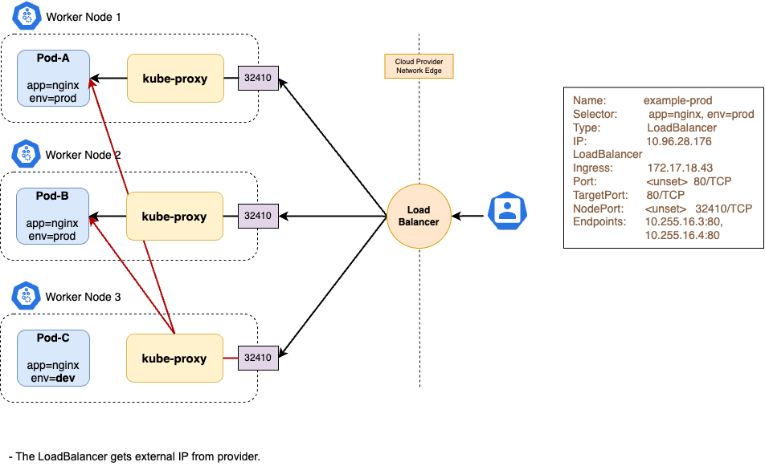

# LoadBalancer Service

The LoadBalancer Service builds upon the NodePort Service to address some of its downsides. At its core, the LoadBalancer Service is a NodePort Service under the hood. However, the LoadBalancer Service has additional functionality that is satisfied by a controller.

On cloud providers which support external load balancers, setting the type field to LoadBalancer provisions a load balancer for your Service. The actual creation of the load balancer happens asynchronously, and information about the provisioned balancer is published in the Service's `.status.loadBalancer` field.



## Example

For example:

```yaml
apiVersion: v1
kind: Service
metadata:
  name: nginx-loadbalancer
spec:
  type: LoadBalancer
  selector:
    app: nginx
  ports:
  - name: http
    port: 80
```

From the networking point of view, a LoadBalancer Service is expected to accomplish three things:

- Allocate a new, externally routable IP from a pool of addresses and release it when a Service is deleted.
- Make sure the packets for this IP get delivered to one of the Kubernetes Nodes.
- Program Node-local data plane to deliver the incoming traffic to one of the healthy backend Endpoints.

**By default, Kubernetes will only take care of the last item**, i.e. `kube-proxy` (or it’s equivalent) will program a Node-local data plane to enable external reachability – most of the work to enable this is already done by the NodePort implementation. However, the most challenging part – **IP allocation and reachability** – **is left to external implementations**. What this means is that in a vanilla Kubernetes cluster, LoadBalancer Services will remain in a “pending” state, i.e. they will have no external IP and will not be reachable from the outside:

```bash
$ kubectl get svc nginx-loadbalancer

nginx-loadbalancer   LoadBalancer   10.254.77.164    <pending>     80:31373/TCP   9s
```

!!! note
    There is no quota for personal projects for the Load Balancing as a Service (LBaaS). More details can be found [here](https://clouddocs.web.cern.ch/networking/load_balancing.html).

However, as soon as a LoadBalancer controller gets installed, it collects all “pending” Services and allocates a unique external IP from its own pool of addresses. It then updates a Service status with the allocated IP and configures external infrastructure to deliver incoming packets to (by default) all Kubernetes Nodes.

## On-Prem cluster

!!! info
    Both on-prem and public **cloud-based clusters** can use existing cloud L4 load balancers, e.g. [AWS NLB](https://docs.aws.amazon.com/eks/latest/userguide/network-load-balancing.html), [LBaaS plugin](https://docs.openstack.org/kuryr-kubernetes/latest/installation/services.html) for OpenStack, etc.

**On-prem clusters** can have multiple configurations options, depending on the requirements and what infrastructure may already be available in a data centre:

- Existing load-balancer appliances from incumbent vendors like F5 can be integrated with on-prem clusters allowing for the same appliance instance to be re-used for multiple purposes.
- If direct interaction with the physical network is possible, load-balancing can be performed by one of the many cluster add-ons, utilising either gratuitous ARP (for L2 integration) or BGP (for L3 integration) protocols to advertise external IPs and attract traffic for those IPs to cluster Nodes.

There are many implementations of these cluster add-ons:

- [MetalLB](https://metallb.universe.tf/): One of the most mature projects today. Supports both ARP and BGP modes via custom userspace implementations.
- [OpenELB](https://github.com/kubesphere/openelb): Supports both ARP and BGP modes, with BGP implementation built on top of GoBGP.
- etc.
