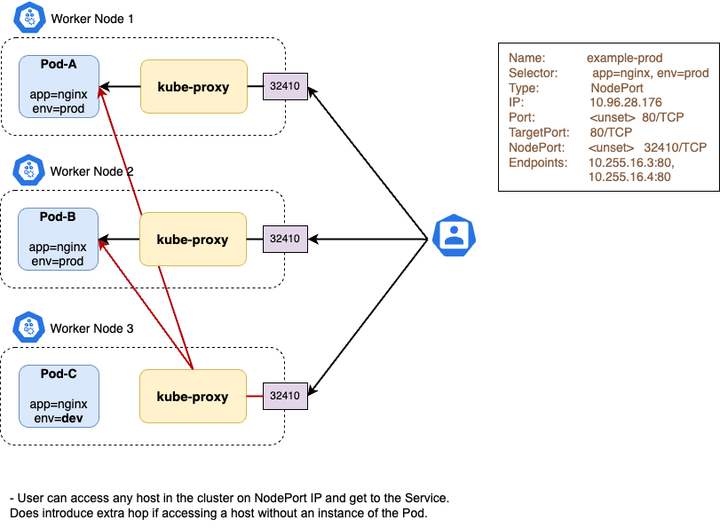

# NodePort Service

NodePort builds on top of the ClusterIP Service and provides a way to expose a group of Pods to the outside world. At the API level, the only difference from the ClusterIP is the mandatory service type which has to be set to `NodePort`, the rest of the values can remain the same.

If you set the `type` field to `NodePort`, the Kubernetes control plane **allocates a port from a range** specified by `--service-node-port-range` flag (default: **30000-32767**). Each node proxies that port (the **same port number on every Node**) into your Service. Your Service reports the allocated port in its `.spec.ports[*].nodePort` field.



## Before Service creation

!!! info
    To illustrate the use of the `NodePort` Service, we're going to use the `nginx-deployment` Deployment (under the `default` namespace) running on our Kubernetes cluster, which was created in previous sections.

**Before creating the Service below**, let's check:

1. That the `http://nginx-nodeport` endpoint doesn't resolve to anything (note: `nginx-nodeport` is the Service name, as stated in the `.metadata.name` field of the corresponding object (see manifest below)):

    ```bash
    # Create a temporary Pod with curl installed
    $ kubectl run temp-curl -it --rm --image=curlimages/curl -- sh

    # Run curl from the (temp) Pod with the Service name as the address
    / $ curl http://nginx-nodeport
    ```

    The output from the last command should return something like this:

    ```bash
    curl: (6) Could not resolve host: nginx-nodeport
    ```

    which means that there is no DNS resolution and loadbalancing across Pods, as the Service hasn't been created yet.

1. Check open ports on the worker nodes of our Kubernetes cluster in the range 30000-32767.

    The easiest way to do this is to SSH on one of the worker nodes and run `ss` (or `netstat`).

    1. Get the IP address of one worker node:

        ```bash
        kubectl get nodes -o wide
        ```

    1. SSH to that worker node, e.g.:

        ```bash
        ssh core@188.185.124.201
        ```

    1. Run [`ss`](https://man7.org/linux/man-pages/man8/ss.8.html) to view all listening TCP and UDP sockets on the node in the desired port range:

        ```bash
        ss -ntul '( sport >= 30000 and sport <= 32768 )'
        ```

## Service creation

Let's create a Service of type `NodePort` that will target the Pods from the `nginx-deployment`:

```yaml
apiVersion: v1
kind: Service
metadata:
  name: nginx-nodeport
spec:
  type: NodePort
  selector:
    app: nginx
  ports:
  - name: http
    port: 80
```

This specification creates a new Service object named `nginx-nodeport`, which targets TCP port `80` on any **Pod** with the `app: nginx` label.

!!! info
    The controller for the Service selector continuously scans for Pods that match its selector, and then POSTs any updates to an Endpoint object also named `nginx-nodeport`.

To list the Services:

```diff
$ kubectl get svc

  NAME              TYPE        CLUSTER-IP       EXTERNAL-IP   PORT(S)   AGE
  kubernetes        ClusterIP   10.254.0.1       <none>        443/TCP        14d
  nginx-clusterip   ClusterIP   10.254.201.125   <none>        80/TCP         25m
+ nginx-nodeport    NodePort    10.254.178.121   <none>        80:31479/TCP   4s
```

As you can see, the `nginx-nodeport` Service has been created and:

- has been assigned the `10.254.178.121` ClusterIP (is only reachable within the cluster).
- is reachable through the `31479` port on _all worker_ nodes.

!!! info
    NodePort Service types are reachable both within and outside the Kubernetes cluster.

## After Service creation

After the `nginx-nodeport` Service has been created, let's try to reach it via a (temporary) Pod with `curl` installed:

```bash
# Create a temporary Pod with curl installed
$ kubectl run temp-curl -it --rm --image=curlimages/curl -- sh

# Run curl from the (temp) Pod with the Service name as the address
/ $ curl http://nginx-nodeport

# Run curl from the (temp) Pod with the ClusterIP address
/ $ curl http://10.254.178.121

# Run curl from the (temp) Pod with the worker node IP address + NodePort
curl http://188.185.124.201:31479
```

The last three commands should return the default nginx webpage.

Moreover, we can verify that the `31479` port has been opened to all worker nodes by SSHing to them and run `ss` (or `netstat`). For example:

```bash
$ ssh core@188.185.124.201 "ss -ntul '( sport >= 30000 and sport <= 32768 )'"


Netid   State   Recv-Q  Send-Q    Local    Address:Port    Peer     Address:Port    Process
tcp     LISTEN  0       4096               0.0.0.0:31479            0.0.0.0:*
```

## Choosing your own port

If you want a specific port number, you can specify a value in the `nodePort` field. The control plane will either allocate you that port or report that the API transaction failed. This means that you need to take care of possible port collisions yourself.

```yaml
apiVersion: v1
kind: Service
metadata:
  name: nginx-nodeport
spec:
  type: NodePort
  selector:
    app: nginx
  ports:
  - name: http
    nodePort: 30171
    port: 80
```

!!! warning
    One of the side-effects of this kind of behaviour is that `ClusterIP` and `NodePort` values are immutable – they cannot be changed throughout the lifecycle of an object. The only way to change or update an existing Service is to provide the right metadata and omit both ClusterIP and NodePort values from the spec.
