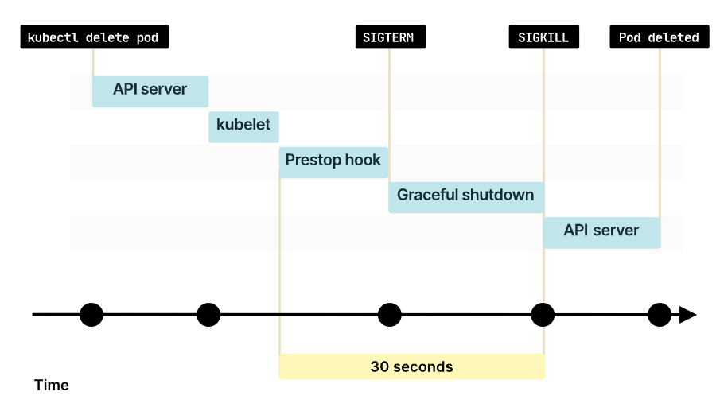

# Pod Lifecycle

Pods follow a defined lifecycle, starting in the `Pending` phase, moving through `Running` if at least one of its primary containers starts OK, and then through either the `Succeeded` or `Failed` phases depending on whether any container in the Pod terminated in failure.

## Pod lifetime

- **Pods are considered to be relatively ephemeral (rather than durable) entities**.
- Pods are created, assigned a unique ID (UID), and scheduled to nodes where they remain until termination (according to restart policy) or deletion. 
    - If a Node dies, the Pods scheduled to that node are scheduled for deletion after a timeout period.

- Pods do not, by themselves, self-heal.
- If a Pod is scheduled to a node that then fails, the Pod is deleted; likewise, a Pod won't survive an eviction due to a lack of resources or Node maintenance.
- Kubernetes uses a higher-level abstraction, called a **controller**, that handles the work of **managing the relatively disposable Pod instances**.


## Pod Phase

Every **Pod** has a `status.phase` field. Possible values are:

| Value | Description |
|:-----:|:-----------:|
| Pending | The Pod has been accepted by the Kubernetes cluster, but one or more of the containers has not been set up and made ready to run. This includes time a Pod spends waiting to be scheduled as well as the time spent downloading container images over the network. |
| Running | The Pod has been bound to a node, and all of the containers have been created. At least one container is still running, or is in the process of starting or restarting. |
| Succeeded | All containers in the Pod have terminated in success, and will not be restarted. |
| Failed | All containers in the Pod have terminated, and at least one container has terminated in failure. That is, the container either exited with non-zero status or was terminated by the system. |
| Unknown | For some reason the state of the Pod could not be obtained. This phase typically occurs due to an error in communicating with the node where the Pod should be running. |

### Example

#### Kubectl Get Pods

You can get the Pod phase using the `kubectl get pods` command:

```bash
$ kubectl get pods nginx-cms-daq-workshop-multiple -o jsonpath={.status.phase}

Running
```

#### Kubectl Describe Pods

You can also get the Pod phase using the `kubectl describe pods` command:

```diff
$ kubectl describe pods nginx-cms-daq-workshop-multiple

Name:         nginx-cms-daq-workshop-multiple
Namespace:    default
Priority:     0
Node:         cms-daq-workshop-gml7jxg5oxyf-node-0/188.185.124.201
Start Time:   Fri, 06 Jan 2023 11:58:08 +0100
Labels:       <none>
Annotations:  cni.projectcalico.org/podIP: 10.100.155.140/32
              cni.projectcalico.org/podIPs: 10.100.155.140/32
+ Status:     Running
IP:           10.100.155.140
IPs:
  IP:  10.100.155.140

<REDACTED>
```

## Container State

As well as the phase of the Pod overall, Kubernetes tracks the **state of each container inside a Pod**.

There are three possible container states: `Waiting`, `Running`, and `Terminated`.

**To check the state of a Pod's containers, you can use `kubectl describe pod <name-of-pod>`**.

Each state has a specific meaning:

| Value | Description |
|:-----:|:-----------:|
| Waiting | If a container is not in either the `Running` or `Terminated` state, it is `Waiting`. A container in the `Waiting` state is still running the operations it requires in order to complete start up: for example, pulling the container image from a container image registry, or applying Secret data. |
| Running | The `Running` status indicates that a container is executing without issues. |
| Terminated | A container in the `Terminated` state began execution and then either ran to completion or failed for some reason. When you use `kubectl` to query a Pod with a container that is `Terminated`, you see a reason, an exit code, and the start and finish time for that container's period of execution. |


### Example

#### Kubectl Get Pods

You can get the state of the container(s) in a Pod using the `kubectl get pod` command:

```diff
$ kubectl get pods nginx-cms-daq-workshop-multiple -o yaml


apiVersion: v1
kind: Pod
metadata:
  name: nginx-cms-daq-workshop-multiple

<REDACTED>

status:
  containerStatuses:
  - containerID: containerd://3c3985d80ddfc0c331fe850775181cbae65dff571bf92d3ea86f947e7cfcfa8c
    image: docker.io/library/alpine:latest
    imageID: docker.io/library/alpine@sha256:8914eb54f968791faf6a8638949e480fef81e697984fba772b3976835194c6d4
    name: alpine-cms-daq-workshop
    ready: true
+   state:
+     running:
+       startedAt: "2023-01-06T10:58:11Z"
  - containerID: containerd://8fd4aee478e670e8d4755a19fda22f7e3ded46a2b703c98b2e24c3ff58fa9844
    image: docker.io/library/nginx:latest
    imageID: docker.io/library/nginx@sha256:0047b729188a15da49380d9506d65959cce6d40291ccfb4e039f5dc7efd33286
    name: nginx
+   state:
+     running:
+       startedAt: "2023-01-06T10:58:10Z"
  hostIP: 188.185.124.201
  phase: Running
  podIP: 10.100.155.140

<REDACTED>
```


#### Kubectl Describe Pods

You can also get the state of the container(s) in a Pod using the `kubectl describe pod` command:

```diff
$ kubectl describe pod nginx-cms-daq-workshop-multiple

Name:         nginx-cms-daq-workshop-multiple
Namespace:    default
Priority:     0
Node:         cms-daq-workshop-gml7jxg5oxyf-node-0/188.185.124.201
Start Time:   Fri, 06 Jan 2023 11:58:08 +0100
Labels:       <none>
Annotations:  cni.projectcalico.org/podIP: 10.100.155.140/32
              cni.projectcalico.org/podIPs: 10.100.155.140/32
Status:       Running
IP:           10.100.155.140
IPs:
  IP:  10.100.155.140
Containers:
  nginx:
    Container ID:   containerd://8fd4aee478e670e8d4755a19fda22f7e3ded46a2b703c98b2e24c3ff58fa9844
    Image:          nginx
    Image ID:       docker.io/library/nginx@sha256:0047b729188a15da49380d9506d65959cce6d40291ccfb4e039f5dc7efd33286
    Port:           8080/TCP
    Host Port:      0/TCP
+   State:          Running
      Started:      Fri, 06 Jan 2023 11:58:10 +0100
    Ready:          True
    Restart Count:  0
    Environment:    <none>
    Mounts:
      /var/run/secrets/kubernetes.io/serviceaccount from kube-api-access-vjpbt (ro)
  alpine-cms-daq-workshop:
    Container ID:  containerd://3c3985d80ddfc0c331fe850775181cbae65dff571bf92d3ea86f947e7cfcfa8c
    Image:         alpine
    Image ID:      docker.io/library/alpine@sha256:8914eb54f968791faf6a8638949e480fef81e697984fba772b3976835194c6d4
    Port:          <none>
    Host Port:     <none>
    Args:
      /bin/sh
      -c
      sleep infinity
+   State:          Running
      Started:      Fri, 06 Jan 2023 11:58:11 +0100
    Ready:          True
    Restart Count:  0
    Environment:    <none>
    Mounts:
      /var/run/secrets/kubernetes.io/serviceaccount from kube-api-access-vjpbt (ro)
Conditions:
  Type              Status
  Initialized       True
  Ready             True
  ContainersReady   True
  PodScheduled      True
Volumes:
  kube-api-access-vjpbt:
    Type:                    Projected (a volume that contains injected data from multiple sources)
    TokenExpirationSeconds:  3607
    ConfigMapName:           kube-root-ca.crt
    ConfigMapOptional:       <nil>
    DownwardAPI:             true
QoS Class:                   BestEffort
Node-Selectors:              <none>
Tolerations:                 node.kubernetes.io/not-ready:NoExecute op=Exists for 300s
                             node.kubernetes.io/unreachable:NoExecute op=Exists for 300s
Events:                      <none>
```

## Container Restart Policy

The `spec` of a Pod has a `restartPolicy` field with possible values:

- `Always` (default)
- `OnFailure`
- `Never`

The `restartPolicy` applies to all containers in the Pod. After containers in a Pod exit, the kubelet restarts them with an exponential back-off delay (10s, 20s, 40s, …), that is capped at five minutes. Once a container has executed for 10 minutes without any problems, the kubelet resets the restart backoff timer for that container.

| Value | Description |
|:-----:|:-----------:|
| `Always` | The container will be restarted even if it exited with a zero exit code (i.e. successfully). This is useful when you don't care why the container exited, you just want to make sure that it is always running (e.g. a web server). This is the default. |
| `OnFailure` | The container will only be restarted if it exited with a non-zero exit code (i.e. something went wrong). This is useful when you want accomplish a certain task with the pod, and ensure that it completes successfully - if it doesn't it will be restarted until it does. |
| `Never` | The container will not be restarted regardless of why it exited (even if the container exits or a liveness probe fails). This Policy should be used for applications that should run once and never be automatically restarted. |


## Termination of Pods

Because Pods represent processes running on nodes in the cluster, it is important to allow those processes to gracefully terminate when they are no longer needed (rather than being abruptly stopped with a `KILL` signal and having no chance to clean up).

!!! info
    A _quick_ recap of a few [Linux signals](https://man7.org/linux/man-pages/man7/signal.7.html):

    - `SIGTERM`: Termination signal
    - `SIGKILL`: Kill signal
    - `SIGSTOP`: Stop process
    - `SIGINT`: Interrupt from keyboard

    The signals `SIGKILL` and `SIGSTOP` cannot be caught, blocked, or ignored.

Typically, the container runtime sends a TERM signal (`SIGTERM`) to the main process in each container. Once the grace period has expired, the KILL signal is sent to any remaining processes, and the Pod is then deleted from the API Server.


An example flow:

1. You use the `kubectl` tool to manually delete a specific Pod, with the default grace period (30 seconds).
1. The Pod in the API server is updated with the time beyond which the Pod is considered "dead" along with the grace period. If you use `kubectl describe` to check on the Pod you're deleting, that Pod shows up as "Terminating". On the node where the Pod is running: as soon as the kubelet sees that a Pod has been marked as terminating (a graceful shutdown duration has been set), the kubelet begins the local Pod shutdown process.

    1. If one of the Pod's containers has defined a `preStop` hook, the kubelet runs that hook inside of the container. If the `preStop` hook is still running after the grace period expires, the kubelet requests a small, one-off grace period extension of 2 seconds.

        !!! note
            If the `preStop` hook needs longer to complete than the default grace period allows, you must modify `terminationGracePeriodSeconds` to suit this.

    1. The kubelet triggers the container runtime to send a TERM signal to process 1 inside each container.

        !!! note
            The containers in the Pod receive the TERM signal at different times and in an arbitrary order. If the order of shutdowns matters, consider using a `preStop` hook to synchronize.

1. At the same time as the kubelet is starting graceful shutdown, the control plane removes that shutting-down Pod from `EndpointSlice` (and `Endpoints`) objects where these represent a Service with a configured selector. ReplicaSets and other workload resources no longer treat the shutting-down Pod as a valid, in-service replica. Pods that shut down slowly cannot continue to serve traffic as load balancers (like the service proxy) remove the Pod from the list of endpoints as soon as the termination grace period begins.
1. When the grace period expires, the kubelet triggers forcible shutdown. The container runtime sends `SIGKILL` to any processes still running in any container in the Pod. The kubelet also cleans up a hidden `pause` container if that container runtime uses one.
1. The kubelet triggers forcible removal of Pod object from the API server, by setting grace period to 0 (immediate deletion).
1. The API server deletes the Pod's API object, which is then no longer visible from any client.


