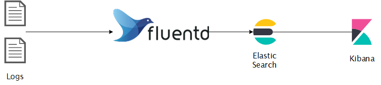

# Container Logs in Kubernetes

Container engines are designed to support logging.

The easiest and most adopted logging method for containerized applications is writing to standard output and standard error streams.

## Pod and container logs

Kubernetes captures logs from each container in a running Pod.

This example uses a manifest for a Pod with a container that writes text to the standard output stream, once per second:

```yaml
apiVersion: v1
kind: Pod
metadata:
  name: counter-date
spec:
  containers:
  - name: count
    image: busybox:1.28
    args: [/bin/sh, -c,
            'i=0; while true; do echo "$i: $(date)"; i=$((i+1)); sleep 1; done']
```

Apply the above manifest to your Kubernetes cluster.

To fetch the logs, use the `kubectl logs` command, as follows:

```bash
kubectl logs counter-date
```

The output is similar to:

```bash
0: Tue Mar 14 17:45:55 UTC 2023
1: Tue Mar 14 17:45:56 UTC 2023
2: Tue Mar 14 17:45:57 UTC 2023
```

The command calls `kubelet` service on that node to retrieve the logs.

### Stream logs

You can use the `--follow` or the `-f` flag to stream the logs:

```bash
kubectl logs -f counter-date
```

### Logs from a previous installation of a container

You can use `--previous` or the `-p` flag to retrieve logs from a previous instantiation of a container:

```bash
kubectl logs -p counter-date
```

### Logs from a specific container in a Pod

If your pod has multiple containers, specify which container's logs you want to access by appending a container name to the command, with a `-c` flag:

```bash
kubectl logs counter-date -c count
```

### Logs from specific time

If you want to fetch logs since a specific time or timestamp:

```bash
kubectl logs --since=1h counter-date # return logs newer than a relative duration

kubectl logs --since-time=2023-03-14T10:46:00.000000000Z counter-date # return logs after a specific date (RFC3339)
```

### Logs for multiple Pods

Kubectl can only show a single pod’s logs at a time. If you need to aggregate many pods into a single stream, you would need to use a higher level log aggregation and management tool, e.g. [`stern`](https://github.com/stern/stern), [`kubetail`](https://github.com/johanhaleby/kubetail), etc.

### All available options

You can view all the available options for the `kubectl logs` command via the [`official documentation`](https://kubernetes.io/docs/reference/generated/kubectl/kubectl-commands#logs) or via the help menu:

```bash
kubectl logs -h
```

## How nodes handle container logs

A container runtime handles and redirects any output generated to a containerized application's `stdout` and `stderr` streams.


By default, **if a container restarts, the kubelet keeps one terminated container with its logs**. If a pod is evicted from the node, all corresponding containers are also evicted, along with their logs.

Kubernetes doesn’t provide built-in log rotation, but this functionality is available in many tools, or standard file shippers or even a simple custom cron job.

## Log locations

The way that the kubelet and container runtime write logs depends on the operating system that the node uses.

On Linux nodes that use systemd, the kubelet and container runtime write to journald by default. You use `journalctl` to read the systemd journal; for example: `journalctl -u kubelet`.

If systemd is not present, the kubelet and container runtime write to `.log` files in the `/var/log` directory.

The kubelet always directs your container runtime to write logs into directories within `/var/log/pods`. You can SSH to one of the worker nodes in your cluster and view the contents of the aforementioned directory.

1. Get the IP address of one of your worker nodes:

    ```bash
    kubectl get nodes -o wide
    ```

1. SSH to this worker node (make sure you replace the `IP_ADDRESS` with your worker node IP):

    ```bash
    ssh core@IP_ADDRESS
    ```

    !!! note
        This step assumes that you have added an SSH key-pair for your OpenStack Magnum Kubernetes cluster, as described in the [Prerequisites section](../00-prerequisites/README.md).

1. View the contents of the `/var/log/pods/` directory:

    ```bash
    ls -al /var/log/pods/
    ```

!!! example
    **Exercise**: Deploy an nginx Pod (or use the already existing ones from the previous sections), generate traffic towards the default nginx webpage and view the logs using the `kubectl logs` command and also on the host that the container is running on (hint: it's a `.log` file and you can use `less`, `tail`, etc., on a Linux host).


## Cluster-level Logging

In a cluster, logs should have a separate storage and lifecycle independent of nodes, pods, or containers. This concept is called cluster-level logging.

Cluster-level logging architectures require a separate backend to store, analyze, and query logs. Kubernetes does not provide a native storage solution for log data. Instead, there are many logging solutions that integrate with Kubernetes.


### Using a node logging agent

You can implement cluster-level logging by including a node-level logging agent on each node. The logging agent is a dedicated tool that exposes logs or pushes logs to a backend.

Containers write to stdout and stderr, but with no agreed format. A node-level agent collects these logs and forwards them for aggregation.

!!! note
    The cluster-level logging solution is usually provided by the cluster administrators.

There are more cluster-level logging architectures, such as:

- using a sidecar container with the logging agent
- exposing logs directly from the application
- etc.

### Using a sidecar for logging

If your application does not output to `stdout` and `stderr`, then you can deploy a sidecar container alongside your application.

You can use a sidecar container in one of the following ways:

- The sidecar container streams application logs to its own stdout.
- The sidecar container runs a logging agent, which is configured to pick up logs from an application container.


<details>
  <summary>Example</summary>

    ```yaml
    apiVersion: v1
    kind: Pod
    metadata:
      name: counter-sidecar-streaming
    spec:
      containers:
      - name: count
        image: busybox:1.28
        args:
        - /bin/sh
        - -c
        - >
          i=0;
          while true;
          do
            echo "$i: $(date)" >> /var/log/1.log;
            echo "$(date) INFO $i" >> /var/log/2.log;
            i=$((i+1));
            sleep 1;
          done      
        volumeMounts:
        - name: varlog
          mountPath: /var/log
      - name: count-log-1
        image: busybox:1.28
        args: [/bin/sh, -c, 'tail -n+1 -F /var/log/1.log']
        volumeMounts:
        - name: varlog
          mountPath: /var/log
      - name: count-log-2
        image: busybox:1.28
        args: [/bin/sh, -c, 'tail -n+1 -F /var/log/2.log']
        volumeMounts:
        - name: varlog
          mountPath: /var/log
      volumes:
      - name: varlog
        emptyDir: {}
    ```

</details>


Sidecar containers can also be used to rotate log files that cannot be rotated by the application itself. An example of this approach is a small container running logrotate periodically. However, it's more straightforward to use `stdout` and `stderr` directly, and leave rotation and retention policies to the kubelet.


## 12factor App

[12factor App, Logs](https://12factor.net/logs)

**Treat logs as event streams**.

!!! quote
    **A twelve-factor app never concerns itself with routing or storage of its output stream**. It should not attempt to write to or manage logfiles. Instead, each running process writes its event stream, unbuffered, to `stdout`.


## Cluster Administrators

A few extra things to consider for logging (mostly for cluster administrators):

- Kubernetes system components logging (e.g. `kube-apiserver`, `kube-scheduler`, `etcd`, etc):
    - Some of these components run in a container, and some of them run on the operating system level (in most cases, a `systemd` service).
- Kubernetes events
    - Kubernetes events can indicate any Kubernetes resource state changes and errors, such as exceeded resource quota or pending pods, as well as any informational messages.
- Kubernetes audit logs
    - Audit logs can be useful for compliance as they should help you answer the questions of what happened, who did what and when.

## Popular stacks for logging

### EFK

The ELK or EFK stack stands for:

- ElasticSearch (object store)
- Logstash or FluentD (log routing and aggregation)
- Kibana for visualization



### PLG

The PLG stack stands for:

- Promtail (agent that ships the logs from the local system to the Loki cluster)
- Loki (log aggregation system)
- Grafana (visualization tool which consumes data from Loki data sources)


