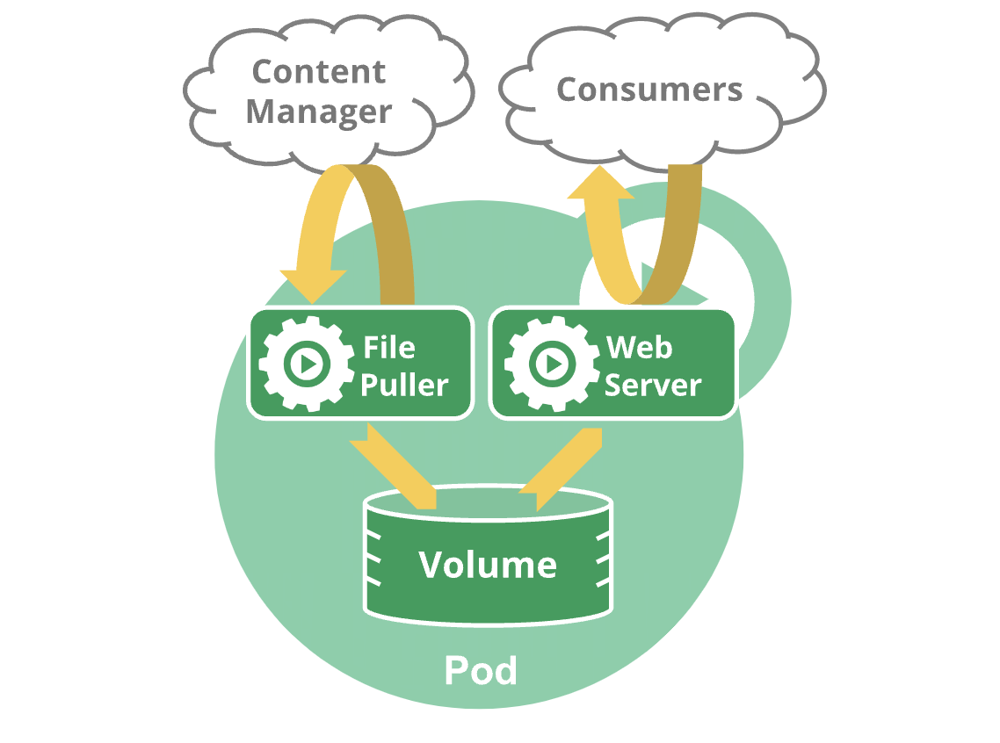

# Multi-Container Pod - Shared Volume Example

Containers in a Pod use the same network namespace (in other words, the same IP address and port space), and the same IPC namespace. They can also use shared volumes.

!!! tip
    Always keep containers in a separate Pods unless they need to share resources.


## Example



A multi-container Pod that contains a file puller and a web server that uses a persistent volume for **shared storage between the containers**.

```yaml
apiVersion: v1
kind: Pod
metadata:
  name: containers-shared-volume
spec:

  volumes:
  - name: shared-data
    emptyDir: {}

  containers:

  - name: nginx
    image: nginx
    volumeMounts:
    - name: shared-data
      mountPath: /usr/share/nginx/html

  - name: alpine
    image: alpine
    volumeMounts:
    - name: shared-data
      mountPath: /pod-data
    command: ["/bin/sh"]
    args: ["-c", "while true; do wget -O /pod-data/index.html http://info.cern.ch; sleep 30; done"]
```

To confirm that the `alpine` container has downloaded the desired webpages:

```bash
kubectl exec -it containers-shared-volume -c nginx -- curl localhost:80
```

The above command should output the contents on the [http://info.cern.ch](http://info.cern.ch) website.

!!! info
    We're going to have closer look at the `kubectl exec` command in a future chapter. You could also consult the [Kubernetes official documentation](https://kubernetes.io/docs/reference/generated/kubectl/kubectl-commands#exec).
