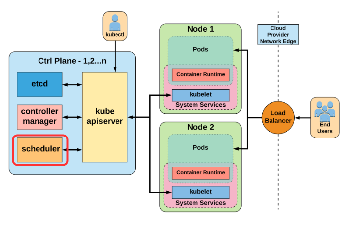

# Scheduler

In Kubernetes, _scheduling_ refers to making sure that Pods are matched to Nodes so that Kubelet can run them.

A scheduler watches for newly created Pods that have no Node assigned. For every Pod that the scheduler discovers, the scheduler becomes responsible for finding the best Node for that Pod to run on.

## kube-scheduler

[kube-scheduler](https://kubernetes.io/docs/reference/command-line-tools-reference/kube-scheduler/) is the default scheduler for Kubernetes and runs as part of the control plane.



Kube-scheduler selects an optimal node to run newly created or not yet scheduled (unscheduled) pods. Since containers in pods - and pods themselves - can have different requirements, the scheduler filters out any nodes that don't meet a Pod's specific scheduling needs. Alternatively, the API lets you specify a node for a Pod when you create it, but this is unusual and is only done in special cases.

Factors that need to be taken into account for scheduling decisions include:
- individual and collective resource requirements
- hardware / software / policy constraints
- affinity and anti-affinity specifications
- data locality, and so on.

### Node selection in kube-scheduler

kube-scheduler selects a node for the pod in a 2-step operation:

- Filtering: the scheduler finds the set of Nodes where it's feasible to schedule the Pod, e.g. checks whether a candidate Node has enough available resource to meet a Pod's specific resource requests.
- Scoring: the scheduler ranks the remaining nodes to choose the most suitable Pod placement. The scheduler assigns a score to each Node that survived filtering, basing this score on the active scoring rules.

Finally, kube-scheduler assigns the Pod to the Node with the highest ranking.

The scheduler then notifies the API server about this decision in a process called _binding_.


The following points in the workflow are open to plugin extension:

- `QueueSort`: Sort the pods in the queue
- `PreFilter`: Check the preconditions of the pods for scheduling cycle
- `Filter`: Filter the nodes that are not suitable for the pod
- `PostFilter`: Run if there are no feasible nodes found for the pod
- `PreScore`: Run prescoring tasks to generate shareable state for scoring plugins
Score: Rank the filtered nodes by calling each scoring plugins
- `NormalizeScore`: Combine the scores and compute a final ranking of the nodes
- `Reserve`: Choose the node as reserved before the binding cycle
- `Permit`: Approve or deny the scheduling cycle result
- `PreBind`: Perform any prerequisite work, such as provisioning a network volume
- `Bind`: Assign the pods to the nodes in Kubernetes API
- `PostBind`: Inform the result of the binding cycle


## Logs

kube-scheduler in CERN's IT OpenStack infrastructure is currently being run as Podman container. To verify this:

1. Find the IP address of one of your master nodes:

    ```bash
    kubectl get nodes -o wide -l magnum.openstack.org/role=master
    ```

1. SSH into (one of) the master node (make sure to replace the `IP_ADDRESS` with the IP address of your master node):

    ```bash
    ssh core@IP_ADDRESS
    ```

1. Verify that the `kube-scheduler` component is running as a Podman container:

    ```bash
    sudo cat /etc/systemd/system/kube-scheduler.service
    ```

    The output should be similar to this:

    ```bash
    ...

    ExecStart=/bin/bash -c '/usr/bin/podman run --name kube-scheduler

    ...
    ```

1. To view the logs of the `kube-scheduler` Podman container:

    ```bash
    $ sudo podman logs kube-scheduler

    I0315 13:46:40.879250       1 eventhandlers.go:123] "Add event for unscheduled pod" pod="default/onfailure-pod"
    I0315 13:46:40.880302       1 scheduler.go:519] "Attempting to schedule pod" pod="default/onfailure-pod"
    I0315 13:46:40.883998       1 default_binder.go:52] "Attempting to bind pod to node" pod="default/onfailure-pod" node="cms-daq-workshop-gml7jxg5oxyf-node-1"
    I0315 13:46:40.888679       1 eventhandlers.go:166] "Delete event for unscheduled pod" pod="default/onfailure-pod"
    I0315 13:46:40.889550       1 eventhandlers.go:186] "Add event for scheduled pod" pod="default/onfailure-pod"
    I0315 13:46:40.891532       1 scheduler.go:675] "Successfully bound pod to node" pod="default/onfailure-pod" node="cms-daq-workshop-gml7jxg5oxyf-node-1" evaluatedNodes=4 feasibleNodes=3
    ```

## Resources

- [Kubernetes Official docs, Scheduling overview](https://kubernetes.io/docs/concepts/scheduling-eviction/kube-scheduler/)
- [Kubernetes Official docs, Scheduling Framework](https://kubernetes.io/docs/concepts/scheduling-eviction/scheduling-framework/)
- [Kubernetes Official docs, Scheduler Performance Tuning](https://kubernetes.io/docs/concepts/scheduling-eviction/scheduler-perf-tuning/)
