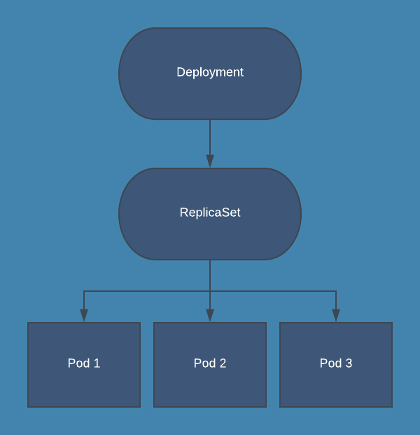

# ReplicaSet

A ReplicaSet's purpose is to maintain a stable set of replica Pods running at any given time. As such, it is often used to guarantee the availability of a specified number of identical Pods.

A ReplicaSet fulfills its purpose by creating and deleting Pods as needed to reach the desired number.

A ReplicaSet is linked to its Pods via the Pods' `metadata.ownerReferences` field, which specifies what resource the current object is owned by. For example:

```bash
$ kubectl get pod nginx-deployment-559d658b74-2rhds -o jsonpath='{.metadata.ownerReferences}' | jq

[
  {
    "apiVersion": "apps/v1",
    "blockOwnerDeletion": true,
    "controller": true,
    "kind": "ReplicaSet",
    "name": "nginx-deployment-559d658b74",
    "uid": "b21872c8-659d-44e6-8bc1-340411a07c7b"
  }
]
```

The above output states that the Pod named `nginx-deployment-559d658b74-2rhds` is owned by the `nginx-deployment-559d658b74` ReplicaSet.

## When to use a ReplicaSet

A ReplicaSet ensures that a specified number of pod replicas are running at any given time. However, **a Deployment is a higher-level concept that manages ReplicaSets** and provides declarative updates to Pods along with a lot of other useful features. Therefore, **we recommend using Deployments instead of directly using ReplicaSets**, unless you require custom update orchestration or don't require updates at all.

This actually means that **you may never need to manipulate ReplicaSet objects: use a Deployment instead**, and define your application in the spec section.


