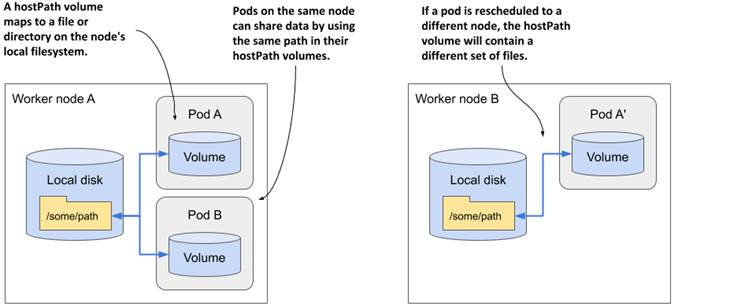

# hostPath

!!! danger
    HostPath volumes present many security risks, and it is a best practice to avoid the use of HostPaths when possible. When a HostPath volume must be used, it should be scoped to only the required file or directory, and mounted as ReadOnly.

A `hostPath` volume **mounts a file or directory from the host node's filesystem into your Pod**.

For example, some uses for a hostPath are:

- Deploying some node-specific files through pod
- running cAdvisor in a container; use a hostPath of /sys
- allowing a Pod to specify whether a given `hostPath` should exist prior to the Pod running, whether it should be created, and what it should exist as



## Types

In addition to the required `path` property, you can optionally specify a `type` for a `hostPath` volume.

The supported values for field `type` are:

| Value | Behavior |
|:-----:|:--------:|
|  | Empty string (default) is for backward compatibility, which means that no checks will be performed before mounting the hostPath volume. |
| `DirectoryOrCreate` | If nothing exists at the given path, an empty directory will be created there as needed with permission set to `0755`, having the same group and ownership with Kubelet. |
| `Directory` | A directory must exist at the given path |
| `FileOrCreate` | If nothing exists at the given path, an empty file will be created there as needed with permission set to `0644`, having the same group and ownership with Kubelet. |
| `File` | A file must exist at the given path |
| `Socket` | A UNIX socket must exist at the given path |
| `CharDevice` | A character device must exist at the given path |
| `BlockDevice` | A block device must exist at the given path |


## Gotchas

Watch out when using this type of volume, because:

- **HostPaths can expose privileged system credentials** (such as for the Kubelet) or privileged APIs (such as container runtime socket), which can be used for container escape or to attack other parts of the cluster.
- Pods with identical configuration (such as created from a PodTemplate) **may behave differently on different nodes** due to different files on the nodes.
- The files or directories created on the underlying hosts are only writable by root. You either need to run your process as root in a [privileged Container](https://kubernetes.io/docs/tasks/configure-pod-container/security-context/) or modify the file permissions on the host to be able to write to a `hostPath` volume.

## Example

```yaml
apiVersion: v1
kind: Pod
metadata:
  name: hostpath-dir
spec:
  containers:
  - image: nginx
    name: nginx
    volumeMounts:
    - mountPath: /test-pd
      name: test-volume
  volumes:
  - name: test-volume
    hostPath:
      # directory location on host
      path: /data
      # this field is optional
      type: Directory
```

For the example above, and in the case where the the `/data` directory doesn't exist on the host, an error like the following should be thrown in the Pod's events (hint: use the `kubectl describe` command to view events for a pod):

```bash
Events:
  Type     Reason       Age                 From               Message
  ----     ------       ----                ----               -------
  Normal   Scheduled    2m6s                default-scheduler  Successfully assigned default/hostpath-dir to cms-daq-workshop-gml7jxg5oxyf-node-2
  Warning  FailedMount  62s (x8 over 2m6s)  kubelet            MountVolume.SetUp failed for volume "test-volume" : hostPath type check failed: /data is not a directory
  Warning  FailedMount  3s                  kubelet            Unable to attach or mount volumes: unmounted volumes=[test-volume], unattached volumes=[kube-api-access-4p27r test-volume]: timed out waiting for the condition
```
