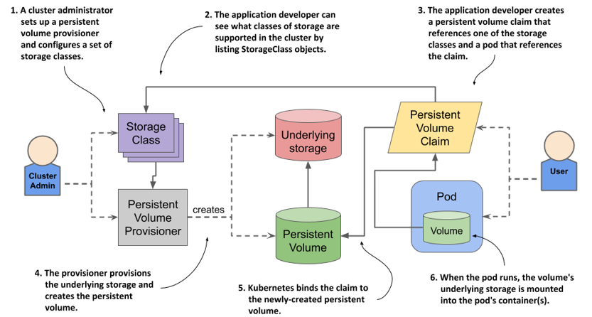
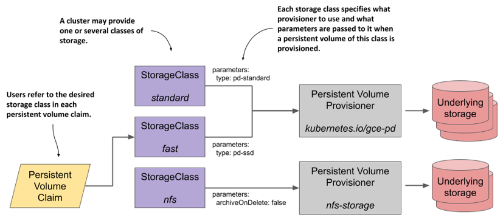
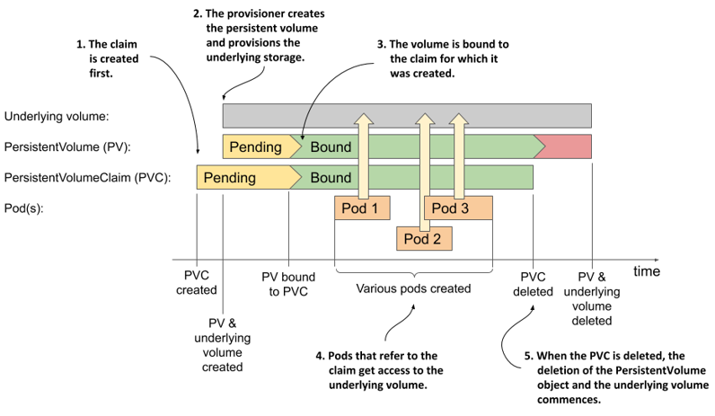

# Dynamic Volume Provisioning

**_Dynamic volume provisioning_ allows storage volumes to be created on-demand**. Without dynamic provisioning, cluster administrators have to manually make calls to their cloud or storage provider to create new storage volumes, and then create `PersistentVolume` objects to represent them in Kubernetes. The dynamic provisioning feature eliminates the need for cluster administrators to pre-provision storage. Instead, it **automatically provisions storage when it is requested by users**.



## Background

The implementation of dynamic volume provisioning is based on StorageClasses.

A cluster administrator can define as many `StorageClass` objects as needed, each specifying a **_volume plugin_** (aka **_provisioner_**) that provisions a volume and the set of parameters to pass to that provisioner when provisioning. A cluster administrator can define and expose multiple flavors of storage (from the same or different storage systems) within a cluster, each with a custom set of parameters. This design also ensures that end users don't have to worry about the complexity and nuances of how storage is provisioned, but still have the ability to select from multiple storage options.




## Enabling Dynamic Provisioning

To enable dynamic provisioning, a cluster administrator needs to pre-create one or more StorageClass objects for users.

## Using Dynamic Provisioning

Users request dynamically provisioned storage by setting the `storageClassName` field a storage class in their `PersistentVolumeClaim`. The value of this field must match the name of a StorageClass configured by the administrator.


To select the `"fast"` storage class, for example, a user would create the following PersistentVolumeClaim:

```yaml
apiVersion: v1
kind: PersistentVolumeClaim
metadata:
  name: claim1
spec:
  accessModes:
    - ReadWriteOnce
  storageClassName: fast
  resources:
    requests:
      storage: 30Gi
```

## Defaulting Behavior

Dynamic provisioning can be enabled on a cluster such that all claims are dynamically provisioned if no storage class is specified. A cluster administrator can enable this behavior by:

- Marking one `StorageClass` object as _default_;
- Making sure that the [`DefaultStorageClass` admission controller](https://kubernetes.io/docs/reference/access-authn-authz/admission-controllers/#defaultstorageclass) is enabled on the API server.

When a default `StorageClass` exists in a cluster and a user creates a `PersistentVolumeClaim` with `storageClassName` unspecified, **the `DefaultStorageClass` admission controller automatically adds the `storageClassName` field pointing to the default storage class**.


## Lifecycle of dynamically provisioned persistent volumes



Unlike statically provisioned persistent volumes, the sequence of events when using dynamic provisioning begins with the creation of the PersistentVolumeClaim object. As soon as one such object appears, Kubernetes instructs the dynamic provisioner configured in the storage class referenced in this claim to provision a volume for it. The provisioner creates both the underlying storage, typically through the cloud provider’s API, and the PersistentVolume object that references the underlying volume.

The underlying volume is typically provisioned asynchronously. When the process completes, the status of the PersistentVolume object changes to Available; at this point, the volume is bound to the claim.

Users can then deploy pods that refer to the claim to gain access to the underlying storage volume. When the volume is no longer needed, the user deletes the claim.
