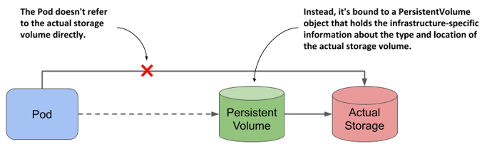
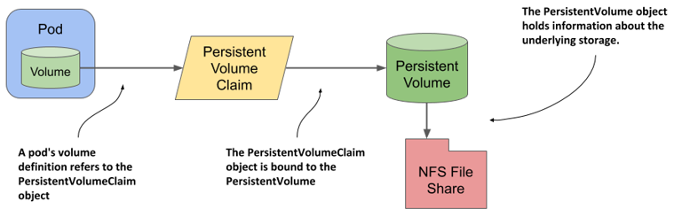
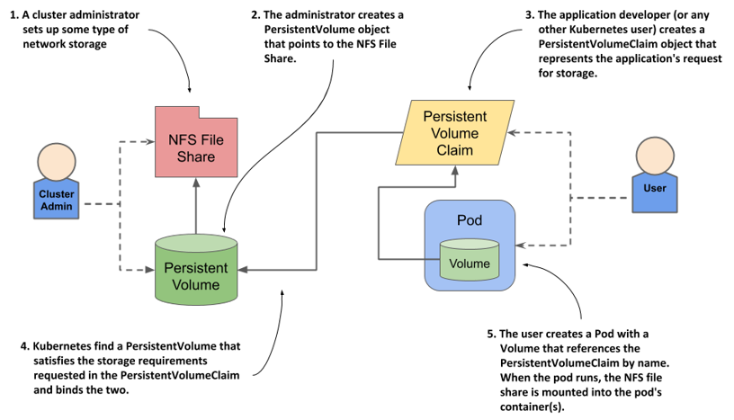

# Persistent Volumes

Before going through the PersistentVolume subsystem, let's see why it was introduced.

## Why does Kubernetes force software developers to understand low-level storage?

If you’re a software developer and not a system administrator, you might wonder if you really need to know all this low-level information about storage volumes? As a developer, should you have to deal with infrastructure-related storage details when writing the pod definition, or should this be left to the cluster administrator?

For example, have a look at the following Pod manifest:

```yaml
apiVersion: v1
kind: Pod
metadata:
  name: mongodb
spec:
  containers:
  - image: mongo
    name: mongodb
    volumeMounts:
    - name: mongodb-data
      mountPath: /data/db
    ports:
    - containerPort: 27017
      protocol: TCP
  volumes:
  - name: mongodb-data
    gcePersistentDisk:
      pdName: mongodb
      fsType: ext4
```

This is not ideal because you **needed to understand the environment your cluster** was running in to know what type of volume to add to your pod. For example, if your cluster runs on Google’s infrastructure, you must define a `gcePersistentDisk` volume in your pod manifest. You can’t use the same manifest to run your application on Amazon because GCE Persistent Disks aren’t supported in their environment. To make the manifest compatible with Amazon, one must modify the volume definition in the manifest before deploying the pod.

Kubernetes offers **another way to add external storage to your pods**. One where you **don’t refer to a specific storage technology within the pod**. One that divides the responsibility for configuring and using the external storage volume into two parts. The **low-level part is managed by cluster administrators**, while **software developers only specify the high-level storage requirements** for their applications. Kubernetes then connects the two parts.


## Enter PersistentVolume subsystem

The **PersistentVolume subsystem provides an API for users and administrators that abstracts details of how storage is provided from how it is consumed**. To do this, we introduce two new API resources: _PersistentVolume_ and _PersistentVolumeClaim_.

## Concepts and Terminology

### PersistentVolumes

- A **PersistentVolume** (**PV**) is a piece of storage in the cluster.  
- PVs are **cluster wide resources** linked to a backing storage provider: NFS, GCEPersistentDisk, RBD etc.
- **Provisioned by an administrator _statically_** _or_ **_dynamically_ provisioned using StorageClasses** (note: StorageClass is another API resource in Kubernetes. More details can be found in the next sections).
- Their lifecycle is handled independently from a pod.
- PVs capture the details of the implementation of the storage, be that NFS, iSCSI, or a cloud-provider-specific storage system.
- **CANNOT** be attached to a Pod directly. Relies on a **PersistentVolumeClaim**.

!!! info
    There are two ways PVs may be provisioned: **statically** _or_ **dynamically**.




### PersistentVolumeClaim

- A **PersistentVolumeClaim** (**PVC**) is a **request for storage by a user**.
    - It is similar to a Pod: Pods consume node resources and PVCs consume PV resources.
        - Pods can request specific levels of resources (CPU and Memory). Claims can request specific size and access modes (e.g., they can be mounted ReadWriteOnce, ReadOnlyMany or ReadWriteMany, etc.).
- PVCs are **namespaced** resources.
- Satisfies a set of requirements instead of mapping to a storage resource directly.
- Ensures that an application’s "claim" for storage is portable across numerous backends or providers.




As its name suggests, a PersistentVolumeClaim object represents a user’s claim on the persistent volume. **Before a user can use a persistent volume in their pods, they must first claim the volume**. After claiming the volume, the user has exclusive rights to it and can use it in their pods. When the volume is no longer needed, the user releases it by deleting the PersistentVolumeClaim object.

### Varying Properties

While PersistentVolumeClaims allow a user to consume abstract storage resources, it is common that users need **PersistentVolumes with varying properties, such as performance**, for different problems.

Cluster administrators need to be able to offer a variety of PersistentVolumes that differ in more ways than size and access modes, without exposing users to the details of how those volumes are implemented. For these needs, there is the StorageClass resource.


## Types of Persistent Volumes

PersistentVolume types are implemented as **plugins**. Kubernetes currently supports the following plugins:

- cephfs - CephFS volume
- csi - Container Storage Interface (CSI)
- fc - Fibre Channel (FC) storage
- hostPath - HostPath volume (for single node testing only; WILL NOT WORK in a multi-node cluster; consider using local volume instead)
- iscsi - iSCSI (SCSI over IP) storage
- local - local storage devices mounted on nodes.
- nfs - Network File System (NFS) storage
- rbd - Rados Block Device (RBD) volume

Note: There are also some types of PersistentVolume that are deprecated and will be removed in a future Kubernetes release.


!!! info
    To find all the supported plugins by the PersistentVolume API object, please consult the [official Kubernetes reference documentation for the `PersistentVolumeSpec` object](https://kubernetes.io/docs/reference/generated/kubernetes-api/v1.27/#persistentvolumespec-v1-core) (note: make sure to modify the link with the Kubernetes version you're using).


## PersistentVolume subsystem advantages


This system with three objects is clearly more complex than what we had in the previous sections, where the pod simply referred to the NFS File Share directly. 

The **biggest advantage of using PersistentVolumes and PersistentVolumesClaims** is that the infrastructure-specific details are now decoupled from the application represented by the pod. Cluster administrators can create the PersistentVolume objects with all their infrastructure-related low-level details, while software developers focus solely on describing the applications and their needs via the Pod and PersistentVolumeClaim objects.


## Flow for statically provisioned PV and Usage in Pods



Instead of the developer adding a technology-specific volume to their pod, the cluster administrator sets up the underlying storage and then registers it in Kubernetes by creating a PersistentVolume object through the Kubernetes API.

When a cluster user needs persistent storage in one of their pods, they first create a PersistentVolumeClaim object in which they either refer to a specific persistent volume by name, or specify the minimum volume size and access mode required by the application, and let Kubernetes find a persistent volume that meets these requirements. In both cases, the persistent volume is then bound to the claim and is given exclusive access. The claim can then be referenced in a volume definition within one or more pods. When the pod runs, the storage volume configured in the PersistentVolume object is attached to the worker node and mounted into the pod’s containers.

!!! note
    The current section refers to _statically-provisioned_ PersistentVolumes, which means that the cluster administrators need to create the PersistentVolume objects manually.
    
    Using _dynamic provisioning_ of persistent volumes, as discussed later in this chapter, administrators don’t need to pre-provision volumes at all. If an automated volume provisioner is installed in the cluster, the physical storage volume and the PersistentVolume object are created on demand for each PersistentVolumeClaim object that users create.
