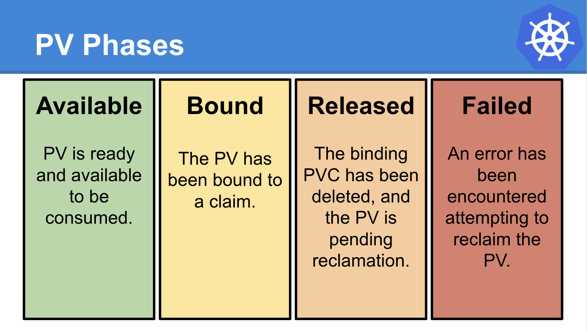

# PersistentVolume

Each PersistentVolume (PV) contains a spec and status, which is the specification and status of the volume. The name of a PersistentVolume object must be a [valid DNS subdomain name](./../../../000-objects/names-and-ids.md).

## Example

```yaml
apiVersion: v1
kind: PersistentVolume
metadata:
  name: pv0003
spec:
  capacity:
    storage: 1Gi
  volumeMode: Block
  accessModes:
    - ReadWriteOnce
  persistentVolumeReclaimPolicy: Retain
  storageClassName: slow
  mountOptions:
    - hard
    - nfsvers=4.1
  nfs:
    path: /tmp
    server: 172.17.0.2
```

!!! note
    Helper programs relating to the volume type may be required for consumption of a PersistentVolume within a cluster. In this example, the PersistentVolume is of type NFS and the helper program `/sbin/mount.nfs` is required to support the mounting of NFS filesystems.


## Configuration

### Capacity

Generally, a PV will have a specific storage capacity. This is set using the PV's `.spec.capacity` attribute.

Currently, storage size is the only resource that can be set or requested. Future attributes may include IOPS, throughput, etc.


### Volume Mode

Kubernetes supports two `volumeModes` of PersistentVolumes:

- `Filesystem` (default)
- `Block`

`volumeMode` is an optional API parameter. 

#### Filesystem

`Filesystem` is the default mode used when `volumeMode` parameter is omitted.

A volume with `volumeMode: Filesystem` is _mounted_ into Pods into a directory. If the volume is backed by a block device and the device is empty, Kubernetes creates a filesystem on the device before mounting it for the first time.

#### Block

You can set the value of `volumeMode` to `Block` to use a volume as a raw block device. Such volume is presented into a Pod as a block device, without any filesystem on it. This mode is useful to provide a Pod the fastest possible way to access a volume, without any filesystem layer between the Pod and the volume. On the other hand, the application running in the Pod must know how to handle a raw block device. 


### Access Modes

A PersistentVolume can be mounted on a host in any way supported by the resource provider. As shown in the table below, providers will have different capabilities and each PV's access modes are set to the specific modes supported by that particular volume. For example, NFS can support multiple read/write clients, but a specific NFS PV might be exported on the server as read-only. Each PV gets its own set of access modes describing that specific PV's capabilities.

The access modes are:

- `ReadWriteOnce` (RWO): the volume can be mounted as read-write by a single node. ReadWriteOnce access mode still can allow multiple pods to access the volume when the pods are running on the same node.
- `ReadOnlyMany` (ROX): the volume can be mounted as read-only by many nodes.
- `ReadWriteMany` (RWX): the volume can be mounted as read-write by many nodes.
- `ReadWriteOncePod` (RWOP): the volume can be mounted as read-write by a single Pod. Use ReadWriteOncePod access mode if you want to ensure that only one pod across whole cluster can read that PVC or write to it. This is only supported for CSI volumes and Kubernetes version 1.22+.

!!!note
    Kubernetes uses volume access modes to match PersistentVolumeClaims and PersistentVolumes. In some cases, the volume access modes also constrain where the PersistentVolume can be mounted.


| Volume Plugin      | ReadWriteOnce          | ReadOnlyMany       | ReadWriteMany       | ReadWriteOncePod                 |
|:------------------:|:----------------------:|:------------------:|:-------------------:|:--------------------------------:|
| AzureFile         | ✓                     | ✓                  | ✓                   | -                               |
| CephFS            | ✓                     | ✓                  | ✓                   | -                               |
| CSI               | depends on the driver | depends on the driver | depends on the driver | depends on the driver      |
| FC                | ✓                     | ✓                  | -                   | -                               |
| FlexVolume        | ✓                     | ✓                  | depends on the driver | -                             |
| GCEPersistentDisk | ✓                     | ✓                  | -                   | -                               |
| Glusterfs         | ✓                     | ✓                  | ✓                   | -                               |
| HostPath          | ✓                     | -                  | -                   | -                               |
| iSCSI             | ✓                     | ✓                  | -                   | -                               |
| NFS               | ✓                     | ✓                  | ✓                   | -                               |
| RBD               | ✓                     | ✓                  | -                   | -                               |
| VsphereVolume     | ✓                     | -                  | - (works when Pods are collocated) | -                |
| PortworxVolume    | ✓                     | -                  | ✓                   | -                               |


### Class

A PV can have a class, which is specified by setting the storageClassName attribute to the name of a StorageClass. A PV of a particular class can only be bound to PVCs requesting that class. A PV with no storageClassName has no class and can only be bound to PVCs that request no particular class.


### Reclaiming

When a user is done with their volume, they can delete the PVC objects from the API that allows reclamation of the resource. The reclaim policy for a PersistentVolume tells the cluster what to do with the volume after it has been released of its claim. Currently, volumes can either be Retained, Recycled, or Deleted.

Current reclaim policies are:

- `Retain` -- manual reclamation
- `Recycle` -- basic scrub (`rm -rf /thevolume/*`)
- `Delete` -- associated storage asset such as AWS EBS or GCE PD volume is deleted

Currently, only NFS and HostPath support recycling. AWS EBS and GCE PD volumes support deletion.


### Mount Options

A Kubernetes administrator can specify additional mount options for when a Persistent Volume is mounted on a node.

!!! note
    Not all Persistent Volume types support mount options.

The following volume types support mount options:

- `azureFile`
- `cephfs`
- `gcePersistentDisk`
- `iscsi`
- `nfs`
- `rbd`
- `vsphereVolume`

Mount options are not validated. If a mount option is invalid, the mount fails.


### Node Affinity

!!! note
    For most volume types, you do not need to set this field. You need to explicitly set this for [`local` volumes](./../tasks/local.md).

A PV can specify node affinity to define constraints that limit what nodes this volume can be accessed from. Pods that use a PV will only be scheduled to nodes that are selected by the node affinity. To specify node affinity, set `nodeAffinity` in the `.spec` of a PV. The PersistentVolume API reference has more details on this field.


## Phase

A volume will be in one of the following phases:

- Available -- a free resource that is not yet bound to a claim
- Bound -- the volume is bound to a claim
- Released -- the claim has been deleted, but the resource is not yet reclaimed by the cluster
- Failed -- the volume has failed its automatic reclamation

The CLI will show the name of the PVC bound to the PV.




## Get Information about PersistentVolumes

To get information about PersistentVolumes with the CLI:

```bash
kubectl get pv <PV_NAME>
```

and

```bash
kubectl describe pv <PV_NAME>
```

!!! note
    In both cases you can either use full API object name (i.e. `persistentvolume`) or the short name (i.e. `pv`).
