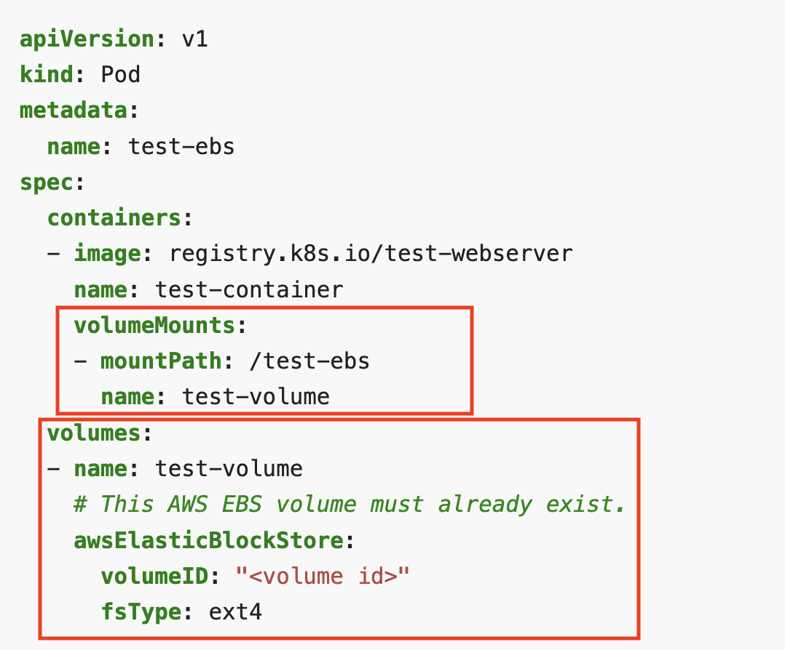
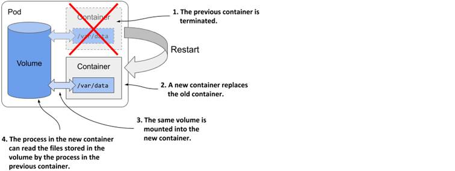
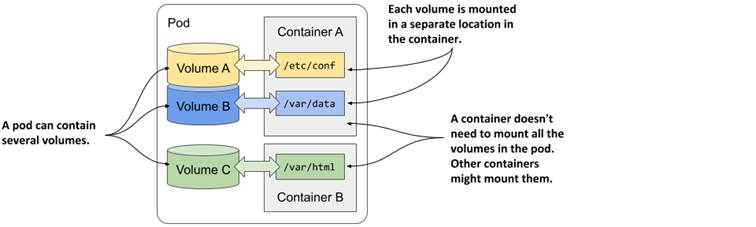
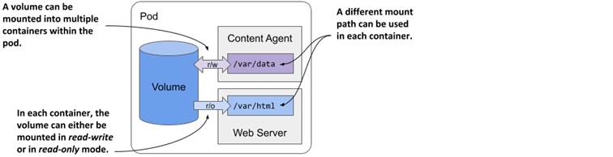
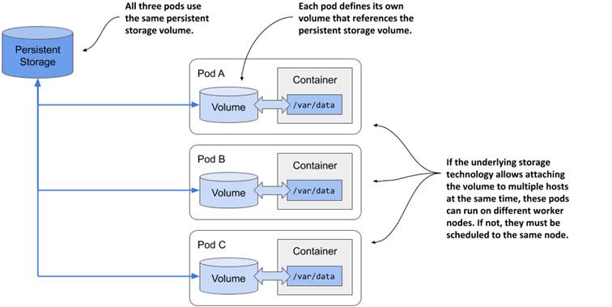

# Volumes

**A Kubernetes volume is a directory containing data, which can be accessed by containers in a Kubernetes pod**. The location of the directory, the storage media that supports it, and its contents, depend on the specific type of volume being used.


## Background

Kubernetes supports many types of volumes. A Pod can use any number of volume types simultaneously.

Volumes could be considered to be part of the three main categories:

- **Ephemeral volumes**: data are not persisted and have a lifetime of a pod.
    - Configuration volumes: mounting data files in Pods (e.g. ConfigMaps and Secrets). Could also be considered part of the emphemeral volumes.
- **Persistent volumes**: data are persisted and they exists beyond the lifetime of a pod.
- Projected volumes: maps several existing volume sources into the same directory.

A high-level overview of the types of storage in Kubernetes and their lifetime:

| Type of storage | How long does it last? |
|:---------------:|:----------------------:|
| Container filesystem | Container lifetime |
| Volume | Pod lifetime |
| Persistent volume | Cluster lifetime (or until deleted) |


At its core, **a volume is a directory**, possibly with some data in it, which is accessible to the containers in a pod. **How that directory comes to be, the medium that backs it, and the contents of it are determined by the particular volume type used**.

To use a volume, specify the volumes to provide for the Pod in `.spec.volumes` and declare where to mount those volumes into containers in `.spec.containers[*].volumeMounts`.


## Example



??? example "Above YAML Pod manifest with Volume"
    ```yaml
    apiVersion: v1
    kind: Pod
    metadata:
      name: test-ebs
    spec:
      containers:
      - image: registry.k8s.io/test-webserver
        name: test-container
        volumeMounts:
        - mountPath: /test-ebs
          name: test-volume
      volumes:
      - name: test-volume
        # This AWS EBS volume must already exist.
        awsElasticBlockStore:
          volumeID: "<volume id>"
          fsType: ext4
    ```

    [Source](https://kubernetes.io/docs/concepts/storage/volumes/)

A short description of the volume-related fields in the above Pod manifest:

- `volumes`: A list of volume objects to be **attached to the Pod**. Every object within the list must have it’s own unique name.
- `volumeMounts`: A **container-specific** list referencing the Pod volumes by name, along with their desired mountPath.


## Understanding how volumes fit into pods

Like containers, **storage volumes in Kubernetes aren’t top-level resources** like pods, but are instead defined as a part of a pod and share the same lifecycle as the pod. This means a volume is created when the pod is started and is destroyed when the pod is deleted.


!!! info
    _Mounting_ is the act of attaching the filesystem of some storage device or volume into a specific location in the operating system’s file tree. The contents of the volume are then available at that location.


### Persisting files across container restarts

All volumes in a pod are created when the pod is set up - before any of its containers are started. They are torn down when the pod is shut down.

Each time a container is (re)started, the volumes that the container is configured to use are mounted in the container’s filesystem. The application running in the container can read from the volume and write to it if the volume and mount are configured to be writable.

A typical **reason for adding a volume to a pod is to persist data across container restarts**. If no volume is mounted in the container, the entire filesystem of the container is ephemeral. Since a container restart replaces the entire container, its filesystem is also re-created from the container image. As a result, all files written by the application are lost.

If, on the other hand, the application writes data to a volume mounted inside the container, as shown in the following figure, the application process in the new container can access the same data after the container is restarted.




### Mounting multiple volumes in a container

A pod can have multiple volumes and each container can mount zero or more of these volumes in different locations:



The reason why you might want to mount multiple volumes in one container is that these volumes may serve different purposes and can be of different types with different performance characteristics.


### Sharing files between multiple containers

A volume can be mounted in more than one container so that applications running in these containers can share files.

A pod can combine a main _application_ container with _sidecar_ containers that extend the behavior of the main application. In some cases, the containers must read or write the same files.

For example, you could create a pod that combines a web server running in one container with a content-producing agent running in another container. The content agent container generates the static content that the web server then delivers to its clients. Each of the two containers performs a single task that has no real value on its own:



We have seen an example like that in a previous section. More details on [Pods/Pods with multiple Containers section](./../000-pods/multiple-containers-02.md).


### Sharing data between pods

Depending on the technology that provides the external storage volume, the same external volume can be attached to multiple pods simultaneously, allowing them to share data. The following figure shows a scenario where three pods each define a volume that is mapped to the same external persistent storage volume.



In the simplest case, the persistent storage volume could be a simple local directory on the worker node’s filesystem, and the three pods have volumes that map to that directory. If all three pods are running on the same node, they can share files through this directory.

If the persistent storage is a network-attached storage volume, the pods may be able to use it even when they are deployed to different nodes. However, this depends on whether the underlying storage technology supports attaching the network volume to more than one computer simultaneously.

While technologies such as Network File System (NFS) allow attaching the volume in read/write mode on multiple computers, other technologies typically available in cloud environments, such as the Google Compute Engine Persistent Disk, allow the volume to be used either in read/write mode on a single cluster node, or in read-only mode on many nodes.


## Types of volumes

Kubernetes supports several types of volumes.

| Type | Description | Example |
|:----:|:-----------:|:-------:|
| `emptyDir` | A simple empty directory used for storing transient data. | [example](./ephemeral/emptyDir.md) |
| `configMap` | Special types of volumes used to provide a way to inject configuration data into pods. | [example](./ephemeral/configmap.md) |
| `Secret` | Special types of volumes used to provide a way to inject sensitive data into pods. | [example](./ephemeral/secret.md) |
| `downwardAPI` | Special types of volumes used to consume information about the current container or the cluster without using the Kubernetes client or API server. | [example](./ephemeral/downward-api.md) |
| `hostPath` | Used for mounting directories from the worker node’s filesystem into the pod. | [example](./hostPath.md) |
| `local` | Represents a mounted local storage device such as a disk, partition or directory. Can only be used as a statically created PersistentVolume. Dynamic provisioning is not supported. | [example](./persistent-volumes/tasks/local.md) |
| `nfs` | Allows an existing NFS (Network File System) share to be mounted into a Pod. Data are preserved. | [example](./persistent-volumes/nfs.md) |
| `iscsi` | Allows an existing iSCSI (SCSI over IP) volume to be mounted into your Pod. Data are preserved. | [example](./persistent-volumes/iscsi.md) |
| `cephfs` | A `cephfs` volume allows an existing CephFS volume to be mounted into your Pod. Data are persisted and can be pre-populated, and that data can be shared between pods. The cephfs volume can be mounted by multiple writers simultaneously. | [example](https://github.com/kubernetes/examples/tree/master/volumes/cephfs/) |
| `persistentVolumeClaim` | Used to mount a PersistentVolume into a Pod. PersistentVolumeClaims are a way for users to "claim" durable storage without knowing the details of the particular cloud environment. | [example]() |
| `projected` | Maps several existing volume sources into the same directory. | [example](#) |


## Node-specific Volume Limits

The Kubernetes scheduler has default limits on the number of volumes that can be attached to a Node for various cloud providers or CSI plugins.

You can change these limits by setting the value of the `KUBE_MAX_PD_VOLS` environment variable, and then starting the scheduler. CSI drivers might have a different procedure, see their documentation on how to customize their limits.

You can view more details on the [official Kubernetes documentation](https://kubernetes.io/docs/concepts/storage/storage-limits/).
