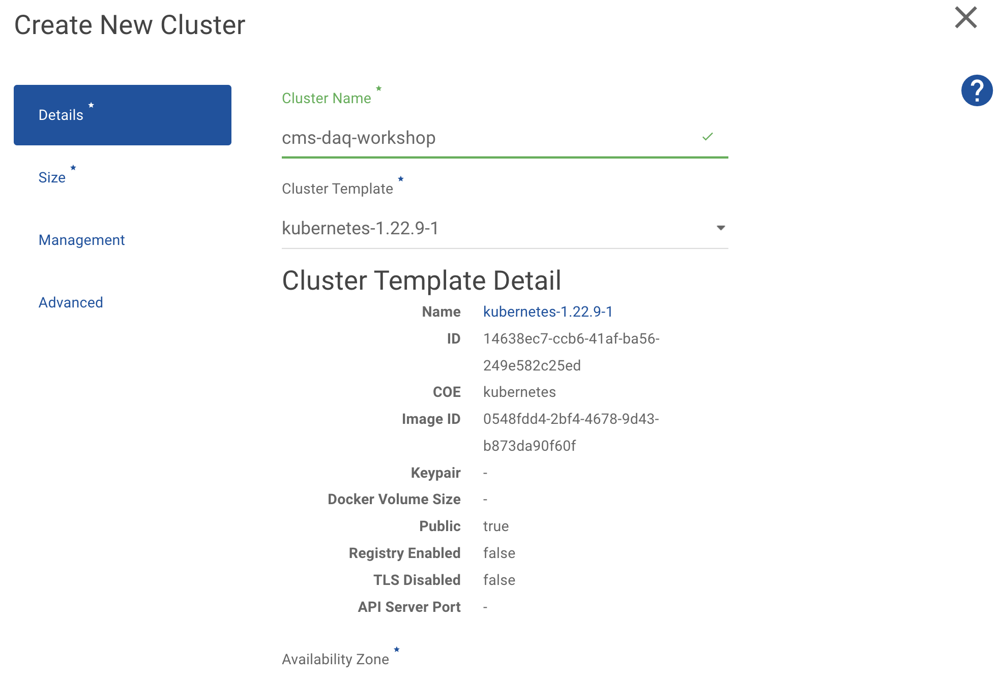
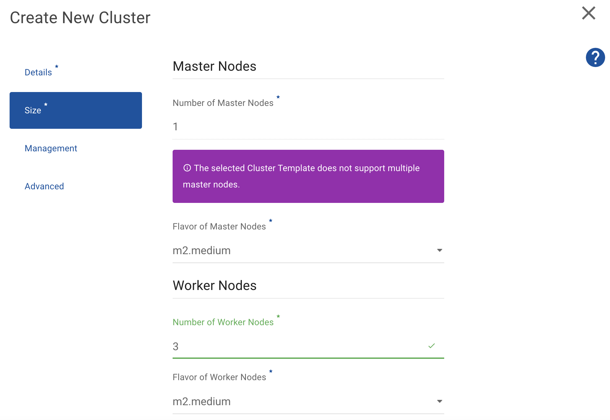
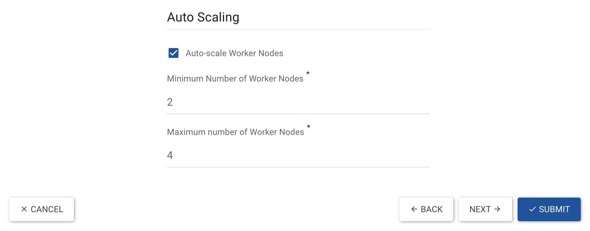
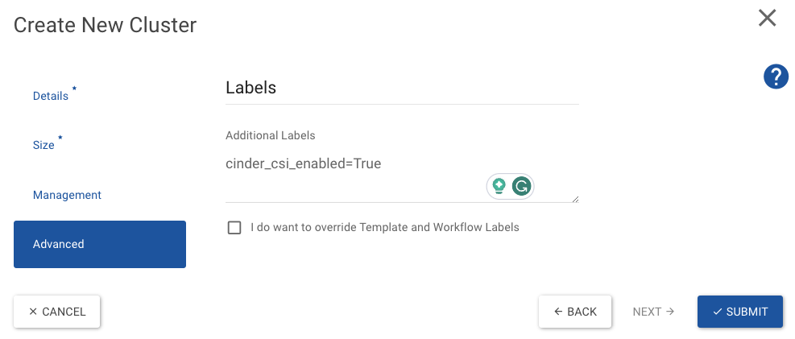

# Kubernetes Cluster Creation

We'll be using IT's OpenStack Cloud for this workshop. The web interface can be found [here](https://openstack.cern.ch/).

## OpenStack

[OpenStack](https://www.openstack.org/) is a free, open standard cloud computing platform. It is mostly deployed as **infrastructure-as-a-service** (IaaS) in both public and private clouds where virtual servers and other resources are made available to users.

**Magnum** is an OpenStack API service developed by the OpenStack Containers Team making container orchestration engines (COE) such as Docker Swarm and Kubernetes available as first class resources in OpenStack.

## Cluster Creation

!!! info
    Make sure you have available quota on your project for the cluster creation.

    The minimum number of instances needed are two. The recommended number of instances for this workshop is four - one master node and three worker nodes.

To create the Kubernetes cluster through OpenStack's web interface:

1. From your browser go to [OpenStack's web interface](https://openstack.cern.ch/).
1. From the list of Projects (left corner, right next to the OpenStack logo), select your Personal Project (e.g. `Personal thrizopo`).
1. Navigate to [Project --> Container Infra --> Clusters](https://openstack.cern.ch/project/clusters) and request a new cluster creation:

    

    

    

    

    

    !!! note
        Make sure to add the `cinder_csi_enabled=True` label, which will be used later in the workshop for the dynamic provisioning of the persistent volumes.
